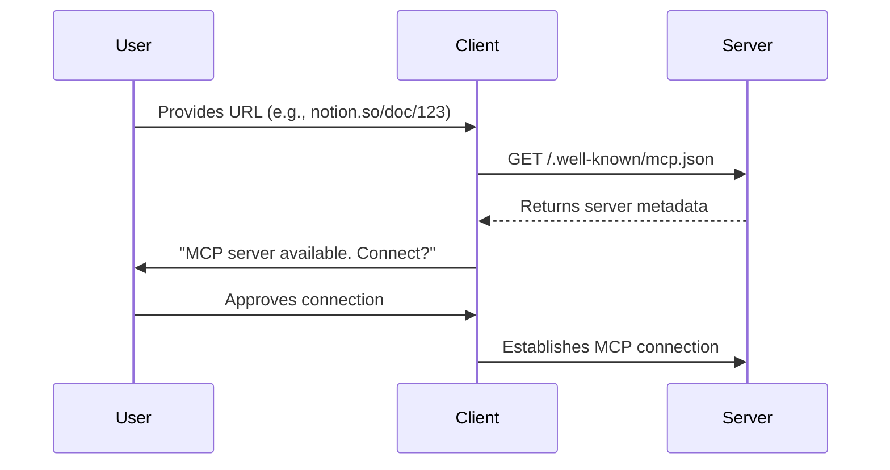

## Overview

Server discovery enables MCP clients to automatically detect and connect to MCP servers when users provide URLs from domains that host MCP-enabled services. This mechanism streamlines the user experience by eliminating manual configuration.

## How it works

MCP servers can advertise their presence by hosting a metadata file at `/.well-known/mcp.json` on their domain. When a client encounters a URL, it can check for this file to determine if an MCP server is available.



## Metadata format

The well-known file provides essential information about the server:

```json
{
  "name": "Example MCP Server",
  "logo": "https://example.com/logo.png",
  "tagline": "Access Example resources through MCP",
  "endpoint": "https://api.example.com/mcp",
  "transports": {
    "http": {
      "endpoint": "https://api.example.com/mcp"
    }
  },
  "capabilities": {
    "tools": true,
    "resources": true,
    "prompts": false
  }
}
```

## Benefits

**For users:**

- Seamless discovery of MCP-enabled services
- No manual configuration required
- Clear information about server capabilities

**For developers:**

- Standard way to advertise MCP capabilities
- Simplified onboarding for users
- Consistent discovery across all MCP clients

## Security considerations

- Well-known files must be served over HTTPS
- Clients should validate metadata before connecting
- Users should explicitly approve new connections
- Servers should implement appropriate CORS policies

## Implementation

For detailed implementation guidelines, see the [Server Discovery specification](/specification/draft/server/discovery).
