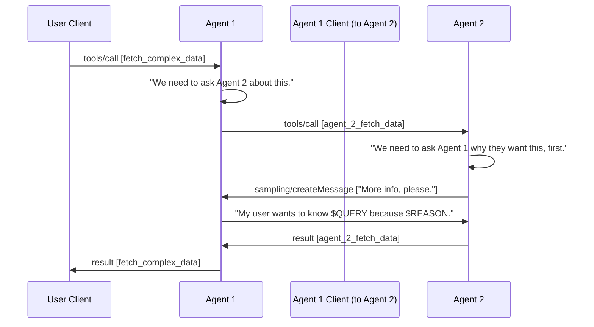

Sampling is a powerful MCP feature that allows servers to request LLM completions through the client, enabling sophisticated LLM-enhanced behaviors while maintaining security and privacy.

<Info>

This feature of MCP is not yet supported in the Claude Desktop client.

</Info>

## Overview

Sampling allows an MCP server to request completions from (or "sample") an LLM controlled by an MCP client.
This enables servers to leverage an LLM as part of other MCP interactions, such as [tools](/docs/concepts/tools) and [prompts](/docs/concepts/prompts), without needing additional infrastructure or configuration to directly integrate with model providers themselves.

Sampling flows generally follow these steps:

1. The server sends a `sampling/createMessage` request to the client, containing a prompt and other information
2. The client reviews the request and may modify it
3. The client requests the completion from its own LLM
4. The client reviews the completion
5. The client responds to the server with the LLM-generated completion

## Capabilities

Sampling is only supported when interacting with clients that have declared support for the corresponding capability:

```typescript
{
  capabilities: {
    sampling: {
    }
  }
}
```

## Implementing sampling

Sampling can be a standalone server-initiated interaction, but works best when used within other MCP features. The following example demonstrates how sampling can be used within tool interactions:

### Server

This server exposes a single `add` tool which asks the client's LLM for the sum of the two inputs. Upon receiving a response from the client, the server extracts the result and returns the tool call result back to the client.
In effect, the server has made its own request from the client within that client's existing tool call request.

```typescript
import assert from "node:assert";
import { z } from "zod";

const server = new McpServer({
  name: "example-server",
  version: "1.0.0",
});

// Add an addition tool
server.tool(
  "add",
  { a: z.number(), b: z.number() },
  async ({ a, b }, extra) => {
    // Send the client a sampling request and wait for a response
    const result = await extra.sendRequest(
      {
        method: "sampling/createMessage",
        params: {
          messages: [
            {
              role: "user",
              content: {
                type: "text",
                text: `Add ${a} and ${b}. Respond with only the sum of the two numbers.`,
              },
            },
          ],
          maxTokens: 1000,
          systemPrompt: "You are very good at math.",
          includeContext: "thisServer",
        },
      },
      CreateMessageResultSchema,
    );

    // You should handle every message type, but for the sake of example, let's assume the client sent a text response
    assert(result.content.type === "text");
    const completion = result.content.text;

    // Return the formatted result to the client
    return {
      content: [
        { type: "text", text: `The sum of ${a} and ${b} is ${completion}.` },
      ],
    };
  },
);

const transport = new StdioServerTransport();
await server.connect(transport);
```

### Client

The client is responsible for collecting the server's system prompt and messages into a single request to send to the model provider it uses.
In this toy example, we simply have the client return a fixed text response, instead.

```typescript
const transport = new StdioClientTransport({
  command: "node",
  args: ["server.js"], // Assumes both files are in the same directory
});

const client = new Client(
  {
    name: "example-client",
    version: "1.0.0",
  },
  {
    capabilities: {
      sampling: {},
    },
  },
);

async function sendPrompt(_prompt: string): Promise<string> {
  // In a real application, you would write code to make a request to an LLM
  return "3";
}

// Define a request handler that determines how the client should respond to sampling requests
client.setRequestHandler(CreateMessageRequestSchema, async (request) => {
  // In a real application, you would raise a prompt to a user before handling the request
  // ...

  // Send the prompt to a model
  const prompt = `${
    request.params.systemPrompt
  }\n\n${request.params.messages.join("\n\n")}`;
  const modelResult = await sendPrompt(prompt);

  // Return the response to the server
  return {
    model: "my-model",
    role: "assistant",
    content: {
      type: "text",
      text: modelResult,
    },
  };
});

await client.connect(transport);

const toolResult = await client.callTool({
  name: "add",
  arguments: {
    a: 1,
    b: 2,
  },
});
```

**Result:**

Upon running this example, the sampling request executes within the tool call, and the final result is returned as expected.

```typescript
{
  content: [{ type: "text", text: "The sum of 1 and 2 is 3." }];
}
```

## Example sampling patterns

Here are some examples of how servers can use sampling to enhance interactions:

### Natural-language tool responses

A tool without direct LLM access may want to perform an operation using natural language:

```typescript
server.tool(
  "retrieve_documents",
  { query: z.string() },
  async ({ query }, { sendRequest }) => {
    // Fetch data from some external data source
    const documents = await fetchData(query);

    // Send the client a sampling request and wait for a response
    const result = await sendRequest(
      {
        method: "sampling/createMessage",
        params: {
          messages: [
            {
              role: "user",
              content: {
                type: "text",
                text: `Reformat these documents into easy-to-consume summaries: ${documents}`,
              },
            },
          ],
          maxTokens: 8000,
        },
      },
      CreateMessageResultSchema,
    );

    // Handle the result...

    // Return the formatted result to the client
    const completion = result.content.text;
    return {
      content: [{ type: "text", text: completion }],
    };
  },
);
```

### Collaborative agent activities

Sampling can also be used as part of collaborative multi-agent workflows:

#### High-level interaction flow



#### Agent 1

```typescript
// An MCP client owned by Agent 1, which connects to an MCP server exposed by Agent 2
const agent2Client = new Client(
  {
    name: "agent-2-client",
    version: "1.0.0",
  },
  {
    capabilities: {
      sampling: {},
    },
  },
);

// Agent 1 exposes a tool to the end-user's client, which requires calling Agent 2
agent1Server.tool(
  "fetch_complex_data",
  { query: z.string() },
  async ({ query }) => {
    // Query some LLM to determine what to do next (pseudocode)
    const llmResult1 = await queryLLM(buildPrompt(query));

    // Send a request to Agent 2
    const agent2ToolResult = await agent2Client.callTool({
      name: "agent_2_fetch_data",
      arguments: { query },
    });

    // Process the result, determining that the interaction is complete and the result can be returned to the end-users
    const llmResult2 = await queryLLM(buildPrompt(query, agent2ToolResult));

    // Return the result to the client
    const completion = llmResult2.content.text;
    return {
      content: [{ type: "text", text: completion }],
    };
  },
);
```

#### Agent 2

```typescript
agent2Server.tool(
  "agent_2_fetch_data",
  { query: z.string() },
  async ({ query }, { sendRequest }) => {
    // Query some LLM to determine what to do next, determining that more information is needed...
    const llmResult1 = await queryLLM(buildPrompt(query));

    // Send Agent 1 a sampling request and wait for a response
    const agent1Result = await sendRequest(
      {
        method: "sampling/createMessage",
        params: {
          messages: [
            {
              role: "user",
              content: {
                type: "text",
                text: "Please provide more information regarding the purpose of your query.",
              },
            },
          ],
          maxTokens: 8000,
          systemPrompt: "Context aggregated from Agent 2...",
        },
      },
      CreateMessageResultSchema,
    );

    // Query the LLM again; it has what it needs, this time
    const llmResult2 = await queryLLM(buildPrompt(query, agent1Result));

    // Return the result to the client
    const completion = llmResult2.content.text;
    return {
      content: [{ type: "text", text: completion }],
    };
  },
);
```

## Request parameter reference

### Messages

The `messages` array contains the conversation history to send to the LLM. Each message has:

- `role`: Either `"user"` or `"assistant"`
- `content`: The message content, which can be:
  - `text` content with a `text` field
  - `image` content with `data` (base64) and `mimeType` fields
  - `audio` content with `data` (base64) and `mimeType` fields

### Model preferences

The optional `modelPreferences` request parameter allows servers to specify their model selection preferences:

- `hints`: Array of model name suggestions that clients can use to select an appropriate model:

  - `name`: String that can match full or partial model names (e.g. "claude-3", "sonnet")
  - Clients may map hints to equivalent models from different providers
  - Multiple hints are evaluated in preference order

- Priority values (0-1 normalized):
  - `costPriority`: Importance of minimizing costs
  - `speedPriority`: Importance of low latency response
  - `intelligencePriority`: Importance of advanced model capabilities

Clients make the final model selection based on these preferences and their available models.

### System prompt

An optional `systemPrompt` field allows servers to request a specific system prompt. The client may modify or ignore this.

### Context inclusion

The optional `includeContext` parameter specifies what MCP context to include:

- `"none"`: No additional context
- `"thisServer"`: Include context from the requesting server
- `"allServers"`: Include context from all connected MCP servers

The client controls what context is actually included.

### Sampling parameters

LLM sampling can be fine-tuned with additional optional parameters:

- `temperature`: Controls randomness (0.0 to 1.0)
- `maxTokens`: Maximum tokens to generate
- `stopSequences`: Array of sequences that stop generation
- `metadata`: Additional provider-specific parameters

## Error handling

Robust error handling should:

- Catch sampling failures
- Handle timeout errors
- Manage rate limits
- Validate responses
- Provide fallback behaviors
- Log errors appropriately

## Limitations

Be aware of these limitations:

- Sampling depends on client capabilities
- Users and clients ultimately control sampling behavior
- Models have varying limits on availability and inference latency
- Not all content types may be supported by the available models

## Best practices

When implementing sampling:

1. Always provide clear, well-structured prompts
2. Handle both text and image content appropriately
3. Set reasonable token limits
4. Include relevant context through `includeContext`
5. Validate responses before using them
6. Handle errors gracefully
7. Consider rate limiting sampling requests
8. Document expected sampling behavior
9. Test with various model parameters
10. Monitor sampling costs

### Human in the loop controls

Sampling is designed with human oversight in mind:

- Users control which model is used
- Users should be able to modify or reject prompts
- Clients control context inclusion
- Clients should show users the proposed prompt
- Clients should show users the completion
- Clients can filter or modify completions
- Clients and servers handle context size limits
- Servers request minimal necessary context
- Servers update system prompts as needed

## Security considerations

When implementing sampling:

- Validate all message content
- Audit sampling requests
- Sanitize sensitive information
- Control access to user data
- Control cost exposure
- Implement appropriate rate limits and timeouts
- Monitor sampling usage
- Encrypt data in transit
- Handle model errors gracefully
