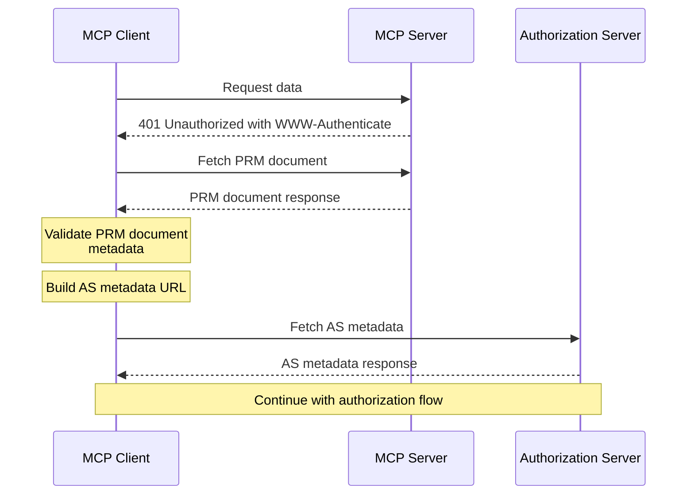
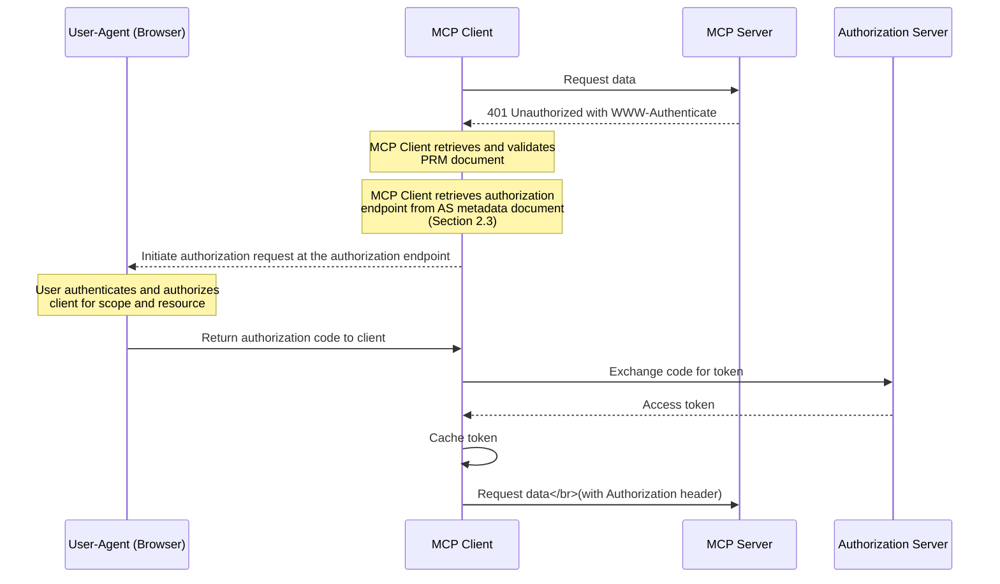
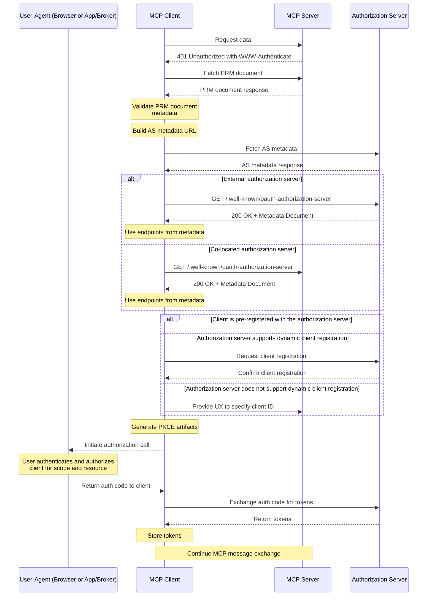
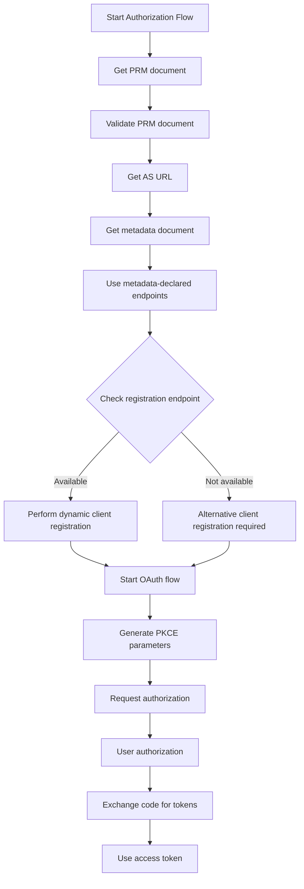

<Info>**Protocol Revision**: 2025-03-26</Info>

## 1. Introduction

### 1.1 Purpose and Scope

The Model Context Protocol provides authorization capabilities at the transport level, enabling MCP
clients to make requests to protected MCP servers on behalf of resource owners. This specification
defines the authorization flow for HTTP-based transports.

The scope of this document is **user authorization** - how a MCP client can authenticate a user
to access a MCP server and the MCP server determine whether to authorize the user to access its tools,
resources, or any other capabilities.

This document **does not discuss server-to-server authorization patterns**.

### 1.2 Baseline Tenets

1. **MCP server developers are not expected to be security experts.**. Developers should not be
   building their own authorization servers unless absolutely necessary, as they expect that MCP
   provides a basline secure authentication and authorization process.
1. **MCP clients are Authorization Server (AS)-agnostic**. When developers build MCP servers and secure
   them with an AS, they need to design them so that standard, off-the-shelf MCP clients can connect
   without needing any special modifications for the server's authorization setup.
   Not doing this will fragment the ecosystem. The specification explicitly assumes that clients are
   not enabled in any unique way to support specific AS implementations beyond what is covered here.
    - **Note:** It is acceptable for clients to be enhanced for specific Authorization Servers,
      primarily through pre-registration.
1. **User Authentication is not a MCP Server concern.** The MCP server can guide the client
   to the AS but will not be responsible for authenticating the user and obtaining credential
   artifacts for the user.
1. **We focus on OAuth 2.1, with room for extensibility for other providers/specifications.** Our
   guiding assumption is that most developers will want to use OAuth 2.1, however in the long-run
   unusual cases for authentication and authorization may emerge (e.g., mTLS, Kerberos), which will
   need clients to be extensible.

### 1.3 Protocol Requirements

Authorization is **OPTIONAL** for MCP implementations. When supported:

- Streamable HTTP or SSE transports **SHOULD** conform to this specification.
- Implementations using an STDIO transport **SHOULD NOT** follow this specification and instead
  retrieve credentials from the execution environment.
- Implementations using alternative transports **MUST** follow established security best practices for
  their protocol.

### 1.4 Standards Compliance

This authorization mechanism is based on established specifications listed below, but implements a
selected subset of their features to ensure security and interoperability while maintaining simplicity:

- [OAuth 2.1 IETF DRAFT](https://datatracker.ietf.org/doc/html/draft-ietf-oauth-v2-1-12)  
- OAuth 2.0 Authorization Server Metadata
  ([RFC 8414](https://datatracker.ietf.org/doc/html/rfc8414))  
- OAuth 2.0 Dynamic Client Registration Protocol
  ([RFC 7591](https://datatracker.ietf.org/doc/html/rfc7591))
- OAuth 2.0 Protected Resource Metadata
  ([RFC DRAFT](https://datatracker.ietf.org/doc/draft-ietf-oauth-resource-metadata/13/))
- OAuth 2.0 Demonstrating Proof of Possession (DPoP), for supporting clients
  ([RFC 9449](https://datatracker.ietf.org/doc/html/rfc9449))  
- Resource Indicators for OAuth 2.0
  ([RFC 8707](https://www.rfc-editor.org/rfc/rfc8707.html))

This specification **DOES NOT** require MCP server developers to implement their own authorization server (AS)
and instead relies on developers adopting dedicated and well-tested AS implementations.

This specification also enables existing deployments to leverage their current infrastructure.
As a side-effect, this also simplifies consent flows, and services that have multiple MCP Servers
won't require individual registration per client:server pair.

## 2. Authorization Flow

### 2.1 Overview

1. Authorization servers **MUST** implement OAuth 2.1 with appropriate security measures
   (see [RFC 9700](https://datatracker.ietf.org/doc/html/rfc9700)) for both confidential and
   public clients.

2. Authorization servers **SHOULD** support the OAuth 2.1 Dynamic Client Registration Protocol
   ([RFC 7591](https://datatracker.ietf.org/doc/html/rfc7591)).

3. Authorization servers **SHOULD** implement and MCP clients **MUST** consume OAuth 2.0 Authorization
   Server Metadata ([RFC 8414](https://datatracker.ietf.org/doc/html/rfc8414)).

4. MCP servers **MUST** implement and support Auth 2.0 Protected Resource Metadata
   ([RFC DRAFT](https://datatracker.ietf.org/doc/draft-ietf-oauth-resource-metadata/13/)).

### 2.2 Client OAuth 2.1 Authorization

When authorization is required and not yet proven by the client, servers **MUST** respond with
`HTTP 401 Unauthorized`.

A `HTTP 401 Unauthorized` response **MUST** include a `WWW-Authenticate` header with
the URL to the protected resource metadata document hosted by the MCP Server in
the following format:

```http
WWW-Authenticate: Bearer resource_metadata="https://resource.example.com/.well-known/oauth-protected-resource",
     scope="mcp:read mcp:write"
```

A MCP server **MUST** host its Protected Resource Metadata (PRM) document, as outlined in
[Section 3 of the RFC draft](https://www.ietf.org/archive/id/draft-ietf-oauth-resource-metadata-13.html#section-3).

A MCP server **MUST** return a set of scopes in the `scope` parameter within the `WWW-Authenticate` header
in the initial handshake as well as in subsequent responses that require incremental authorization.

A MCP server **MUST** include its AS configuration in the PRM document as outlined in
[Section 2 of the RFC draft](https://www.ietf.org/archive/id/draft-ietf-oauth-resource-metadata-13.html#section-2).

A MCP client **MUST** issue a `GET` request to the URL in `resource_metadata` to get information about
the AS.

A MCP client **MUST** verify that the `resource` value in the PRM document matches the MCP server
fully-qualified domain name.

A MCP client **SHOULD** evaluate or permit the user to evaluate the trustworthiness of AS
discovered through the PRM document to prevent phishing. For example, an MCP client could prompt 
the user "Do you want to login with `https://authserver.example`?"

A MCP client **MUST** use `authorization_servers` values from the PRM document to construct
the OAuth 2.0 metadata discovery document path, following
[RFC 8414](https://datatracker.ietf.org/doc/html/rfc8414#section-3).

A MCP client **MAY** use the AS-provided registration endpoint to register itself with the AS.

A MCP client **MAY** be pre-registered with an AS and not require dynamic registration.

A MCP client **MUST** send the `resource` identifier to the AS, following
[RFC 8707](https://www.rfc-editor.org/rfc/rfc8707.html).

A MCP client **MAY** implement Demonstrating Proof of Possession (DPoP) and use it to the extent
supported by the AS. See
[RFC 9449](https://datatracker.ietf.org/doc/html/rfc9449).

A MCP clients **MUST** initiate an
[OAuth 2.1 (draft)](https://datatracker.ietf.org/doc/html/draft-ietf-oauth-v2-1-12) authorization
flow after receiving a *HTTP 401 Unauthorized* response.

### 2.2.1 OAuth Grant Types

OAuth specifies different flows or grant types, which are different ways of obtaining an
access token. Each of these targets different use cases and scenarios.

MCP servers **SHOULD** support the OAuth grant types that best align with the intended
audience. For instance:

1. Authorization Code: useful when the client is acting on behalf of a (human) end user.
   - For instance, an agent calls an MCP tool implemented by a SaaS system.
2. Client Credentials: the client is another application (not a human)
   - For instance, an agent calls a secure MCP tool to check inventory at a specific
     store. No need to impersonate the end user.

MCP clients **MUST** support authorization code flow with PKCE, per
OAuth 2.1 specification.

MCP clients **MAY** choose to implement other authorization grant types
in addition to authorization code flow with PKCE.

### 2.3 MCP Server Authorization Metadata Discovery

MCP servers **MUST** return the full path to their PRM document in the `WWW-Authenticate` header
with a `HTTP 401 Unauthorized` response, following the format outlined in
[Section 2.2](#22-client-oauth-21-authorization).

MCP servers **MUST** follow [RFC 6750 Section 3.1](https://www.rfc-editor.org/rfc/rfc6750#section-3.1) for
any authorization failures.

For MCP server capability discovery:

- MCP clients **MUST** parse the `WWW-Authenticate` response to discover the path to the PRM document.
- MCP servers **SHOULD** include the PRM document path in error responses.
- MCP clients **SHOULD** evaluate or enable the user to evaluate the trustworthiness of authorization
  servers they are connecting to.
- Authorization servers **MUST** support
  [OAuth 2.0 Authorization Server Metadata](https://datatracker.ietf.org/doc/html/rfc8414)

The discovery flow is illustrated below:  



#### 2.3.1 Server Metadata Discovery Headers

MCP clients **SHOULD** include the header `MCP-Protocol-Version: <protocol-version>` during Server
Metadata Discovery to allow the MCP server to respond based on the MCP protocol version.

For example:

```http
MCP-Protocol-Version: 2024-11-05
```

### 2.4 Authorization Server Integration

#### 2.4.1 Overview

MCP clients **SHOULD** be considered _public clients_.

MCP servers **MUST NOT** complete public client flows on behalf of the MCP client (e.g., take 
authorization codes and exchange them for tokens with a public client ID, and then pass the tokens 
back to the client).

Public client flows **MUST** be completed by MCP Client using OAuth 2.1 Authorization
Code Flow with PKCE.

#### 2.4.2 Flow Description

The third-party authorization flow comprises these steps:

1. MCP client requests data from the MCP server.
1. MCP server responds with `HTTP 401 Unauthorized` and `WWW-Authenticate` header containing the
   URL to the PRM document.
1. MCP client retrieves and validates the PRM document.
1. MCP client retrieves the AS endpoint from the PRM document.
1. MCP client redirects user to the AS authorization endpoint. MCP client can include scopes that
   are defined in the PRM document or other scopes, as supported by the MCP server.
1. User authorizes with authorization server.
1. Authorization server redirects back to MCP client with authorization code.
1. MCP client exchanges the code for the requested tokens.
1. MCP client stores the token.
1. MCP client can now request data from the MCP server with the token attached in the `Authorization`
   header.



#### 2.4.4 Security Considerations

When implementing authorization with an existing AS, MCP servers **MUST**:

1. Request the minimum number of required scopes.  
2. Securely handle any tokens that need to be stored or otherwise managed by the MCP server.  
3. Implement appropriate session timeout handling.  
4. Consider security implications of token chaining.  
5. Implement proper error handling for authorization failures.

MCP clients **MUST**:

1. Securely store Access and Refresh Tokens received from the AS.  
2. Properly handle requests to renew and replace expired or invalid tokens (using the
   Refresh Token grant) or due to challenges (refer to
   [RFC 9470](https://www.rfc-editor.org/rfc/rfc9470.html)).
3. Verify that the `resource` identifier in the PRM document matches the MCP server.

Authorization servers **MUST**:

1. Verify that the resource identifier is registered for the audience of the access token issued.

### 2.5 Delegated Authorization or Colocated AS

In limited scenarios, MCP servers **MAY** implement their own AS, refer to as a _colocated AS_ due
to the MCP server _colocating_ itself, the resource server (RS) with the AS.

MCP servers **MUST** be considered _confidential clients_, as defined in
[RFC 6749 Section 2.1](https://datatracker.ietf.org/doc/html/rfc6749#section-2.1).

MCP servers that implement their own AS **MUST** host appropriate AS metadata, as outlined in
[RFC 8414 Section 3](https://datatracker.ietf.org/doc/html/rfc8414#section-3).

MCP servers **MAY** support delegated authorization through third-party AS.
In this flow, the MCP server acts as both an OAuth client (to the external AS) and an OAuth
AS (to the MCP client).

#### 2.5.1 Special Considerations

MCP servers that use delegated authorization or implement a colocated AS **MUST**:

1. Maintain secure mapping between third-party tokens and issued client sessions.
1. Never pass third-party tokens directly to the client.
1. Validate token status before granting any data access.
1. Implement appropriate token lifecycle management.  
1. Provide appropriate responses to the client if re-authentication is needed. Please refer to
   [RFC 9470 OAuth 2.0 Step Up Authentication Challenge Protocol](https://www.rfc-editor.org/rfc/rfc9470.html).

### 2.7 Dynamic Client Registration

MCP clients **SHOULD** support the
[OAuth 2.0 Dynamic Client Registration Protocol](https://datatracker.ietf.org/doc/html/rfc7591) to
allow MCP clients to obtain OAuth client IDs without user interaction. This provides a standardized
way for clients to automatically register with new servers, which is crucial for MCP because:

- Clients cannot know all possible servers in advance  
- Manual registration would create friction for users  
- It enables seamless connection to new servers  
- Servers can implement their own registration policies

MCP clients that want to dynamically register OAuth clients with an authorization server **MUST**
provide the `software_id` and `software_version` parameters, as defined in the
[Client Metadata](https://datatracker.ietf.org/doc/html/rfc7591#section-2) section of
[RFC 7591](https://datatracker.ietf.org/doc/html/rfc7591).

MCP clients with mass audiences will *generally* want to pre-register and hardcode client IDs.

Some authorization servers (such as Google and Microsoft) limit the functionality of dynamically
registered clients.

An MCP client **MAY** contain a configuration for common issuers, such as:

```json
[
  { "issuer":"https://authserver.example", "client_id":"12345"},
  { "issuer":"https://authserver2.example", "client_id":"urn:client_ids:546"}
]
```

Alternatively, an MCP client could allow the user to register the MCP client and provide those details
to the MCP client through a UI.

### 2.8 Authorization Flow Steps

The complete authorization flow proceeds as follows:  



#### 2.8.1 Decision Flow Overview



### 2.9 Access Token Usage

#### 2.9.1 Token Requirements

Access token handling **MUST** conform to
[OAuth 2.1 Section 5](https://datatracker.ietf.org/doc/html/draft-ietf-oauth-v2-1-12#section-5) or
[DPoP Section 7](https://datatracker.ietf.org/doc/html/rfc9449#section-7) (if client
supports DPoP) requirements for resource requests.

MCP client **MUST** use the `Authorization` request header field and **MUST NOT** use URI query string 
to transport tokens [OAuth Section 5.1.1](https://datatracker.ietf.org/doc/html/draft-ietf-oauth-v2-1-12#section-5.1.1):

```http
Authorization: Bearer <access-token>
```

or
[DPoP Section 7.1](https://datatracker.ietf.org/doc/html/rfc9449#name-the-dpop-authentication-sch)
(if client supports DPoP):

```http
Authorization: DPoP <access-token>
DPoP: <DPoP proof>
```

Note that `Authorization` header **MUST** be included in every HTTP request from client to server,
even if they are part of the same logical session.

#### 2.9.2 Token Handling

Resource servers (MCP servers _or_ downstream APIs) **MUST** validate access tokens as described
in [Section 5.2](https://datatracker.ietf.org/doc/html/draft-ietf-oauth-v2-1-12#section-5.2).

If validation fails, servers **MUST** respond according to
[Section 5.3](https://datatracker.ietf.org/doc/html/draft-ietf-oauth-v2-1-12#section-5.3) error
handling requirements. Invalid or expired tokens **MUST** receive a `HTTP 401` response.

### 2.10 Security Considerations

The following security requirements **MUST** be implemented:

1. MCP clients **MUST** securely store tokens following OAuth 2.1 best practices, as
   outlined in the
   [OAuth 2.1 Authorization Framework](https://datatracker.ietf.org/doc/html/draft-ietf-oauth-v2-1-12).
1. MCP servers **MUST** take all necessary steps to ensure no data is returned to unauthorized parties
   and **MUST** ensure any credentials are valid before processing the request. For example, a MCP server
   could validate inbound tokens through one of the following approaches:
  1. Token introspection, according to [RFC 7662](https://datatracker.ietf.org/doc/html/rfc7662).
     `aud` validation is a **MUST**.
  1. JWT validation, according to [RFC 9068](https://www.rfc-editor.org/rfc/rfc9068.html).
  1. Custom validation, according to the conventions established by the AS.
1. All authorization endpoints **MUST** be served over HTTPS.  
1. Authorization servers **MUST** validate redirect URIs to prevent open redirect vulnerabilities.
1. Redirect URIs **MUST** be either `localhost` URLs or HTTPS URLs.
1. Special considerations **MUST** be accounted for to prevent phishing through MCP servers.

### 2.11 Error Handling

Servers **MUST** return appropriate HTTP status codes for authorization errors:

| Status Code | Description  | Usage                                      |
| ----------- | ------------ | ------------------------------------------ |
| 401         | Unauthorized | Authorization required or token invalid    |
| 403         | Forbidden    | Invalid scopes or insufficient permissions |
| 400         | Bad Request  | Malformed authorization request            |

### 2.12 Implementation Requirements

1. Implementations **MUST** follow OAuth 2.1 security best practices.  
2. PKCE is **REQUIRED** for all clients.  
3. Token rotation **MUST** be implemented for enhanced security.  
4. Token lifetimes **MUST** be limited based on security requirements.

## 3. Best Practices

### 3.1 Authorization servers

Almost universally, MCP server developers should prefer integrating with existing AS (as
defined in [Section 2.4](#24-authorization-server-integration)) rather than colocate or
support delegated authoriziation (as defined in
[Section 2.5](#25-delegated-authorization-or-colocated-as-flows)). This significantly
reduces the burden on developers and reduces the risk of incorrect token handling
implementations.

### 3.2 Local clients as Public OAuth 2.1 Clients

We strongly recommend that local clients implement OAuth 2.1 as a public client:

1. Utilizing code challenges (PKCE) for authorization requests to prevent interception attacks.  
2. Implementing secure token storage appropriate for the local system.  
3. Following token refresh best practices to maintain sessions.  
4. Properly handling token expiration and renewal.

### 3.3 Dynamic Client Registration

Since clients do not know the set of MCP servers in advance, we strongly recommend the implementation
of dynamic client registration. This allows applications to automatically register with the MCP
server, and removes the need for users to obtain client IDs manually.

### 3.4 Separation of Concerns

To ensure the security of MCP servers and their customers, the following represent best practices
in ensuring that the concerns of MCP clients, MCP servers, and AS are properly separated.

A protected MCP server is responsible for hosting and protecting MCP-specific entities, such as tools,
prompts, resources, cached data, or any other artifacts directly managed by it.

MCP clients **MUST** present valid tokens with the protected MCP server as the audience and **MUST NOT**
use the MCP server as a pass-through to channel tokens issued to different audiences through it.

Protected MCP servers that receive tokens with an audience different than itself **MUST** reject
them under all circumstances (see [Section 3.11](#210-security-considerations) for validation
considerations).

MCP clients are responsible for performing an OAuth authorization flow, as outlined in
[Section 2.2.1](#221-oauth-grant-types) against the AS declared in the MCP server's PRM document.
This is the only OAuth relationship the client participates in.

Downstream OAuth calls (e.g., to third-party APIs) are implementation details left to the MCP
server developers to design. For those scenarios, the MCP server itself becomes an OAuth client,
and downstream interactions are handled entirely by the MCP server. The MCP client's authorization
relationship remains solely between itself and the MCP server's declared AS.
