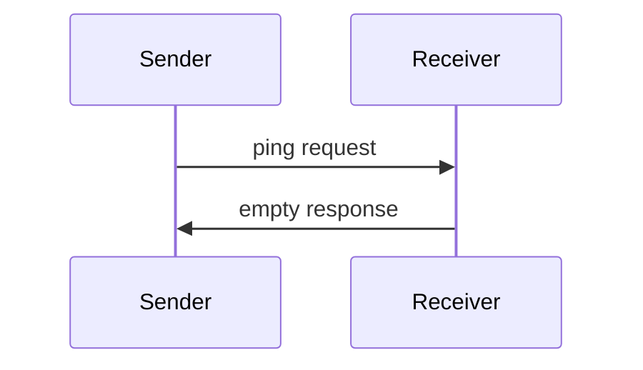

<Info>**Protocol Revision**: 2025-03-26</Info>

As MCP servers grow in complexity and number of tools, resources, and users, it may
be necessary to logically separate feature areas by namespace. MCP implements namespaces
using a NPM model whereby a single directory style prefix is used to group related tools,
prompts, and resources.

## Overview

Namespacing functionality is implemented through a simple, single depth hierarchy, `@weather`.
This namespace is then optionally included in method calls and name parameters.

## Namespace Format

A namespace must be a string of the form `@<namespace>` where `<namespace>` is a sequence of
alphanumeric characters (A-Z, a-z, 0-9), underscores, and / or hyphens.

### Tool, Resource, and Prompt Names
As part of being in a namespace, a tool name, resource name, or prompt name **MUST** begin with the namespace
`@weather/get_weather_forecast_by_location`.

## Namespace Filtering

### Namespacing Features
Namespaces are optional, but well known, on the name property of tools, resources, and prompts.

### Filtering

#### Namespace Prefix
1. List commands can be invoked by prepending a namespace prefix to the method name `@weather/tools/list`

## Usage Patterns

## Implementation Considerations

- Implementations **SHOULD** periodically issue pings to detect connection health
- The frequency of pings **SHOULD** be configurable
- Timeouts **SHOULD** be appropriate for the network environment
- Excessive pinging **SHOULD** be avoided to reduce network overhead

## Error Handling

- Timeouts **SHOULD** be treated as connection failures
- Multiple failed pings **MAY** trigger connection reset
- Implementations **SHOULD** log ping failures for diagnostics
