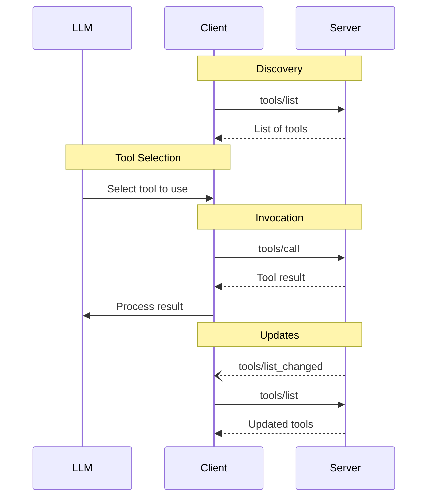

<Info>**Protocol Revision**: 2025-03-26</Info>

The Model Context Protocol (MCP) allows servers to expose tools that can be invoked by
language models. Tools enable models to interact with external systems, such as querying
databases, calling APIs, or performing computations. Each tool is uniquely identified by
a name and includes metadata describing its schema.

## User Interaction Model

Tools in MCP are designed to be **model-controlled**, meaning that the language model can
discover and invoke tools automatically based on its contextual understanding and the
user's prompts.

However, implementations are free to expose tools through any interface pattern that
suits their needs&mdash;the protocol itself does not mandate any specific user
interaction model.

<Warning>
For trust & safety and security, there **SHOULD** always
be a human in the loop with the ability to deny tool invocations.

Applications **SHOULD**:

- Provide UI that makes clear which tools are being exposed to the AI model
- Insert clear visual indicators when tools are invoked
- Present confirmation prompts to the user for operations, to ensure a human is in the
  loop
</Warning>

## Capabilities

Servers that support tools **MUST** declare the `tools` capability:

```json
{
  "capabilities": {
    "tools": {
      "listChanged": true
    }
  }
}
```

`listChanged` indicates whether the server will emit notifications when the list of
available tools changes.

## Protocol Messages

### Listing Tools

To discover available tools, clients send a `tools/list` request. This operation supports
[pagination](/specification/2025-03-26/server/utilities/pagination).

**Request:**

```json
{
  "jsonrpc": "2.0",
  "id": 1,
  "method": "tools/list",
  "params": {
    "cursor": "optional-cursor-value"
  }
}
```

**Response:**

```json
{
  "jsonrpc": "2.0",
  "id": 1,
  "result": {
    "tools": [
      {
        "name": "get_weather",
        "description": "Get current weather information for a location",
        "inputSchema": {
          "type": "object",
          "properties": {
            "location": {
              "type": "string",
              "description": "City name or zip code"
            }
          },
          "required": ["location"]
        },
        "outputSchema": {
          "type": "object",
          "properties": {
            "temperature": {
              "type": "number",
              "description": "Temperature in degrees Fahrenheit"
            },
            "conditions": {
              "type": "string",
              "description": "Weather conditions description"
            }
          }
        }
      }
    ],
    "nextCursor": "next-page-cursor"
  }
}
```

### Calling Tools

To invoke a tool, clients send a `tools/call` request:

**Request:**

```json
{
  "jsonrpc": "2.0",
  "id": 2,
  "method": "tools/call",
  "params": {
    "name": "get_weather",
    "arguments": {
      "location": "New York"
    }
  }
}
```

**Response:**

```json
{
  "jsonrpc": "2.0",
  "id": 2,
  "result": {
    "content": [
      {
        "type": "text",
        "text": "Here's the current weather for New York:"
      },
      {
        "type": "data",
        "data": {
          "temperature": 72,
          "conditions": "Partly cloudy",
          "forecast": [
            {"day": "Monday", "high": 75, "low": 65},
            {"day": "Tuesday", "high": 80, "low": 68}
          ]
        }
      }
    ],
    "isError": false
  }
}
```

### List Changed Notification

When the list of available tools changes, servers that declared the `listChanged`
capability **SHOULD** send a notification:

```json
{
  "jsonrpc": "2.0",
  "method": "notifications/tools/list_changed"
}
```

## Message Flow



## Data Types

### Tool

A tool definition includes:

- `name`: Unique identifier for the tool
- `description`: Human-readable description of functionality
- `inputSchema`: JSON Schema defining expected parameters
- `annotations`: optional properties describing tool behavior
- `output`: Optional configuration defining what content types the tool can return:
  - `strict`: If true, only declared content types will appear in responses
  - `content`: Configuration object for each supported content type:
    - `text`: Text response configuration
    - `image`: Image response configuration
    - `audio`: Audio response configuration
    - `resource`: Resource response configuration
    - `data`: JSON data response configuration

Each content type configuration can include:
- `count`: Whether the content type returns 'single' or 'multiple' items
- `description`: Human-readable description of the returned content
- For image/audio/resource: `mimeType`: String or array of strings specifying supported MIME type(s)
- For data: `schema` and `strict` options for JSON schema validation

<Warning>For trust & safety and security, clients **MUST** consider
tool annotations to be untrusted unless they come from trusted servers.</Warning>

#### Example Tool Definition

```json
{
  "name": "get_weather",
  "description": "Get current weather information for a location",
  "inputSchema": {
    "type": "object",
    "properties": {
      "location": {
        "type": "string",
        "description": "City name or zip code"
      }
    },
    "required": ["location"]
  },
  "output": {
    "strict": false,
    "content": {
      "text": {
        "count": "single",
        "description": "Human-readable weather description"
      },
      "image": {
        "count": "single",
        "description": "Weather radar image",
        "mimeType": ["image/png", "image/jpeg"]
      },
      "audio": {
        "count": "single",
        "description": "Weather forecast audio",
        "mimeType": "audio/mp3"
      },
      "resource": {
        "count": "multiple",
        "description": "Related weather resources",
        "mimeType": "application/pdf"
      },
      "data": {
        "count": "single",
        "description": "Structured weather data",
        "schema": {
          "type": "object",
          "properties": {
            "temperature": {
              "type": "number",
              "description": "Temperature in degrees Fahrenheit"
            },
            "conditions": {
              "type": "string",
              "description": "Weather conditions description"
            },
            "forecast": {
              "type": "array",
              "items": {
                "type": "object",
                "properties": {
                  "day": {"type": "string"},
                  "high": {"type": "number"},
                  "low": {"type": "number"}
                }
              }
            }
          }
        }
      }
    }
  }
}
```

### Tool Result

Tool results can contain multiple content items of different types:

#### Text Content

```json
{
  "type": "text",
  "text": "Tool result text"
}
```

#### Image Content

```json
{
  "type": "image",
  "data": "base64-encoded-data",
  "mimeType": "image/png"
}
```

#### Audio Content

```json
{
  "type": "audio",
  "data": "base64-encoded-audio-data",
  "mimeType": "audio/wav"
}
```

#### JSON Content (DataContent)

```json
{
  "type": "data",
  "data": {
    "temperature": 72,
    "conditions": "Partly cloudy",
    "forecast": [
      {"day": "Monday", "high": 75, "low": 65},
      {"day": "Tuesday", "high": 80, "low": 68}
    ]
  },
  "schema": "#/components/schemas/WeatherResponse"
}
```

The JSON content type (DataContent) allows structured data to be returned from tools. This enables more precise communication of complex, structured information that can be programmatically processed by the client or presented to the LLM.

The content includes:
- `type`: Must be "data"
- `data`: A JSON object containing the structured data
- `schema` (optional): Can be one of:
  - Omitted (in which case the tool's `output.content.data.schema` is implied)
  - A string URI reference to a schema
  - An inline object containing the full schema definition

Schema validation behavior:
- If `output.content.data.strict` is true, the data must validate against the entire schema
- Otherwise, partial schemas or schema fragments can be provided with the DataContent instance

#### Sample Tool Call with Structured Data Response

Request:
```json
{
  "jsonrpc": "2.0",
  "id": 2,
  "method": "tools/call",
  "params": {
    "name": "get_weather",
    "arguments": {
      "location": "New York"
    }
  }
}
```

Response with structured data:
```json
{
  "jsonrpc": "2.0",
  "id": 2,
  "result": {
    "content": [
      {
        "type": "text",
        "text": "Here's the current weather for New York:"
      },
      {
        "type": "data",
        "data": {
          "temperature": 72,
          "conditions": "Partly cloudy",
          "forecast": [
            {"day": "Monday", "high": 75, "low": 65},
            {"day": "Tuesday", "high": 80, "low": 68}
          ]
        }
      }
    ],
    "isError": false
  }
}
```

#### Embedded Resources

[Resources](/specification/2025-03-26/server/resources) **MAY** be embedded, to provide additional context
or data, behind a URI that can be subscribed to or fetched again by the client later:

```json
{
  "type": "resource",
  "resource": {
    "uri": "resource://example",
    "mimeType": "text/plain",
    "text": "Resource content"
  }
}
```

## Error Handling

Tools use two error reporting mechanisms:

1. **Protocol Errors**: Standard JSON-RPC errors for issues like:

   - Unknown tools
   - Invalid arguments
   - Server errors

2. **Tool Execution Errors**: Reported in tool results with `isError: true`:
   - API failures
   - Invalid input data
   - Business logic errors

Example protocol error:

```json
{
  "jsonrpc": "2.0",
  "id": 3,
  "error": {
    "code": -32602,
    "message": "Unknown tool: invalid_tool_name"
  }
}
```

Example tool execution error:

```json
{
  "jsonrpc": "2.0",
  "id": 4,
  "result": {
    "content": [
      {
        "type": "text",
        "text": "Failed to fetch weather data: API rate limit exceeded"
      }
    ],
    "isError": true
  }
}
```

## Security Considerations

1. Servers **MUST**:

   - Validate all tool inputs
   - Implement proper access controls
   - Rate limit tool invocations
   - Sanitize tool outputs

2. Clients **SHOULD**:
   - Prompt for user confirmation on sensitive operations
   - Show tool inputs to the user before calling the server, to avoid malicious or
     accidental data exfiltration
   - Validate tool results before passing to LLM
   - Implement timeouts for tool calls
   - Log tool usage for audit purposes
