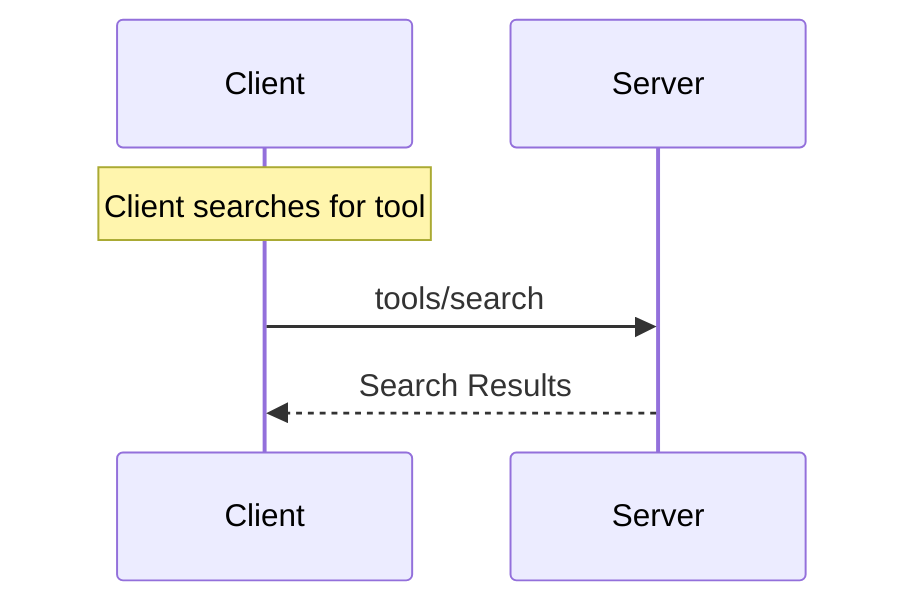

<Info>**Protocol Revision**: 2025-03-26</Info>

The Model Context Protocol (MCP) provides a standardized way for agents to search tools,
resources, prompts, and other features.

## User Interaction Model

Search in MCP is designed to facilitate discovery of tools for assisting and automating
tasks, especially in environments where the number of tools is either too large to be
reasonably paginated or there are concerns with LLM context length for the number of tools.

For example, given a prompt such as what's the weather in San Francisco, an LLM could
request a search of tools such as "Get weather data for North America". The list of tools
will be returned and ordered by relevance, with the server's approximation of most relevant
tools at the top.

Implementations are free to use any different method to enable search, from very simple
keyword search, to more complex embedded vectorization search.

## Capabilities

Servers that support search **MUST** declare the `search` capability in the respective
feature area:

```json
{
  "capabilities": {
    "tools": {
      "search": true
    }
  }
}
```

```json
{
  "capabilities": {
    "prompts": {
      "search": true
    }
  }
}
```

```json
{
  "capabilities": {
    "resources": {
      "search": true
    }
  }
}
```

## Protocol Messages

### Requesting earch

To get completion suggestions, clients send the appropriate request to the server, `tools/search`,
identifying both what feature set is being searched and providing a query. Pagination is handled
through the cursor, but the client **MUST** provide the original query parameter paired with the
cursor.

**Request:**

```json
{
  "jsonrpc": "2.0",
  "id": 1,
  "method": "tools/search",
  "params": {
    "query": "tools to return the weather in San Francisco",
    "cursor": "optional-cursor-value"
  }
}
```

**Response:**

```json
{
  "jsonrpc": "2.0",
  "id": 1,
  "result": {
    "tools": [
      {
        "name": "get_weather",
        "description": "Get current weather information for a location",
        "inputSchema": {
          "type": "object",
          "properties": {
            "location": {
              "type": "string",
              "description": "City name or zip code"
            }
          },
          "required": ["location"]
        }
      }
    ],
    "nextCursor": "next-page-cursor"
  }
}
```

### Search Results

Servers return an array of search results, matching the format of the list call for, for the
various features, ranked by relevance, with:

- Maximum 10 items per response
- Optional next cursor

## Message Flow



## Data Types

### SearchRequest

- `query`: Text that expresses what is being searched for. This can be a keyword (e.g., 'weather'), a description (e.g., 'cities weather is available for'), or a use case (e.g., 'trying to generate weather reports').
- `nextCursor`: An opaque pagination token

### SearchResult
Please see the list results in [Tools](/specification/2025-03-26/server/tools),
[Prompts](/specification/2025-03-26/server/prompts), and [Resources](/specification/2025-03-26/server/resources),

## Error Handling

Servers **SHOULD** return standard JSON-RPC errors for common failure cases:

- Method not found: `-32601` (Capability not supported)
- Missing required arguments: `-32602` (Invalid params)
- Internal errors: `-32603` (Internal error)

## Implementation Considerations

1. Servers **SHOULD**:
   - Return suggestions sorted by relevance
   - Implement embedded vectorization when possible to enable better natural language results
   - Rate limit search results
   - Validate all inputs

2. Clients **SHOULD**:
   - Use batching if it's not clear whether a tool, resource, or prompt is being searched
   - Cache results when possible
   - Facilitate pagination through the `nextCursor` field

## Security

Implementations **MUST**:

- Validate all search inputs
- Implement appropriate rate limiting
- Limit access to search results based on appropriate user controls
