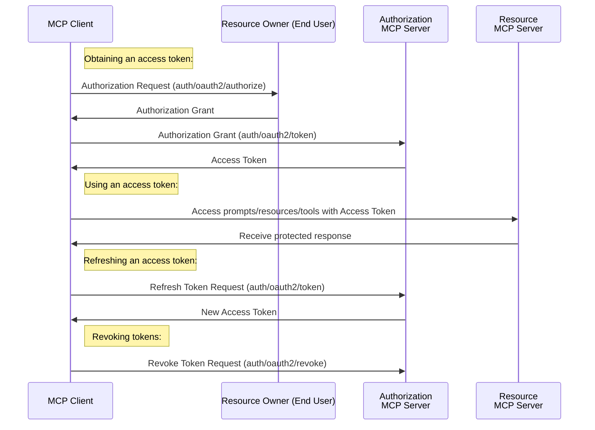


Auth is **experimental**, and being drafted for release in the next [revision]() of the protocol.

The additions to the base protocol are backwards compatible to revision 2024-11-05; however, **the auth specification may change in backwards incompatible ways** until the next protocol revision.


The Model Context Protocol (MCP) supports [OAuth 2.0](https://oauth.net/2/) as a standardized authentication method, allowing secure authorization flows between clients and servers. Tokens will be securely communicated as part of the request body.

## Protocol Flow
We follow the flows defined by [RFC 6749](https://datatracker.ietf.org/doc/html/rfc6749).


Note that the authorization server may be the same server as the resource server or a separate entity. A single authorization server may issue access tokens accepted by multiple resource servers.

## Capabilities

Clients supporting OAuth 2.0 **MUST** declare it during initialization:

```json
{
  "capabilities": {
    "auth": {
      "oauth2": true
    }
  }
}
```

Servers supporting OAuth 2.0 **MUST** include their capabilities:

```json
{
  "capabilities": {
    "auth": {
      "oauth2": {
        "authorize": true,
        "token": true,
        "revoke": true
      }
    }
  }
}
```

## Flows
### Initialization
During initialization, if the client and server both support the `oauth2` capability, the client **SHOULD** include an access token in all subsequent requests. If the client does not have an access token, the client **SHOULD** obtain one.

### Obtaining an Access Token

#### Authorization Grant Flow
To obtain an access token, clients **MUST** send an `auth/oauth2/authorize` request.

**Request:**
```typescript
{
  "jsonrpc": "2.0",
  "id": 1,
  "method": "auth/oauth2/authorize",
  "params": {
    "response_type": "code", // REQUIRED
    "client_id": "client_id", // REQUIRED
    "redirect_uri": "redirect_uri", // OPTIONAL
    "scope": "scope", // OPTIONAL
    "state": "state", // RECOMMENDED
  }
}
```
**Response:**
```json
{
  "jsonrpc": "2.0",
  "id": 1,
  "result": {
    "authorization_url": "<scheme>://<domain>/oauth2"
  }
}
```
- The client **MUST** redirect the user to the authorization URL.
- The authorization URL **SHOULD** prompt the user to configure any credentials as needed. Once complete, the server provides an authorization grant in the form of a code.
- The client **MUST** implement a way to receive the authorization grant. This can be through a callback such as the redirect URI, providing some interface for the user to provide it, etc.

#### Access Token Exchange Flow

After receiving the authorization code, the client **SHOULD** exchange it for tokens:

```json
{
  "jsonrpc": "2.0",
  "id": 1,
  "method": "auth/oauth2/token",
  "params": {
    "grant_type": "authorization_code",
    "code": "code",
    "state": "state"
  }
}
```

The server responds with tokens:

```typescript
{
  "jsonrpc": "2.0",
  "id": 2,
  "result": {
    "access_token": "access_token", // REQUIRED
    "token_type": "token_type", // REQUIRED
    "expires_in": 3600, // RECOMMENDED
    "scope": "scope", // OPTIONAL if idential to client-requested scope, otherwise REQUIRED
    "state": "state" // REQUIRED if the "state" parameter was present in the client authorization request.
    // OPTIONAL additional parameters
  }
}
```
- The client **MUST** securely store the access token, and a refresh token if one is included.
- The server **MUST** implement rate-limiting to prevent abuse.

### Utilizing an Access Token

Once a client has obtained an access token, it **SHOULD** include it in all requests in the parameters, including the initalization request.

**Request:**

```json
{
  "jsonrpc": "2.0",
  "id": 1,
  "method": "...",
  "params": {
    "auth": {
      "oauth2": {
        "access_token": "..."
      }
    }
  }
}
```

### Handling Expired Tokens

If the client has a refresh token, the client **SHOULD** automatically request a new access token with a `auth/oauth2/token` request. If the client does not have a valid refresh token, it **SHOULD** obtain an access token as if the user was authenticating for the first time.

**Request:**

```typescript
{
  "jsonrpc": "2.0",
  "id": 1,
  "method": "auth/oauth2/token",
  "params": {
    "refresh_token": "refresh_token", // REQUIRED
    "grant_type": "refresh_token", // REQUIRED, must be set to `refresh_token`
    "scope": "scope" // OPTIONAL
  }
}
```
The response will be identical to obtaining an access token for the first time.

### Revoke Token Flow

**Request:**

```json
{
  "jsonrpc": "2.0",
  "id": 1,
  "method": "auth/oauth2/revoke",
  "params": {
    "token": "access_or_refresh_token"
  }
}
```

## Error Handling
### Error Responses
If a request failed client authentication or is invalid the server should respond with an error response as described in [Section 5.2 of RFC 6749](https://datatracker.ietf.org/doc/html/rfc6749#section-5.2).

**Response:**
```typescript
{
  "jsonrpc": "2.0",
  "id": 1,
  "error": {
    "code": -32001,
    "message": "Auth error, please see nested data.",
    "data": {
      "authRequest": {
        "oauth2": {
          "error": "ASCII error code from 5.2", // REQUIRED
          "error_description": "Helpful message", // OPTIONAL
          "error_uri": "Helpful webpage" // OPTIONAL
        }
      }
    }
  }
}
```
Clients **SHOULD** handle errors as gracefully as possible with automated token refresh logic and presenting errors clearly.


### Server Guidelines

## Security Considerations

1. Clients **MUST**:
   - Follow security best practices outlined in the [OAuth 2.0 framework](https://datatracker.ietf.org/doc/html/rfc6749)
   - Securely store tokens
   - Provide clear user interfaces to token management, including obtaining and revoking tokens

2. Servers **MUST**:
   - Follow security best practices outlined in the [OAuth 2.0 framework](https://datatracker.ietf.org/doc/html/rfc6749)
   - Implement rate limiting for token endpoints
   - Validate all tokens
   - Support token revocation
   - Maintain secure storage of all secrets

3. Servers **SHOULD**:
   - Provide a UI that makes it easy for users to consent to and revoke access.
   - Provide a secure way for clients to obtain client secrets for sensitive applications.
   - Implement recommended/optional security features, such as scope, to limit client capabilities.
   