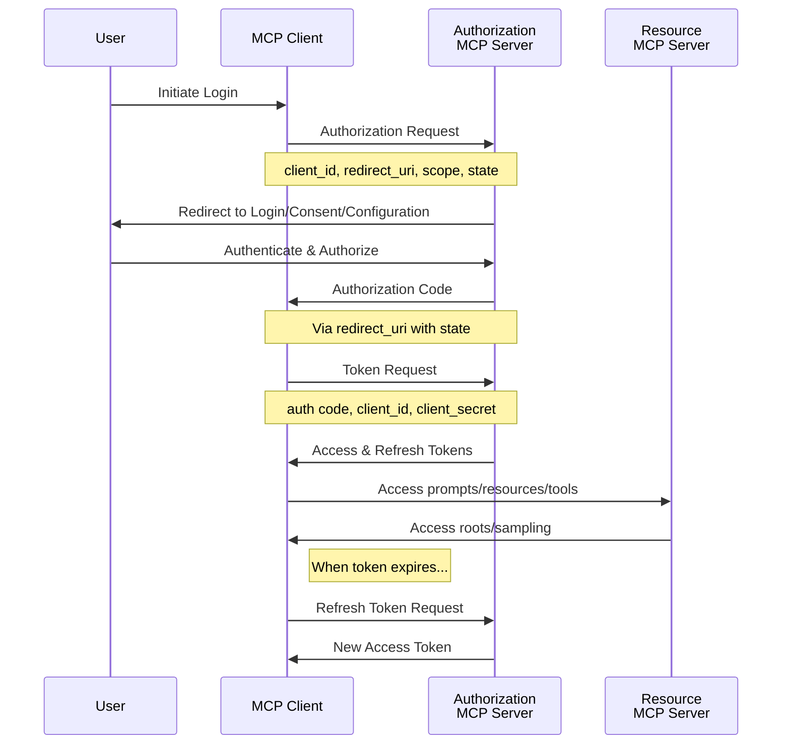


Auth is **experimental**, and being drafted for release in the next [revision]() of the protocol.

The additions to the base protocol are backwards compatible to revision 2024-11-05; however, **the auth specification may change in backwards incompatible ways** until the next protocol revision.


The Model Context Protocol (MCP) supports OAuth 2.0 as a standardized authentication method, allowing secure authorization flows between clients and servers. Tokens will be securely communicated as part of the request body.

## Protocol Flow



## Capabilities

Clients supporting OAuth 2.0 **MUST** declare it during initialization:

```json
{
  "capabilities": {
    "auth": {
      "oauth2": true
    }
  }
}
```

Servers supporting OAuth 2.0 **MUST** include their capabilities:

```json
{
  "capabilities": {
    "auth": {
      "oauth2": {
        "token": true,
        "revoke": true
      }
    }
  }
}
```

## Authentication Flows

### Get Access Token Flow

1. Initial Request

When a client without valid credentials attempts to initialize, the server **MUST** respond with an OAuth 2.0 authorization requirement in the form of an error:

```json
{
  "jsonrpc": "2.0",
  "id": 1,
  "error": {
    "code": -32001,
    "message": "OAuth 2.0 authorization required",
    "data": {
      "authRequest": {
        "authorizationUrl": "<scheme>://<domain>/oauth2",
        "clientId": "<client_id>",
        "scope": ["read", "write"],
        "responseType": "code",
        "state": "state"
      }
    }
  }
}
```
The authorization URL **SHOULD** prompt the user to configure any credentials as needed.

2. Authorization Code Exchange

After receiving the authorization code, the client **SHOULD** exchange it for tokens:

```json
{
  "jsonrpc": "2.0",
  "id": 2,
  "method": "auth/oauth2/token",
  "params": {
    "grant_type": "authorization_code",
    "code": "auth_code",
    "state": "xyz"
  }
}
```

The server responds with tokens:

```json
{
  "jsonrpc": "2.0",
  "id": 2,
  "result": {
    "access_token": "access_token",
    "refresh_token": "refresh_token",
    "expires_in": 3600
  }
}
```

### Valid Access Token Flow

Once a client has obtained an access token, it **SHOULD** include it in the initialization request:

```json
{
  "jsonrpc": "2.0",
  "id": 1,
  "method": "initialize",
  "params": {
    "protocolVersion": "...",
    "capabilities": {
      "auth": {
        "oauth2": true
      }
    },
    "auth": {
      "oauth2": {
        "access_token": "..."
      }
    }
  }
}
```

### Invalid Access Token Flow

If the access token is invalid, the server **MUST** respond with:

```json
{
  "jsonrpc": "2.0",
  "id": 1,
  "error": {
    "code": -32002,
    "message": "Descriptive OAuth 2.0 issue (invalid, expired, etc.)",
    "data": {
      "authRequest": {
        "authorizationUrl": "<scheme>://<domain>/oauth2",
        "client_id": "client_id",
        "scope": "scope",
        "responseType": "code",
        "state": "state"
      }
    }
  }
}
```

### Refresh Token Flow

When an access token expires, the client **SHOULD** request a new one using the refresh token:

```json
{
  "jsonrpc": "2.0",
  "id": 1,
  "method": "auth/oauth2/token",
  "params": {
    "refresh_token": "refresh_token",
    "grant_type": "refresh_token"
  }
}
```

Server response:

```json
{
  "jsonrpc": "2.0",
  "id": 1,
  "result": {
    "accessToken": "access_token",
    "refreshToken": "refresh_token",
    "expiresIn": 3600,
    "scope": "scope"
  }
}
```

### Revoke Token Flow

To revoke a token:

```json
{
  "jsonrpc": "2.0",
  "id": 1,
  "method": "auth/oauth2/revoke",
  "params": {
    "token": "access_or_refresh_token"
  }
}
```

## Error Handling

Servers **SHOULD** return specific error codes for common OAuth 2.0 failure cases:

- Invalid token: -32002
- Expired token: -32002
- Authorization required: -32001

Example error response:

```json
{
  "jsonrpc": "2.0",
  "id": 1,
  "error": {
    "code": -32002,
    "message": "Invalid OAuth 2.0 token",
    "data": {
      "authRequest": {
        "authorizationUrl": "<scheme>://<domain>/oauth2",
        "client_id": "client_id",
        "scope": "scope",
        "responseType": "code",
        "state": "state"
      }
    }
  }
}
```

## Implementation Requirements

### Client Requirements

Clients **MUST**:
1. Support the OAuth 2.0 authorization code flow
2. Securely store access and refresh tokens
3. Include valid tokens in request headers
4. Implement token refresh logic
5. Handle token revocation

### Server Requirements

Servers **MUST**:
1. Validate all tokens
2. Provide clear error messages for authentication failures
3. Support token refresh
4. Implement token revocation
5. Maintain secure token storage

## Security Considerations

1. Clients **MUST**:
   - Securely store tokens
   - Validate state parameters
   - Implement proper token refresh logic
   - Handle token revocation

2. Servers **MUST**:
   - Validate all tokens
   - Implement proper token expiration
   - Support token revocation
   - Maintain secure storage of client secrets
   - Implement rate limiting for token endpoints