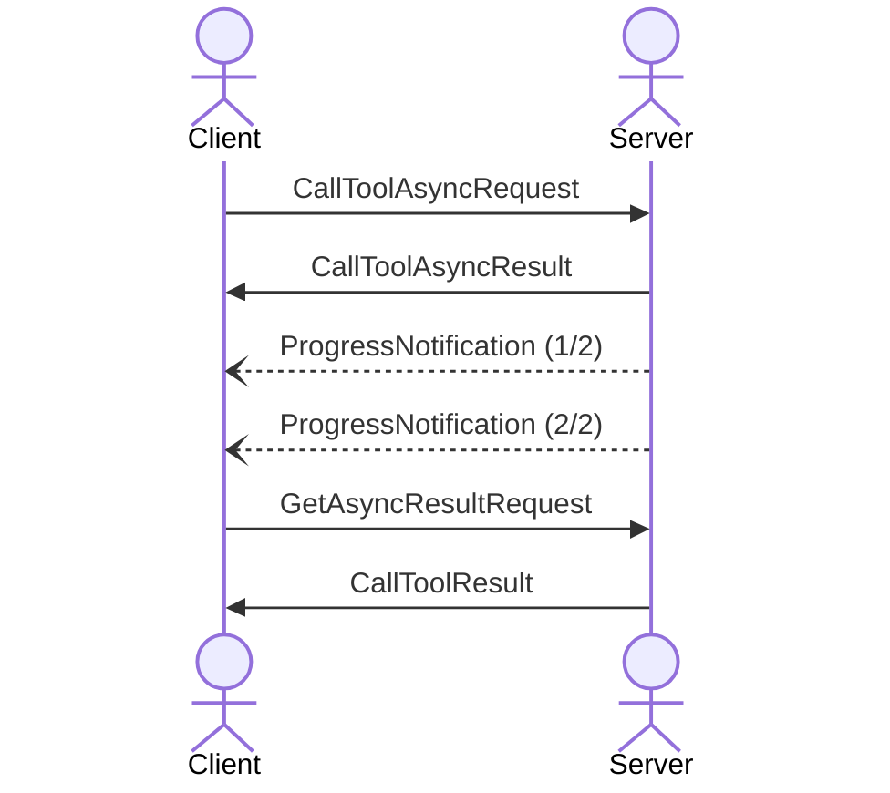
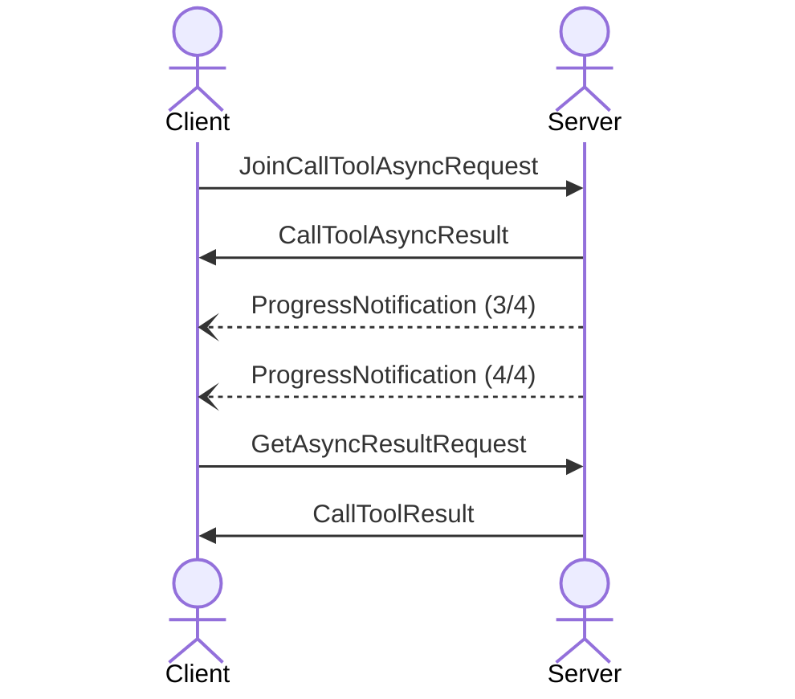
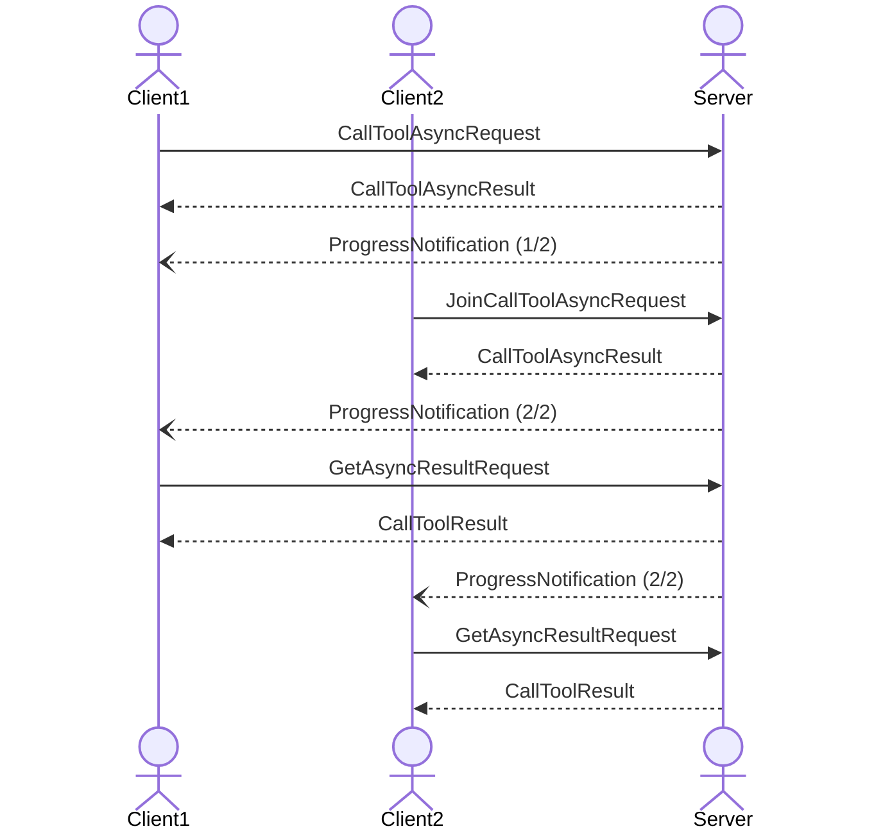
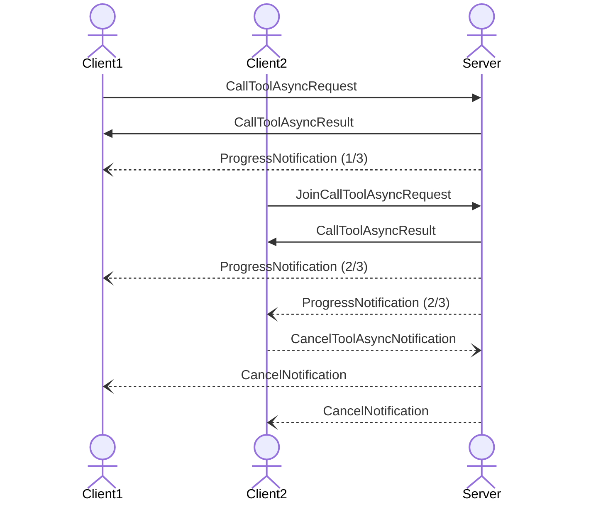

<Info>**Protocol Revision**: draft</Info>

The Model Context Protocol (MCP) defines a rigorous protocol for client-server 
async call tool requests.

## 1. Introduction

### 1.1 Purpose and Scope

The Model Context Protocol provides asyncronouse capabilities at the transport level,
enabling MCP clients to make asyncronous requests to call tools.

### 1.2 Protocol Requirements

Asynchronous tool calls is **OPTIONAL** for MCP implementations. When supported:

- Implementations **MUST** follow established security best practices for their protocol.

### 1.3 Standards Compliance

- TODO note any relevant standards in this space

### 2.1 Overview

#### 2.1.1 Basic usage

The following diagram shows a basic sequence of request, responses and notifications

#### 2.1.1 Join usage

A client may join an existing tool call request. A server MAY send all or partial progress notifications to the client

Multiple clients MAY join an existing tool call request. 

#### 2.1.1 Cancel usage

A client may cancel any in progress call tool requests. 
The server SHOULD notify all clients that have called or joined the async tool call of the cancellation
