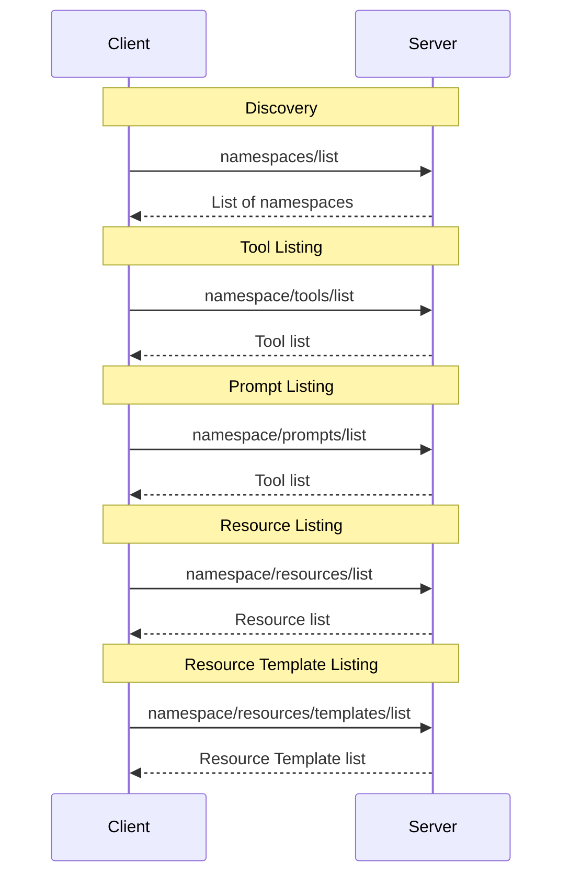

<Info>**Protocol Revision**: 2025-03-26</Info>

As MCP servers grow in complexity and number of tools, resources, and prompts, it may
be necessary to logically separate feature areas by namespace. MCP implements namespaces
using a single hierarchy model, where a specially annotated single preceding identifier is used to group related tools,
prompts, and resources.

## Overview

Namespacing functionality is implemented through a simple, single depth hierarchy, e.g. `weather`.
This namespace is then optionally included in method calls and name parameters.

## Capability
To indicate support for feature level advanced filtering, i.e. `<namespace>/tools/list`, the server **MAY** expose a
namespace capability:
```json
{
  "capabilities": {
    "namespaces": {}
  }
}
```

## Namespace Format
A namespace must be a string of is any of alphanumeric characters (A-Z, a-z, 0-9), underscores, and hyphens.
For instance, com_github would be an acceptable namespace.

### Tool, Resource, and Prompt Names
As part of being in a namespace, a tool name or prompt name **MUST** begin with the namespace, e.g.
`weather__get_weather_forecast_by_location`.

## Namespace Prefixing

### Listing

As an optional capability (for backwards compatibility), the server **MAY** expose a namespace list feature.

```json
{
  "capabilities": {
    "namespaces": {
      "list": true
    }
  }
}
```

**Request:**

```json
{
  "jsonrpc": "2.0",
  "id": 3,
  "method": "namespaces/list"
}
```

**Response:**

```json
{
  "jsonrpc": "2.0",
  "id": 3,
  "result": {
    "resourceTemplates": [
      {
        "name": "weather",
        "description": "Collection of tools, resources, and prompts to help with weather based queries. Includes tools to retrieve current weather by location, weather forecasts by location, and more."
      }
    ]
  }
}
```


2. List commands can be invoked by prepending a namespace prefix to the method name `weather/namespaces/list`, which

### Filtering
1. List commands can be invoked by prepending a namespace prefix to the method name `weather/tools/list`, which will
return a paginated list of tools within the `weather` namespace.

## Usage Patterns



## Implementation Considerations
- Namespace registration and requirement enforcement is an implementation detail - in shared environments, it may be
necessary to require tools have an approved namespaces, but this spec offers no guidance on this.
