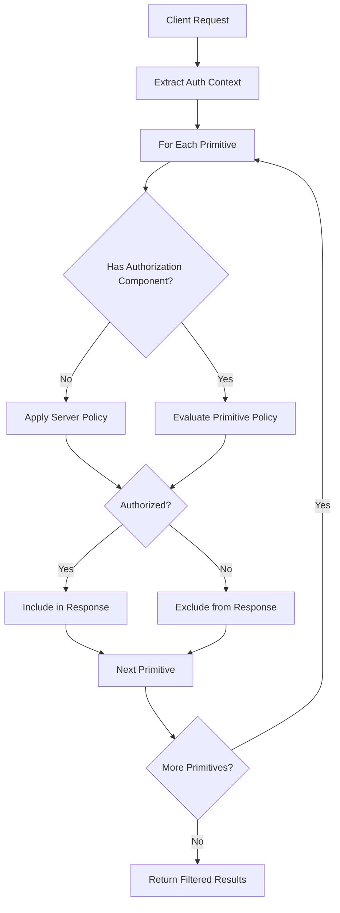

<div id="enable-section-numbers" />

<Info>**Protocol Revision**: draft</Info>

## Introduction

### Purpose and Scope

The Model Context Protocol provides authorization capabilities at the primitive level,
enabling MCP servers to control access to individual primitives (resources, prompts, tools, and roots)
based on the requesting client's identity and permissions. This specification defines
granular authorization mechanisms that extend beyond the all-or-nothing approach of
transport-level authorization.

This specification is applicable to **remote MCP servers** and builds upon the
foundation established in the [Authorization specification](./authorization).

### Protocol Requirements

Primitive authorization is **OPTIONAL** for MCP implementations. When supported:

- Implementations **MUST** first implement transport-level authorization as defined
  in the [Authorization specification](./authorization).
- Implementations **MUST** support per-primitive access control policies.
- Implementations **MUST** integrate with existing authentication and authorization
  mechanisms.
- Implementations **MUST** support non-disclosure of unauthorized primitives during
  discovery operations.

### Standards Compliance

This authorization mechanism builds upon the existing MCP authorization framework,
which requires OAuth 2.1 compliance. Implementations **MAY** support additional
established security patterns such as:

- Role-Based Access Control (RBAC)
- Attribute-Based Access Control (ABAC)
- Policy-based access control
- Custom authorization models

MCP servers **MUST** remain compliant with OAuth 2.1 as specified in the
[Authorization specification](./authorization), while the choice of additional
authorization patterns is left to implementers based on their specific requirements.

## Rationale

Current MCP authorization is all-or-nothing: clients either access all primitives
or none. This specification enables servers to control access to individual
primitives while maintaining interoperability.

**Key Problem**: Multi-tenant and enterprise deployments need granular access
control without forcing clients to attempt primitive invocation to discover
availability.

**Solution**: Standardized authorization metadata allows filtered primitive
discovery, enabling clients to present appropriate interfaces while preventing
information disclosure about unauthorized capabilities.

## Authorization Model

### Primitive Classes

MCP primitives can be classified into two authorization categories:

| Primitive Class | Description                                                                                                             |
| :-------------- | :---------------------------------------------------------------------------------------------------------------------- |
| **Public**      | Anyone with access to the MCP server, whether authorized or not, has access to the primitive.                           |
| **Restricted**  | To access the primitive, the MCP server must assess whether the requestor is authorized to access that specific entity. |

### Authorization Metadata

Each primitive definition **MAY** include an `authorization` component that specifies
access control requirements. The presence or absence of this component determines
the primitive's classification:

- **Presence** of `authorization` component: The primitive requires specific authorization
  evaluation and is not discoverable without satisfying the specified policy.
- **Absence** of `authorization` component: The primitive may or may not require
  global authorization as configured by the MCP server.

<Warning>

The `authorization` component is **exclusively for server-side policy evaluation**.
Servers **MUST NOT** include the `authorization` field in any responses to clients.
This metadata is used internally by the server to make access control decisions
and must never be exposed to prevent information disclosure about authorization
requirements.

</Warning>

## Primitive Authorization Structure

### Example: Tool with Authorization

```json
{
  "name": "create-file",
  "description": "Creates a new file with the specified content at the given path",
  "inputSchema": {
    "type": "object",
    "properties": {
      "path": {
        "type": "string",
        "description": "The file path where the file should be created"
      },
      "content": {
        "type": "string",
        "description": "The content to write to the file"
      }
    },
    "required": ["path", "content"]
  },
  "authorization": {
    "allowed_roles": ["admin", "contributor", "manager"],
    "allowed_scopes": ["files:write", "workspace:modify"],
    "required_claims": {
      "organization": "example-org"
    }
  },
  "annotations": {
    "title": "Create File",
    "readOnlyHint": false,
    "destructiveHint": true,
    "idempotentHint": false,
    "openWorldHint": true
  }
}
```

## Discovery and Access Control

### Filtered Discovery

When an MCP client invokes discovery operations (such as `tools/list`, `resources/list`,
`prompts/list`, or `roots/list`), the server **MUST**:

1. Extract authorization context from the request (e.g., `Authorization` header)
2. Evaluate each primitive's authorization requirements against the client's permissions
3. Return only primitives that the client is authorized to access
4. **NOT** disclose the existence of unauthorized primitives
5. **Remove** the `authorization` field from all primitive definitions before sending to clients

#### Example Client Response

For the tool definition shown above, an authorized client would receive:

```json
{
  "tools": [
    {
      "name": "create-file",
      "description": "Creates a new file with the specified content at the given path",
      "inputSchema": {
        "type": "object",
        "properties": {
          "path": {
            "type": "string",
            "description": "The file path where the file should be created"
          },
          "content": {
            "type": "string",
            "description": "The content to write to the file"
          }
        },
        "required": ["path", "content"]
      },
      "annotations": {
        "title": "Create File",
        "readOnlyHint": false,
        "destructiveHint": true,
        "idempotentHint": false,
        "openWorldHint": true
      }
    }
  ]
}
```

Note that the `authorization` field is completely absent from the client response.

### Authorization Evaluation Process

For each primitive during discovery, the server **MUST**:

1. Check if the primitive has an `authorization` component
2. If no `authorization` component exists, apply server-wide authorization policy
3. If `authorization` component exists, evaluate the specified policy requirements
4. Include the primitive in the response only if authorization succeeds



## Runtime Authorization

### Invocation-Time Checks

When a client attempts to invoke a restricted primitive, the server **MUST**:

1. Re-evaluate authorization policies at invocation time.
2. Verify that the client still has the required permissions.
3. Handle cases where additional authorization may be required.

### Authorization Challenges

If a primitive requires additional permissions beyond those available in the current
authorization context, the server **MUST**:

1. Respond with `HTTP 401 Unauthorized`
2. Include a `WWW-Authenticate` header following RFC 9728 Protected Resource Metadata
3. Provide the resource metadata URL for client authorization server discovery

Example response:

```
HTTP/1.1 401 Unauthorized
WWW-Authenticate: Bearer error="insufficient_scope",
                  error_description="Additional scopes required: files:write workspace:modify",
                  resource="https://mcp.example.com/.well-known/oauth-protected-resource"
```

The client **MUST** then follow the Protected Resource Metadata discovery process
as defined in the [Authorization specification](./authorization) to obtain the
necessary additional permissions.

## Policy Integration

### Policy Engine Flexibility

The authorization framework is designed to be policy engine-agnostic. Servers **MAY**
integrate with various authorization systems:

- Identity provider-based policies
- External policy decision points (e.g., [AuthZen](https://openid.net/specs/authorization-api-1_0-01.html)-compliant services)
- Custom authorization logic
- Hybrid approaches combining multiple systems

Servers implementing external policy decision points **SHOULD** consider using
standardized authorization APIs such as AuthZen for improved interoperability.

### Additional Metadata Resolution

When the authorization token lacks sufficient information for policy evaluation,
servers **MAY**:

1. Perform synchronous lookups to retrieve additional user attributes.
2. Use cached authorization decisions with appropriate expiration.
3. Implement token exchange or augmentation flows.
4. Query external policy decision points.

### Policy Interpretation

Servers have full discretion over policy interpretation, including:

- Whether **all** or **any** requirements must be satisfied
- How to handle policy conflicts or ambiguities
- When to require additional authorization flows
- Caching strategies for authorization decisions

## Security Considerations

### Principle of Least Privilege

Servers **SHOULD**:

- Default to restrictive policies unless explicitly configured otherwise.
- Regularly review and audit primitive authorization configurations.
- Implement time-based access controls where appropriate.

### Information Disclosure

Servers **MUST NOT**:

- Reveal the existence of primitives the client is not authorized to access.
- Include unauthorized primitives in error messages or metadata.
- Provide hints about authorization requirements for inaccessible primitives.

### Token Validation

Servers **MUST**:

- Validate authorization tokens on every request.
- Handle token expiration and refresh scenarios appropriately.
- Implement proper token revocation checking where supported.
