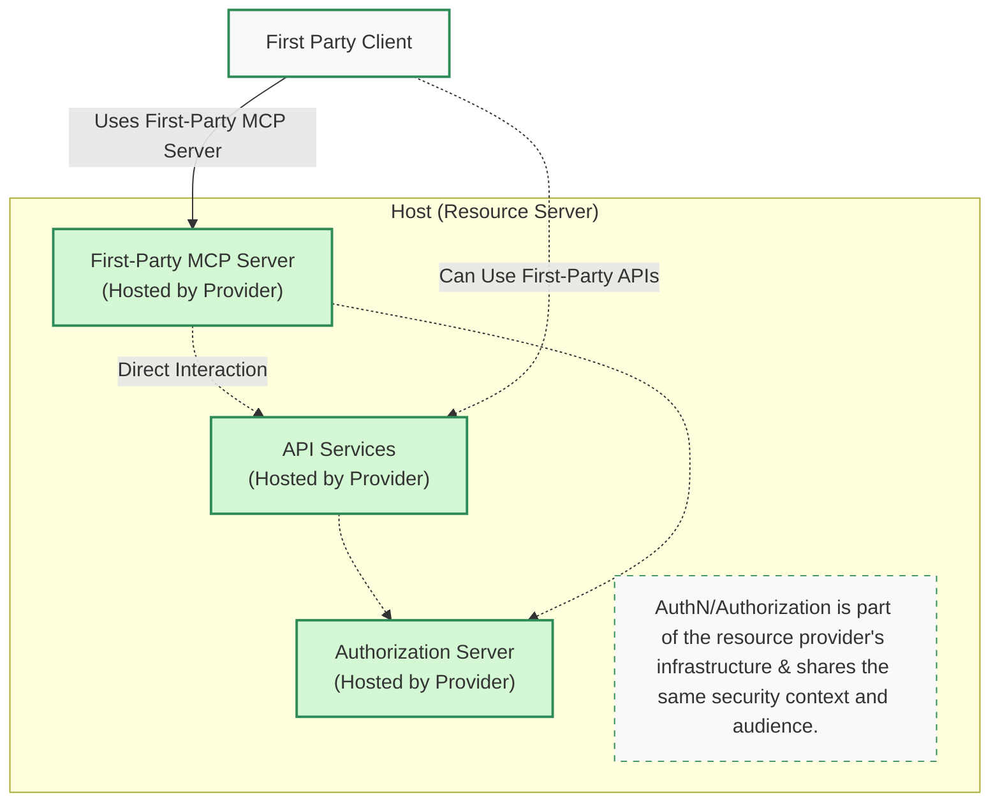
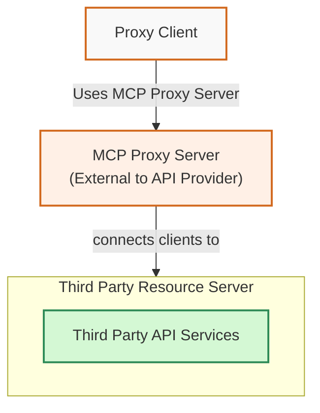
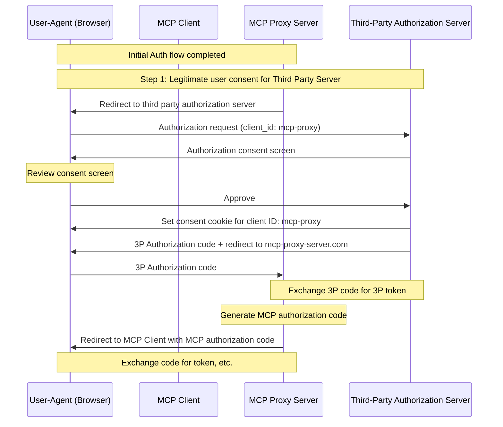
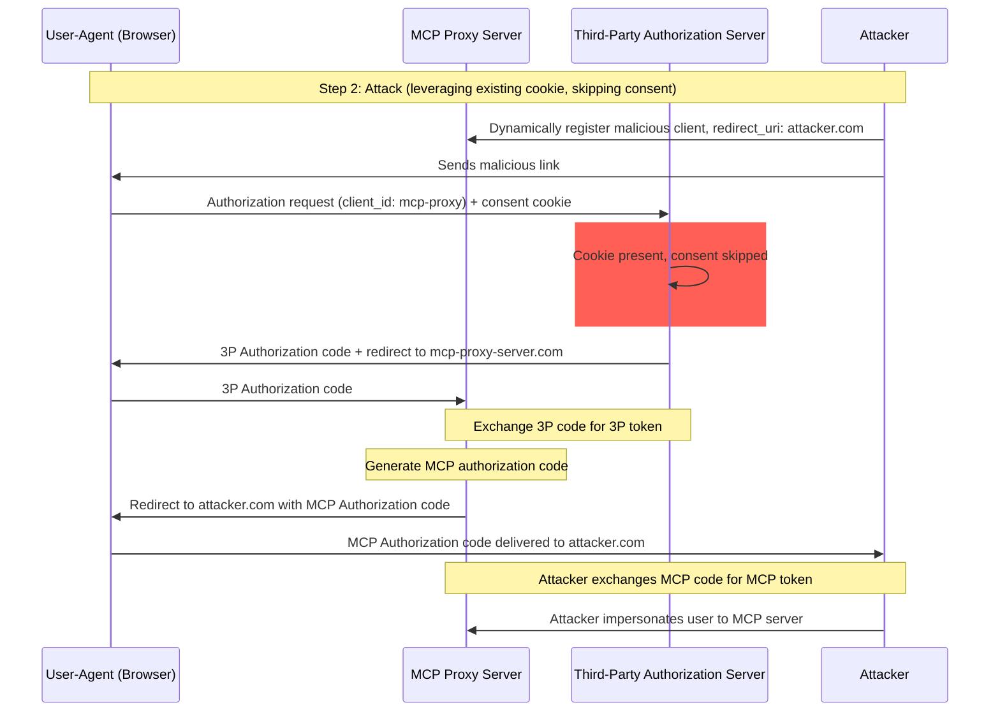

## Introduction

### Purpose and Scope

This document provides security considerations for the Model Context Protocol (MCP), complementing the MCP Authorization specification. This document identifies security risks, attack vectors, and best practices specific to MCP implementations.

The primary audience for this document includes developers implementing MCP authorization flows, MCP server operators, and security professionals evaluating MCP-based systems. This document should be read alongside the MCP Authorization specification and [OAuth 2.0 security best practices](https://datatracker.ietf.org/doc/html/rfc9700).

## Common Terminology & Context

### Terminology Reference Diagrams

Common terminology and context are essential for understanding the security considerations in this document. The following sections define key terms and provide a reference diagram to illustrate the architecture of MCP implementations.

**First-Party Hosted MCP Server**
: An MCP server that directly controls both the resources it serves and the authorization infrastructure, eliminating the need for third-party OAuth flows. This first-party architecture simplifies security management by keeping all components under unified administrative control, commonly used by SaaS platforms serving their own APIs through MCP.

**MCP Proxy Server**
: An MCP server that connects MCP clients to third-party APIs, offering MCP features while delegating operations and acting as a single OAuth client to the third-party API server.

**Third-Party Authorization Server**
: Authorization server that protects the third-party API. It may lack dynamic client registration support, requiring MCP proxy to use a static client ID for all requests.

**Third-Party API**
: The protected resource server that provides the actual API functionality. Access to this
API requires tokens issued by the third-party authorization server.

**Static Client ID**
: A fixed OAuth 2.0 client identifier used by the MCP proxy server when communicating with
the third-party authorization server. This Client ID refers to the MCP server acting as a client
to the Third-Party API. It is the same value for all MCP server to Third-Party API interactions regardless of
which MCP client initiated the request.

### Terminology Reference Diagrams

The following diagrams provide visual context for the terminology used in this document.

#### First-Party Hosted MCP Server Architecture

The following diagram illustrates First-Party Hosted MCP Servers.

#### Third-Party MCP Server Architecture

The following diagram illustrates MCP Proxy Servers which sit outside the boundaries of the Resource Server.

## Attacks and Mitigations

This section gives a detailed description of attacks on MCP implementations, along with potential countermeasures.

### Confused Deputy Problem

Attackers can exploit MCP servers proxying other resource servers, creating "[confused deputy](https://en.wikipedia.org/wiki/Confused_deputy_problem)" vulnerabilities.

#### Architecture and Attack Flows

##### Normal OAuth proxy usage (preserves user consent)

##### Malicious OAuth proxy usage (skips user consent)

#### Attack Description

When an MCP proxy server uses a static client ID to authenticate with a third-party
authorization server that does not support dynamic client registration, the following
attack becomes possible:

1. A user authenticates normally through the MCP proxy server to access the third-party API
2. During this flow, the third-party authorization server sets a cookie on the user agent
   indicating consent for the static client ID
3. An attacker later sends the user a malicious link containing a crafted authorization request which contains a malicious redirect URI along with a new dynamically registered client ID
4. When the user clicks the link, their browser still has the consent cookie from the previous legitimate request
5. The third-party authorization server detects the cookie and skips the consent screen
6. The MCP authorization code is redirected to the attacker's server (specified in the crafted redirect_uri during dynamic client registration)
7. The attacker exchanges the stolen authorization code for access tokens for the MCP server without the user's explicit approval
8. Attacker now has access to the third-party API as the compromised user

#### Mitigation

MCP proxy servers using static client IDs **MUST** obtain user consent for each dynamically
registered client before forwarding to third-party authorization servers (which may require additional consent).

### Token Passthrough

"Token passthrough" is an anti-pattern where an MCP server accepts tokens from an MCP client without validating that the tokens were properly issued _to the MCP server_ and "passing them through" to the downstream API.

#### Risks

Token passthrough is explicitly forbidden in the [authorization specification](/specification/draft/basic/authorization) as it introduces a number of security risks, that include:

- **Security Control Circumvention**
  - The MCP Server or downstream APIs might implement important security controls like rate limiting, request validation, or traffic monitoring, that depend on the token audience or other credential constraints. If clients can obtain and use tokens directly with the downstream APIs without the MCP server validating them properly or ensuring that the tokens are issued for the right service, they bypass these controls.
- **Accountability and Audit Trail Issues**
  - The MCP Server will be unable to identify or distinguish between MCP Clients when clients are calling with an upstream-issued access token which may be opaque to the MCP Server.
  - The downstream Resource Server’s logs may show requests that appear to come from a different source with a different identity, rather than the MCP server that is actually forwarding the tokens.
  - Both factors make incident investigation, controls, and auditing more difficult.
  - If the MCP Server passes tokens without validating their claims (e.g., roles, privileges, or audience) or other metadata, a malicious actor in possession of a stolen token can use the server as a proxy for data exfiltration.
- **Trust Boundary Issues**
  - The downstream Resource Server grants trust to specific entities. This trust might include assumptions about origin or client behavior patterns. Breaking this trust boundary could lead to unexpected issues.
  - If the token is accepted by multiple services without proper validation, an attacker compromising one service can use the token to access other connected services.
- **Future Compatibility Risk**
  - Even if an MCP Server starts as a "pure proxy" today, it might need to add security controls later. Starting with proper token audience separation makes it easier to evolve the security model.

#### Mitigation

MCP servers **MUST NOT** accept any tokens that were not explicitly issued for the MCP server.
