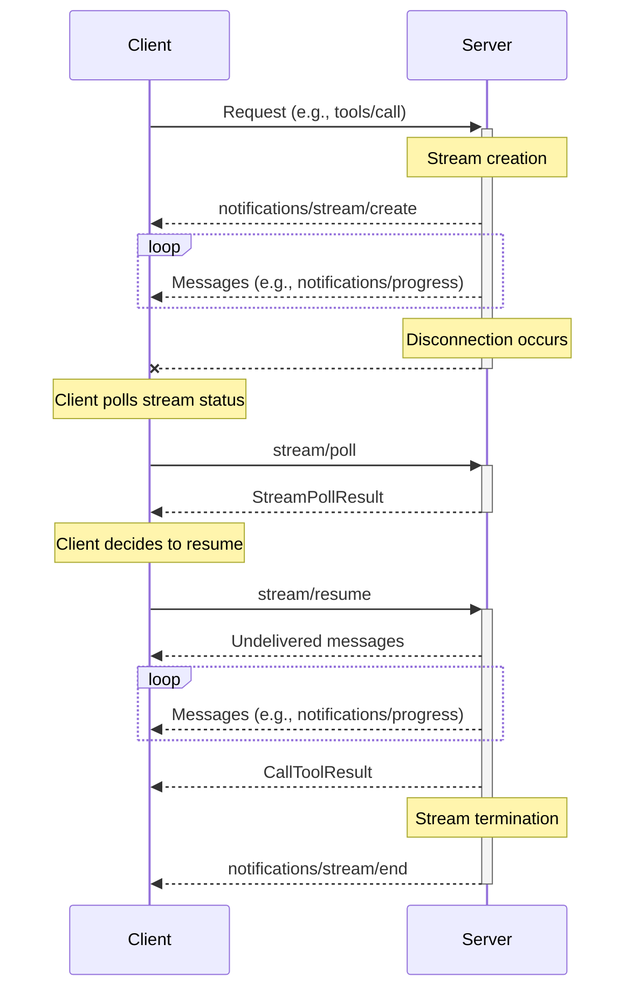
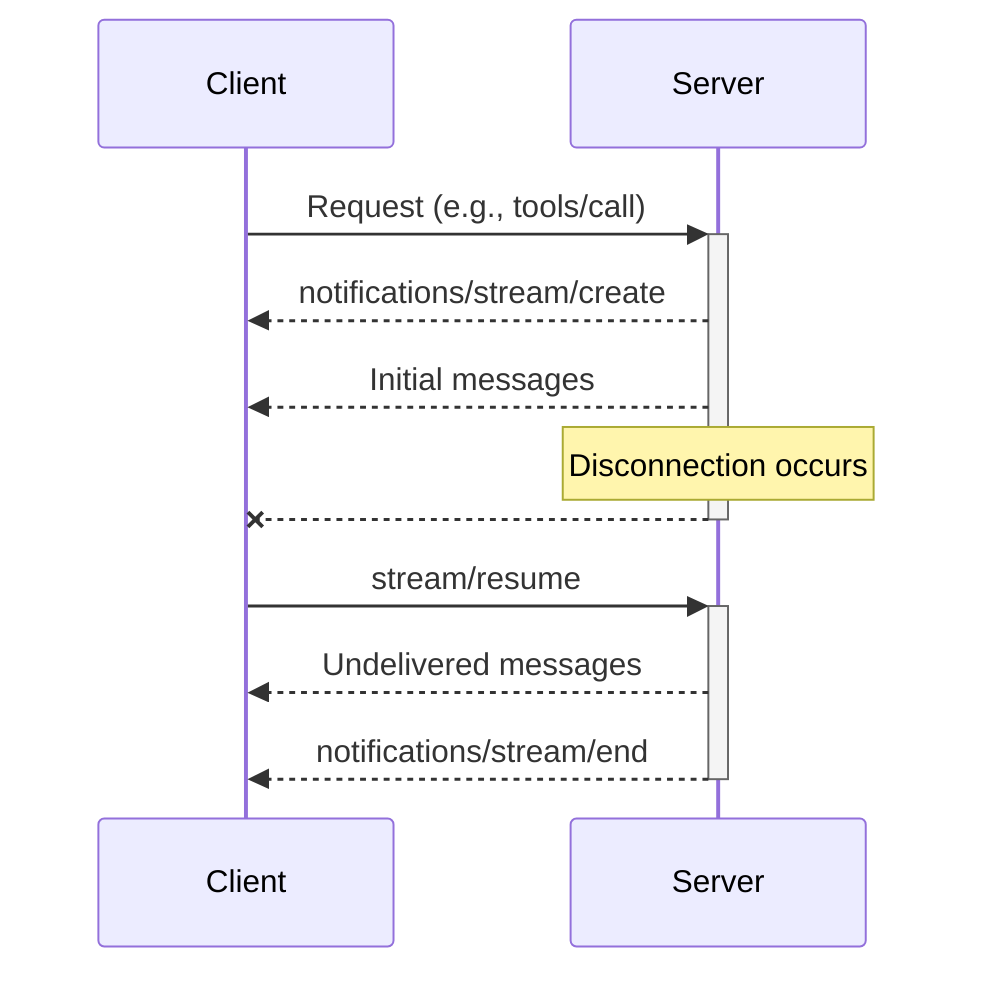
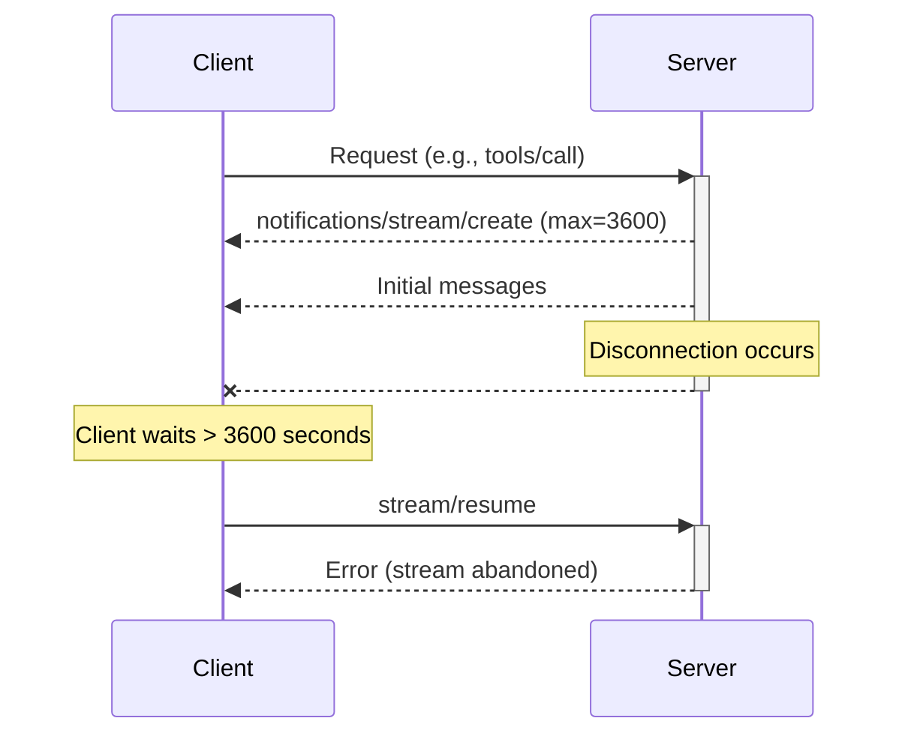
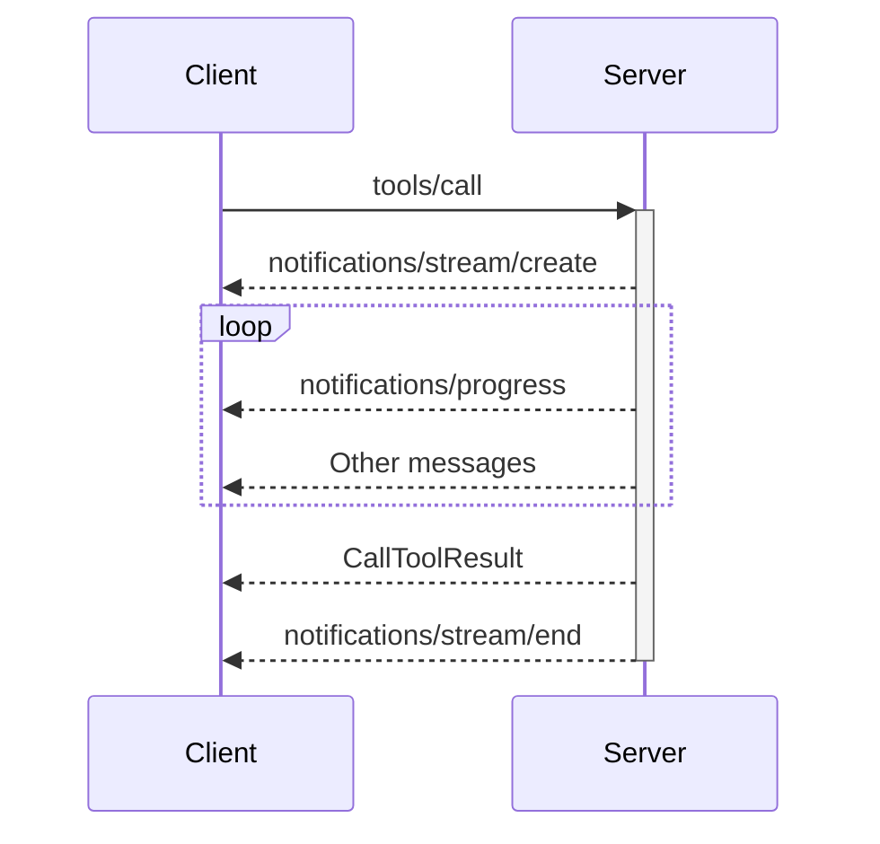

<div id="enable-section-numbers" />

<Info>**Protocol Revision**: draft</Info>

MCP defines a transport-agnostic mechanism for resumable streams that allow clients and servers to maintain state across disconnections.

- Clients and servers can use streams regardless of transport (HTTP, WebSocket, stdio, etc.).
- Clients and servers can disconnect and reconnect without losing progress.
- Servers can communicate expiration timeouts and reclaim resources thereafter.
- Clients can poll stream status after disconnect without fetching all undelivered messages.

## Lifecycle

A stream follows a defined lifecycle:

1. **Creation**: Server creates a stream and sends a `notifications/stream/create` notification with a unique stream ID.
2. **Live**: Messages are sent as part of the stream.
3. **Completion**: Server sends a `notifications/stream/end` notification when the stream is complete.

In the event of disconnection, the client may send a `stream/poll` to check the stream's status, and a `stream/resume` request to receive messages from the stream.



### Creation

When a client sends a request that might cause a long-running response, the server can create a stream by sending a `notifications/stream/create` notification with a unique stream ID, a resume token, and resume interval parameters.

```json
{
  "jsonrpc": "2.0",
  "method": "notifications/stream/create",
  "params": {
    "stream": {
      "streamId": "550e8400-e29b-41d4-a716-446655440000",
      "resumeToken": "eyJhbGciOiJIUzI1NiIsInR5cCI6IkpXVCJ9...",
      "requestId": "1",
      "resumeInterval": {
        "min": 5,
        "max": 3600
      }
    }
  }
}
```

- `streamId` and `resumeToken` are used to resume or poll the stream in the event of disconnection.
- `resumeInterval.min` specifies the minimum seconds a client should wait before resuming or polling the stream in order to prevent excessive reconnections.
- `resumeInterval.max` specifies the maximum seconds a client may wait before the server considers the stream abandoned.

### Disconnection and Resumption

Either the client or server may disconnect at any time. After a disconnection, the client can resume the stream by sending a `stream/resume` request with the stream ID and resume token.

```json
{
  "jsonrpc": "2.0",
  "method": "stream/resume",
  "params": {
    "streamId": "550e8400-e29b-41d4-a716-446655440000",
    "resumeToken": "eyJhbGciOiJIUzI1NiIsInR5cCI6IkpXVCJ9..."
  }
}
```

When a client sends a `stream/resume` request, the server should:

1. Send all undelivered messages for the stream to the client.
2. If the stream has ended, send a `notifications/stream/end` notification after sending all other undelivered messages.
3. If the stream ID or resume token is invalid, respond with an error.



<Note>

When using the [Streamable HTTP transport](/specification/draft/basic/transports#streamable-http) to stream messages, a server cannot definitively know whether a message has been delivered. Clients use the `Last-Event-ID` HTTP header upon reconnect to indicate the last delivered messages.

In order to provide message delivery guarantees, servers may use monotonic SSE event IDs, and maintain a buffer of recently sent messages (a two minute window aligns with common TCP idle timeout configurations). When a client resumes a stream, the `Last-Event-ID` header can be used to determine which messages in the buffer should be discarded before sending the remainder to the client.

</Note>

### Polling

Clients can check a stream's status without fetching all undelivered messages by sending a `stream/poll` request with the stream ID and resume token.

```json
{
  "jsonrpc": "2.0",
  "id": 2,
  "method": "stream/poll",
  "params": {
    "streamId": "550e8400-e29b-41d4-a716-446655440000",
    "resumeToken": "eyJhbGciOiJIUzI1NiIsInR5cCI6IkpXVCJ9..."
  }
}
```

The response will indicate the status of the stream as well as whether there are pending messages.

```json
{
  "jsonrpc": "2.0",
  "id": 2,
  "result": {
    "streamId": "550e8400-e29b-41d4-a716-446655440000",
    "status": "live",
    "pendingMessages": true,
    "hasRequest": false,
    "hasError": false
  }
}
```

- `status`: The stream status (`"live"` or `"completed"`)
- `pendingMessages`: Whether there are pending messages
- `hasRequest`: Whether any pending messages include a server-to-client request
- `hasError`: Whether any pending messages include an error result

### Abandonment

If a client does not resume or poll a stream within the `resumeInterval.max` period, the server may consider the stream abandoned and reclaim resources. The next time the client attempts to resume or poll the stream, the server may respond with an error.



### Termination

When a stream completes, the server sends a `notifications/stream/end` notification.

```json
{
  "jsonrpc": "2.0",
  "method": "notifications/stream/end",
  "params": {
    "streamId": "550e8400-e29b-41d4-a716-446655440000"
  }
}
```

## Using Streams with Tool Calls

A common pattern is to use streams with tool calls that might take a long time to complete. When using streams with tool calls:

1. The server sends a `notifications/stream/create` notification immediately after receiving the tool call request.
2. The server can send progress updates and other messages as part of the stream.
3. When the tool call completes, the server sends the result.
4. The server ends the stream with a `notifications/stream/end` notification.



## Security Considerations

- Resume tokens should be treated as sensitive information as they can be used to retrieve message history.
- Servers should validate that clients have appropriate permissions to resume a stream.
