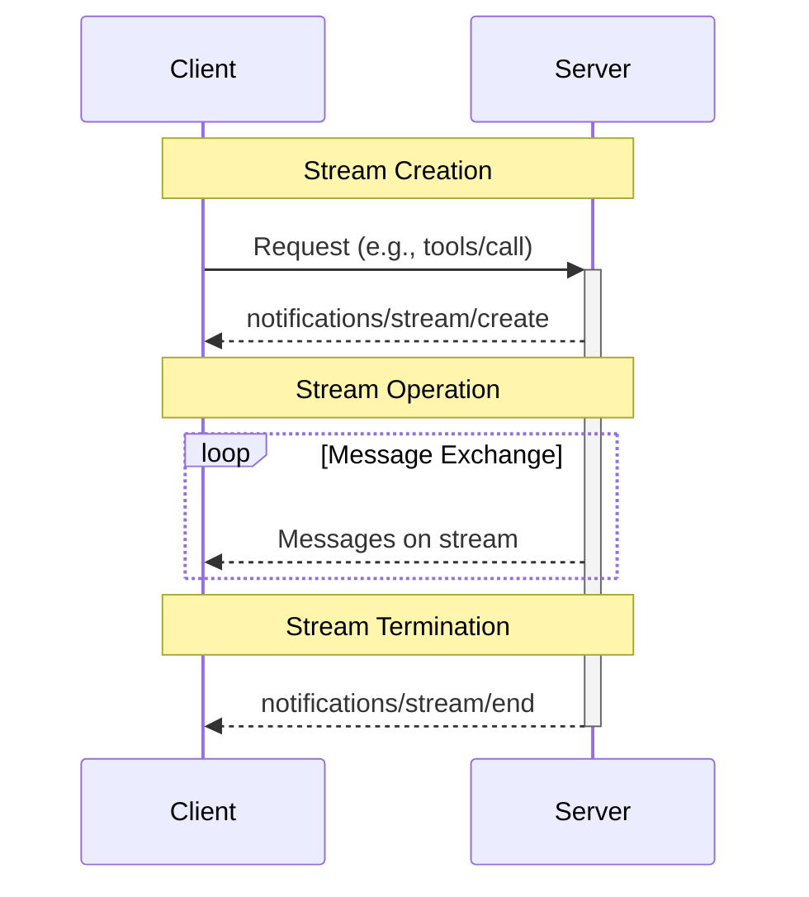
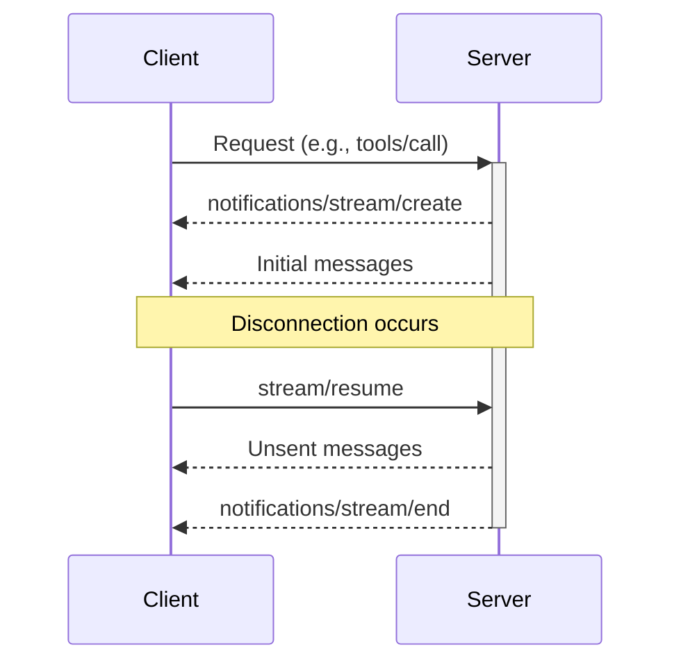
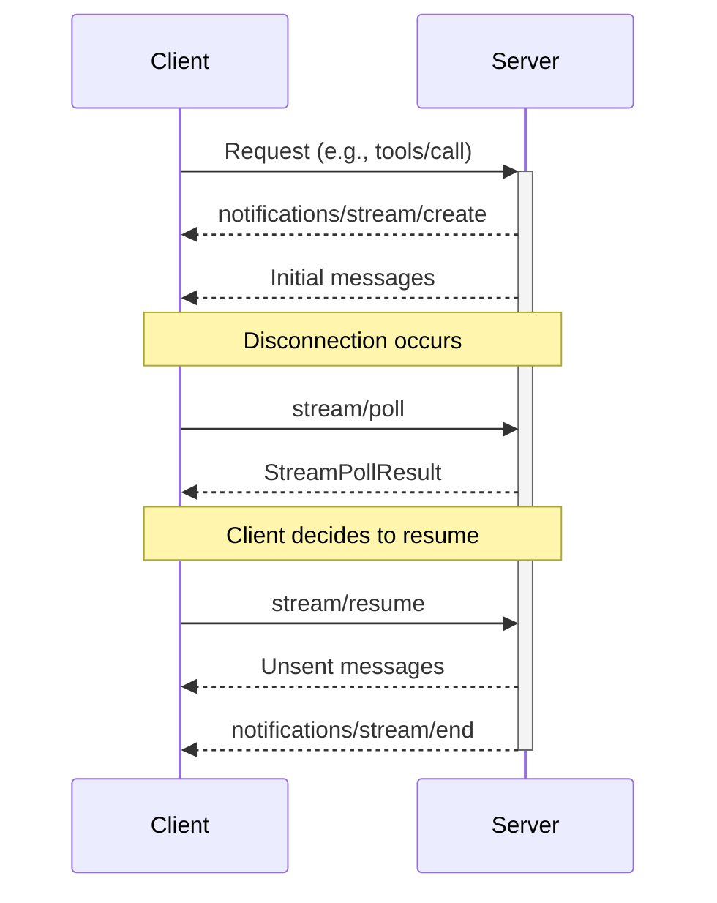
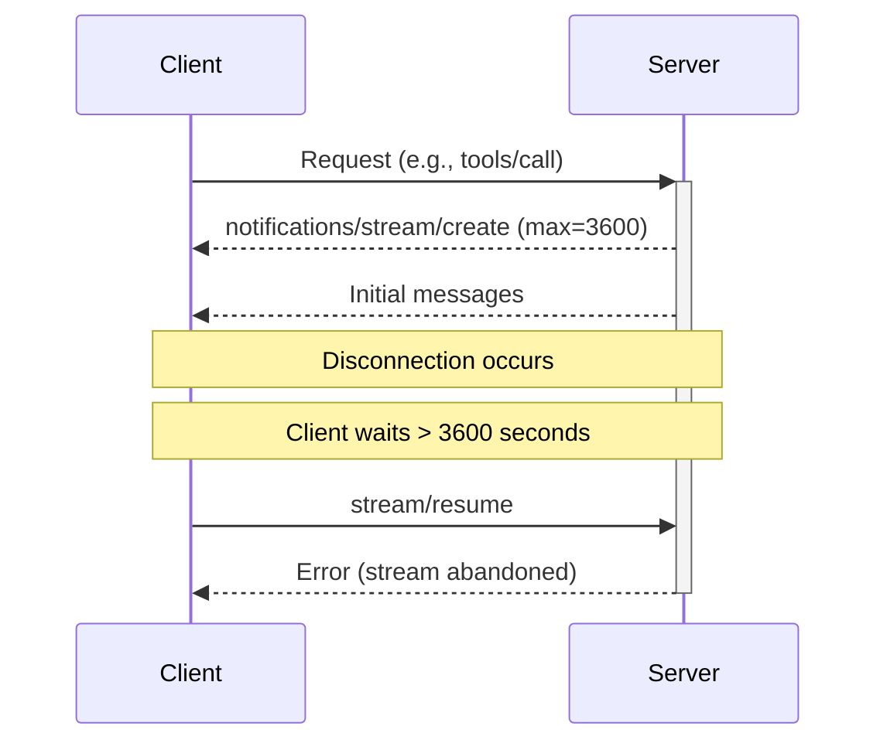
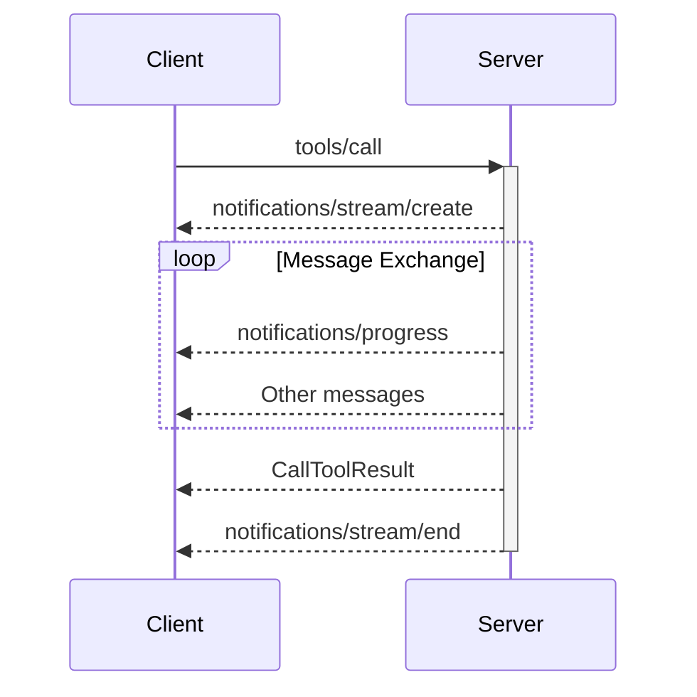

<div id="enable-section-numbers" />

<Info>**Protocol Revision**: draft</Info>

MCP defines a transport-agnostic mechanism for resumable streams, allowing clients and servers to maintain state across disconnections.

## Introduction

Streams provide a way to manage long-running operations and ensure message delivery even when connections are interrupted. Key benefits include:

- Transport-agnostic resumability (works with HTTP, WebSocket, stdio, etc.)
- Ability for clients and servers to disconnect and reconnect without losing progress
- Resource management through configurable timeouts
- Status checking without requiring full reconnection

## Lifecycle

A stream follows a defined lifecycle:

1. **Creation**: The server creates a stream and sends a `notifications/stream/create` notification with a unique stream ID
2. **Live**: Messages are exchanged on the stream.
3. **Completion**: Server sends a `notifications/stream/end` notification when the stream is complete

A client may use the `stream/resume` request to receive messages from a live stream, and `stream/poll` to poll a stream's state. A client may also use `stream/poll/all` to poll all available streams.



### Creation

When a client sends a request that may produce a long-running response, the server can create a stream by sending a `notifications/stream/create` notification with a unique stream ID and resume interval parameters.

```json
{
  "jsonrpc": "2.0",
  "method": "notifications/stream/create",
  "params": {
    "stream": {
      "streamId": "550e8400-e29b-41d4-a716-446655440000",
      "resumeInterval": {
        "min": 5,
        "max": 3600
      }
    }
  }
}
```

The `resumeInterval` specifies:

- `min`: Minimum seconds a client should wait before resuming the stream (prevents excessive reconnections)
- `max`: Maximum seconds a client may wait before the server considers the stream abandoned

### Disconnection and Resumption

Either the client or server may disconnect at any time. After a disconnection, the client can resume the stream by sending a `stream/resume` request with the stream ID:



Example `stream/resume` request:

```json
{
  "jsonrpc": "2.0",
  "method": "stream/resume",
  "params": {
    "streamId": "550e8400-e29b-41d4-a716-446655440000"
  }
}
```

When a client sends a `stream/resume` request, the server should:

1. Send all unsent messages for the stream to the client
2. If the stream has ended, send a `notifications/stream/end` notification after sending all other unsent messages
3. If the stream ID is invalid (e.g., abandoned), respond with an error

#### Streamable HTTP Considerations

When using the [Streamable HTTP transport](/specification/draft/basic/transports#streamable-http), streams are implemented using the Server-Sent Events (SSE) protocol. When served over HTTP, a server cannot definitively know when any given message is delivered. Clients use the `Last-Event-ID` HTTP header to resume their SSE connection to Streamable HTTP servers.

In order to deliver durable message guarantees, servers may maintain a buffer of recently sent messages (a two minute window aligns with common TCP idle timeout configurations), and use a scheme to correlate message IDs across streams, such as by using a strictly monotonic counter. When a client reconnects after a disconnection, the `Last-Event-ID` header can be used to derive the point from which its view of streams will resume and poll from.

### Polling

Clients can check a stream's status without receiving all unsent messages by sending a `stream/poll` request:



Example `stream/poll` request and response:

```json
// Request
{
  "jsonrpc": "2.0",
  "id": 2,
  "method": "stream/poll",
  "params": {
    "streamId": "550e8400-e29b-41d4-a716-446655440000"
  }
}

// Response
{
  "jsonrpc": "2.0",
  "id": 2,
  "result": {
    "streamId": "550e8400-e29b-41d4-a716-446655440000",
    "status": "live",
    "pendingMessages": true,
    "hasRequest": false,
    "hasError": false
  }
}
```

The response includes:

- `status`: The stream state (`"live"` or `"completed"`)
- `pendingMessages`: Whether there are unsent messages
- `hasRequest`: Whether any pending messages include a server-to-client request
- `hasError`: Whether any pending messages include an error result

### Abandonment

If a client fails to resume or poll a stream within the `resumeInterval.max` period, the server may consider the stream abandoned and reclaim resources. The next time a client attempts to resume or poll the stream, the server may respond with an error.



### Termination

When a stream completes, the server sends a `notifications/stream/end` notification:

```json
{
  "jsonrpc": "2.0",
  "method": "notifications/stream/end",
  "params": {
    "streamId": "550e8400-e29b-41d4-a716-446655440000"
  }
}
```

## Using Streams with Tool Calls

A common pattern is to use streams with tool calls that may take a long time to complete:



When using streams with tool calls:

1. The server creates a stream immediately after receiving the tool call
2. The server can send progress updates and other messages on the stream
3. When the tool completes, the server sends the result
4. The server ends the stream with a `notifications/stream/end` notification

## Security Considerations

- Stream IDs should be treated as sensitive information as they can be used to retrieve message history
- Servers should validate that clients have appropriate permissions to resume streams
- Servers should limit the number of unsent messages a disconnected stream may retain in order to prevent denial of service attacks
