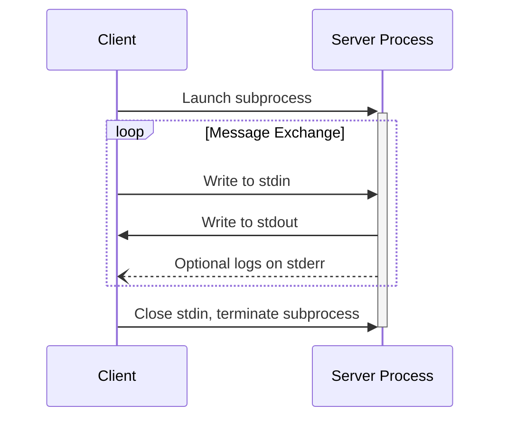
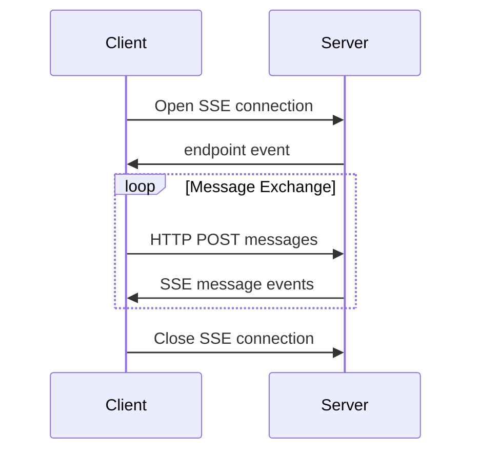
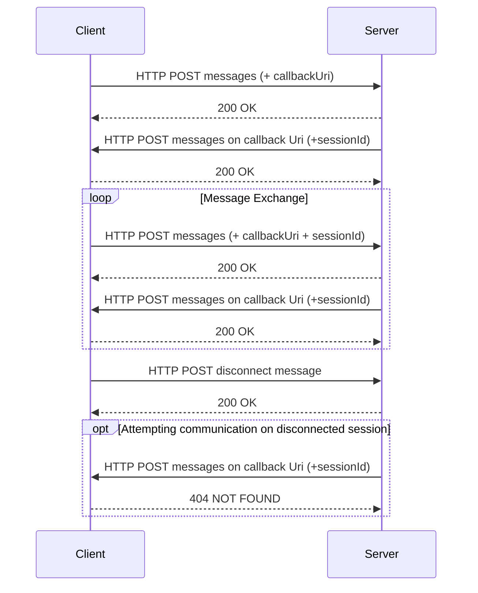

 **Protocol Revision**: draft 

MCP uses JSON-RPC to encode messages. JSON-RPC messages **MUST** be UTF-8 encoded.

The protocol currently defines three standard transport mechanisms for client-server
communication:

1. [stdio](#stdio), communication over standard in and standard out
2. [HTTP with Server-Sent Events](#http-with-sse) (SSE)
3. [HTTP with Webhooks](#http-with-webhooks), optimized for long-running and Server to Server communication
 
Clients **SHOULD** support stdio whenever possible.

It is also possible for clients and servers to implement
[custom transports](#custom-transports) in a pluggable fashion.

## stdio

In the **stdio** transport:

- The client launches the MCP server as a subprocess.
- The server receives JSON-RPC messages on its standard input (`stdin`) and writes
  responses to its standard output (`stdout`).
- Messages are delimited by newlines, and **MUST NOT** contain embedded newlines.
- The server **MAY** write UTF-8 strings to its standard error (`stderr`) for logging
  purposes. Clients **MAY** capture, forward, or ignore this logging.
- The server **MUST NOT** write anything to its `stdout` that is not a valid MCP message.
- The client **MUST NOT** write anything to the server's `stdin` that is not a valid MCP
  message.

## HTTP with SSE

In the **SSE** transport, the server operates as an independent process that can handle
multiple client connections.

The server **MUST** provide two endpoints:

1. An SSE endpoint, for clients to establish a connection and receive messages from the
   server
2. A regular HTTP POST endpoint for clients to send messages to the server

When a client connects, the server **MUST** send an `endpoint` event containing a URI for
the client to use for sending messages. All subsequent client messages **MUST** be sent
as HTTP POST requests to this endpoint.

Server messages are sent as SSE `message` events, with the message content encoded as
JSON in the event data.

## HTTP with Webhooks

Contrary to **stdio** and **SSE**,  the lifecycle of a session using **Webhooks** is *not* scoped to a process or request. 

The server **MUST** provide a single HTTP POST endpoint for clients to send messages to the server.

Additionally, the client **MUST** provide a HTTP POST endpoint for servers to send messages back to the client.

### Client behavior
A client connects by sending JRPC payloads to the server at a known endpoint. 
In addition to the standard JRPC payload, the client **MUST** include an additional `callbackUri` property.
When resuming an existing session, the client **MUST** provide a `sessionId` query parameter.

### Server behavior
- The server **MUST** follow the callback URI when replying. 
- For successful requests, the server must respond with a `200 OK` status code.
- When receiving new payloads from the client, the server **SHOULD** use the latest callback URI from the client.
- The server **MUST** include a `X-MCP-Session-Id` header when sending messages to the client. The server **MAY** change the `X-MCP-Session-Id` in following responses.
- The Server **MAY** encode information in the session id, to enable it to act as a (time-scoped) _Secure Access Signature_ URI.
 
 ### Disconnect
 Whereas we have a clear signal when disconnecting in **stdio** and **SSE**,  we cannot depend on a specific connection. Instead, we leverage a combination of signals and HTTP Response codes.
1. If a session is unknown or closed, both client and server **MUST** respond with a `404 Not Found` status code on incoming requests.
2.  Client and Server **MAY** send a "notifications/disconnect" JRPC notification payload to indicate 
the end of the session.

## Custom Transports

Clients and servers **MAY** implement additional custom transport mechanisms to suit
their specific needs. The protocol is transport-agnostic and can be implemented over any
communication channel that supports bidirectional message exchange.

Implementers who choose to support custom transports **MUST** ensure they preserve the
JSON-RPC message format and lifecycle requirements defined by MCP. Custom transports
**SHOULD** document their specific connection establishment and message exchange patterns
to aid interoperability.
