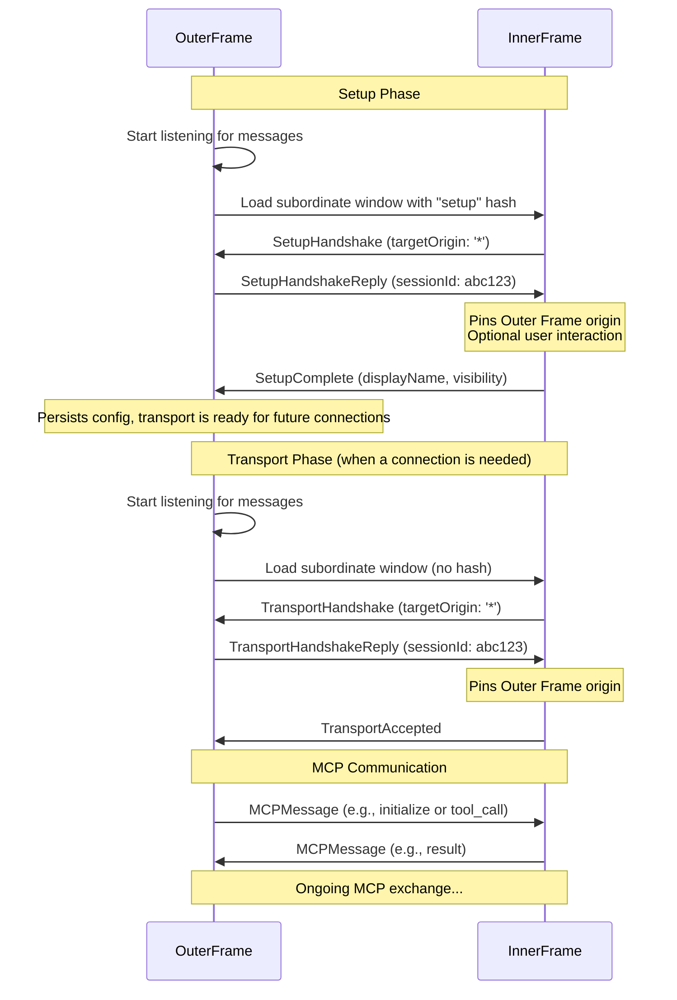

<div id="enable-section-numbers" />

<Info>**Protocol Revision**: draft</Info>

The **postMessage transport** enables secure, zero-installation MCP connections between browser contexts (iframes and popup windows). By leveraging the browser's native `window.postMessage` API, this transport eliminates installation barriers while maintaining strong security through origin-based isolation.

## Overview

The postMessage transport supports two powerful architectural patterns by separating the **Window Hierarchy** (physical layer) from **MCP Protocol Roles** (logical layer):

### Supported Architectures

#### Standard Architecture (Client-in-Control)

- **Outer Frame**: MCP Client
- **Inner Frame**: MCP Server
- **Use Case**: A primary application (like a chat client) embeds and consumes tools from third-party services.

#### Inverted Architecture (Server-in-Control)

- **Outer Frame**: MCP Server
- **Inner Frame**: MCP Client
- **Use Case**: A primary application (like a user dashboard) provides contextual data as tools to an embedded, sandboxed AI copilot.

| Transport Feature       | Standard Architecture | Inverted Architecture |
| ----------------------- | --------------------- | --------------------- |
| **Outer Frame Role**    | MCP Client            | MCP Server            |
| **Inner Frame Role**    | MCP Server            | MCP Client            |
| **Who provides tools?** | Inner Frame           | Outer Frame           |
| **Who calls tools?**    | Outer Frame           | Inner Frame           |

## Protocol Phases

The transport uses a **two-phase connection model**:

1. **Setup Phase** (`#setup` URL hash): One-time configuration when a server is first added. Used for authentication, API keys, user preferences, etc.
2. **Transport Phase** (no `#setup` hash): Normal, ongoing MCP communication with configured servers.

**Note**: The setup phase is always required in terms of protocol steps, but can be transparent to users. Servers can immediately respond with handshake completion, making setup instantaneous without user interaction.

## Security Implementation

### Origin Validation Requirements

The transport's security model relies on browser origin enforcement:

- MCP Servers must maintain an explicit allowlist of permitted client origins
- Message validation uses `event.origin` from the browser's MessageEvent API
- Origin information in message payloads should not be used for security decisions

### Target Origin Protocol

1. **Inner Frame's First Message**: Uses `targetOrigin: '*'` for initial handshake (doesn't know Outer Frame's origin yet)
2. **Origin Pinning**: After receiving Outer Frame's first message, Inner Frame pins the `event.origin` value
3. **Subsequent Messages**: Inner Frame uses only the pinned origin for all future communication
4. **Outer Frame Behavior**: Always uses Inner Frame's origin (from iframe URL) as `targetOrigin`

## Message Flows

To avoid race conditions, the Outer Frame **must** always begin listening for messages _before_ navigating the Inner Frame to its URL.



## Message Types

The protocol defines eight message types across two phases, all prefixed with `MCP_`:

### Setup Phase Messages

#### 1. SetupHandshake (Inner Frame → Outer Frame)

**Context**: The Outer Frame has created a subordinate window (Inner Frame) and navigated it to a URL with a `#setup` hash. The Inner Frame detects this and initiates setup.

**Target Origin**: The Inner Frame **must** use `'*'` because it cannot know the origin of its parent/opener at this stage.

```typescript
export interface SetupHandshakeMessage {
  type: "MCP_SETUP_HANDSHAKE";

  /** Minimum protocol version required by the inner frame */
  minProtocolVersion: string;

  /** Maximum protocol version supported by the inner frame */
  maxProtocolVersion: string;

  /** Whether the server needs to show UI during setup */
  requiresVisibleSetup: boolean;

  /** Optional permissions needed during setup and/or transport phases */
  requestedPermissions?: PermissionRequirement[];
}
```

#### 2. SetupHandshakeReply (Outer Frame → Inner Frame)

**Context**: The Outer Frame receives the setup handshake and replies to confirm willingness to proceed. If `requiresVisibleSetup` was true, the Outer Frame makes the Inner Frame visible.

**Target Origin**: The Outer Frame uses the Inner Frame's origin (known from iframe URL).

**Security**: Upon receiving this message, the Inner Frame must:

1. Validate that `event.origin` matches the expected Outer Frame's origin
2. Pin `event.origin` for all subsequent communication in this session

```typescript
export interface SetupHandshakeReplyMessage {
  type: "MCP_SETUP_HANDSHAKE_REPLY";

  /** The agreed-upon protocol version within the negotiated range */
  protocolVersion: string;

  /** Unique identifier for this connection instance */
  sessionId: string;
}
```

#### 3. SetupComplete (Inner Frame → Outer Frame)

**Context**: Setup is complete within the Inner Frame. This final message allows the Outer Frame to persist configuration and close/hide the setup window.

**Target Origin**: The Inner Frame uses the pinned origin of the Outer Frame.

```typescript
export interface SetupCompleteMessage {
  type: "MCP_SETUP_COMPLETE";

  /** Whether setup succeeded or failed */
  status: "success" | "error";

  /** User-facing name for the application */
  displayName: string;

  /** Optional brief message to show the user */
  ephemeralMessage?: string;

  /** Visibility behavior during transport phase */
  transportVisibility: {
    requirement: "required" | "optional" | "hidden";
    description?: string; // If 'optional', describes benefit of visibility
  };

  /** If status is 'error', details about what went wrong */
  error?: {
    code:
      | "USER_CANCELLED"
      | "AUTH_FAILED"
      | "TIMEOUT"
      | "CONFIG_ERROR"
      | "VERSION_MISMATCH"
      | "INSUFFICIENT_PERMISSIONS";
    message: string;
  };
}
```

### Transport Phase Messages

#### 4. TransportHandshake (Inner Frame → Outer Frame)

**Context**: The Outer Frame has created a subordinate window for an active transport session (no `#setup` hash). The Inner Frame initiates the connection.

**Target Origin**: The Inner Frame uses `'*'` because, as a new window instance, it doesn't yet know its controller's origin.

```typescript
export interface TransportHandshakeMessage {
  type: "MCP_TRANSPORT_HANDSHAKE";

  /** Protocol version for compatibility checking */
  protocolVersion: "1.0";
}
```

#### 5. TransportHandshakeReply (Outer Frame → Inner Frame)

**Context**: The Outer Frame receives the transport handshake and replies with the `sessionId`, authorizing the transport to begin.

**Target Origin**: The Outer Frame uses the Inner Frame's origin.

**Security**: Upon receiving this message, the Inner Frame must:

1. Validate that `event.origin` is an allowed origin
2. Pin `event.origin` for all subsequent communication in this session

```typescript
export interface TransportHandshakeReplyMessage {
  type: "MCP_TRANSPORT_HANDSHAKE_REPLY";

  /** Unique identifier for this connection instance */
  sessionId: string;

  /** Protocol version for compatibility checking */
  protocolVersion: "1.0";
}
```

#### 6. TransportAccepted (Inner Frame → Outer Frame)

**Context**: The Inner Frame has received the handshake reply, validated the Outer Frame's origin, and is ready for MCP communication.

**Target Origin**: The Inner Frame uses the pinned origin of the Outer Frame.

```typescript
export interface TransportAcceptedMessage {
  type: "MCP_TRANSPORT_ACCEPTED";

  /** Echo back the session ID to confirm */
  sessionId: string;
}
```

#### 7. MCPMessage (Bidirectional)

**Context**: After `TransportAccepted`, all MCP protocol messages are wrapped in this message type to distinguish them from transport control messages.

**Target Origin**: Both parties use their respective pinned origins.

```typescript
export interface MCPMessage {
  type: "MCP_MESSAGE";

  /** The complete MCP JSON-RPC 2.0 message */
  payload: {
    jsonrpc: "2.0";
    id?: string | number;
    method?: string;
    params?: any;
    result?: any;
    error?: any;
  };
}
```

#### 8. SetupRequired (Inner Frame → Outer Frame) _Optional_

**Context**: During an active session, the Inner Frame determines it needs to re-run the setup phase (e.g., expired OAuth token, invalid API key).

**Target Origin**: The Inner Frame uses the pinned origin from the session.

```typescript
export interface SetupRequiredMessage {
  type: "MCP_SETUP_REQUIRED";

  /** Why setup is needed again */
  reason: "AUTH_EXPIRED" | "CONFIG_CHANGED" | "PERMISSIONS_CHANGED" | "OTHER";

  /** Human-readable explanation */
  message: string;

  /** Whether the current session can continue working */
  canContinue: boolean;
}
```

## Version Negotiation

The protocol supports range-based version negotiation during setup handshake for backward and forward compatibility:

1. **Inner Frame declares range**: Sends `minProtocolVersion` and `maxProtocolVersion`
2. **Outer Frame selects version**: Chooses highest compatible version within range
3. **Semantic version validation**: Both parties validate using [semantic versioning](https://semver.org/) rules
4. **Compatibility check**: If no compatible version exists, outer frame rejects with `VERSION_MISMATCH` error

**Example**:

- Inner Frame supports: `minProtocolVersion: "1.0.0"`, `maxProtocolVersion: "1.2.0"`
- Outer Frame supports: `["1.1.0", "1.3.0", "2.0.0"]`
- Agreed version: `"1.1.0"` (highest version within Inner Frame's range)

## Permission Declaration System

Inner frames can declare browser permissions needed, enabling:

**Proactive Sandbox Configuration**: The outer frame configures iframe `allow` attributes:

```javascript
const allowValue = requestedPermissions.map((p) => p.name).join("; ");
iframe.setAttribute("allow", allowValue);
```

**Transparent User Consent**: Outer frames can display permission requests with clear explanations before embedding.

**Permission Structure**:

```typescript
export interface PermissionRequirement {
  /** Standard permission name (e.g., "camera", "clipboard-read") */
  name: string;

  /** Phases when needed: 'setup' and/or 'transport' */
  phase: ("setup" | "transport")[];

  /** Whether required for core functionality */
  required: boolean;

  /** User-facing explanation of why needed */
  purpose: string;
}
```

**Recommended Sandbox Attributes**:

Production Environment:

```javascript
iframe.sandbox.value =
  "allow-scripts allow-forms allow-storage-access-by-user-activation allow-modals";
```

Testing/Development (same-origin only):

```javascript
iframe.sandbox.value =
  "allow-scripts allow-same-origin allow-forms allow-storage-access-by-user-activation allow-modals";
```

<Warning>

`allow-same-origin` combined with `allow-scripts` significantly reduces sandbox effectiveness and should only be used in testing environments or when the inner frame is served from a trusted same-origin source.

</Warning>

## Session Management

Sessions are orchestrated by the **MCP Client**, which generates and provides the `sessionId`. The **MCP Server** uses this ID to scope persistent storage.

**Cross-Phase Workflow**:

1. **Setup Phase**: Client provides sessionId during setup handshake
2. **Server Storage**: Server stores configuration (API keys, preferences) scoped by sessionId
3. **Transport Phase**: Client provides same sessionId during transport handshake
4. **Data Retrieval**: Server uses sessionId to retrieve previously stored configuration

**Implementation Example**:

```javascript
// During setup phase
const configKey = `server-config-${sessionId}`;
localStorage.setItem(configKey, JSON.stringify({ apiKey, preferences }));

// During transport phase
const config = JSON.parse(localStorage.getItem(`server-config-${sessionId}`));
```

**Session Continuity**: The Outer Frame can reuse session IDs across Inner Frame reloads, allowing state restoration across page refreshes.

## Use Cases

### Zero Installation

- MCP servers distributed as URLs
- No software installation required
- Instant access to capabilities in browser sandbox

### Privacy-First Processing

- Healthcare and financial data processed locally
- Sensitive information never leaves user's device
- Full browser security model protection

### Interactive Visualization Tools

- Rich UI tools embedded directly
- Real-time collaborative interfaces
- Progressive enhancement of client applications

### Edge Computing

- Computation in user's browser context
- Reduced latency and server costs
- Improved data locality

## Implementation Notes

### Race Condition Prevention

The Outer Frame **must** start listening for messages _before_ navigating the Inner Frame to prevent missing the initial handshake message.

### State Persistence

Server state **must** be persisted using the provided `sessionId` as a key to ensure proper isolation and retrieval across sessions.

### Error Handling

Implement proper timeout handling for handshake phases and validate all message structures before processing.
