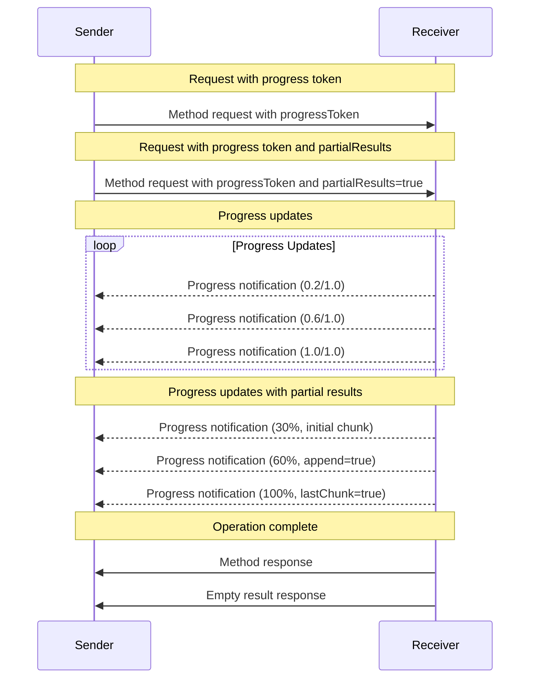

<Info>**Protocol Revision**: draft</Info>

The Model Context Protocol (MCP) supports optional progress tracking for long-running
operations through notification messages. Either side can send progress notifications to
provide updates about operation status.

## Progress Flow

When a party wants to _receive_ progress updates for a request, it includes a
`progressToken` in the request metadata.

- Progress tokens **MUST** be a string or integer value
- Progress tokens can be chosen by the sender using any means, but **MUST** be unique
  across all active requests.

```json
{
  "jsonrpc": "2.0",
  "id": 1,
  "method": "some_method",
  "params": {
    "_meta": {
      "progressToken": "abc123"
    }
  }
}
```

The receiver **MAY** then send progress notifications containing:

- The original progress token
- The current progress value so far
- An optional "total" value
- An optional "message" value

```json
{
  "jsonrpc": "2.0",
  "method": "notifications/progress",
  "params": {
    "progressToken": "abc123",
    "progress": 50,
    "total": 100,
    "message": "Reticulating splines..."
  }
}
```

- The `progress` value **MUST** increase with each notification, even if the total is
  unknown.
- The `progress` and the `total` values **MAY** be floating point.
- The `message` field **SHOULD** provide relevant human readable progress information.

## Partial Results

Progress notifications can also include partial results for operations that generate data incrementally. This allows clients to display intermediate results while an operation is still in progress.

To request partial results, the client includes both a `progressToken` and `partialResults: true` in the request metadata:

```json
{
  "jsonrpc": "2.0",
  "id": 1,
  "method": "tools/call",
  "params": {
    "_meta": {
      "progressToken": "abc123",
      "partialResults": true
    },
    "name": "analyzeData",
    "arguments": {
      "datasetId": "financial-q1-2025"
    }
  }
}
```

The server can then include partial results in progress notifications:

```json
{
  "jsonrpc": "2.0",
  "method": "notifications/progress",
  "params": {
    "progressToken": "abc123",
    "progress": 30,
    "total": 100,
    "message": "Initial analysis complete",
    "partialResult": {
      "chunk": {
        "content": [
          {
            "type": "text",
            "text": "## Preliminary Analysis\n\nData processing has revealed initial patterns..."
          }
        ]
      },
      "append": false,
      "lastChunk": false
    }
  }
}
```

### Partial Result Structure

The `partialResult` object contains:

- `chunk`: The partial result data (any JSON object)
- `append`: Whether this chunk should be appended to previous chunks (`true`) or replace them (`false`)
- `lastChunk`: Whether this is the final chunk of the result (`true`) or more chunks will follow (`false`)

### Incremental Updates

Subsequent progress notifications can append to previous chunks:

```json
{
  "jsonrpc": "2.0",
  "method": "notifications/progress",
  "params": {
    "progressToken": "abc123",
    "progress": 60,
    "total": 100,
    "message": "Processing additional data",
    "partialResult": {
      "chunk": {
        "content": [
          {
            "type": "text",
            "text": "\n\n### Key Findings\n\n- Revenue increased by 12%\n- Customer acquisition cost reduced by 7%"
          }
        ]
      },
      "append": true,
      "lastChunk": false
    }
  }
}
```

### Final Response

When partial results are used, the final response **SHOULD** be an empty result object, as the complete result has already been delivered through progress notifications:

```json
{
  "jsonrpc": "2.0",
  "id": 1,
  "result": {}
}
```

## Behavior Requirements

1. Progress notifications **MUST** only reference tokens that:

   - Were provided in an active request
   - Are associated with an in-progress operation

2. Receivers of progress requests **MAY**:
   - Choose not to send any progress notifications
   - Send notifications at whatever frequency they deem appropriate
   - Omit the total value if unknown

3. When using partial results:
   - The `lastChunk: true` flag **MUST** be set on the final chunk
   - Clients **MUST** be prepared to handle both appended and replaced chunks
   - Servers **SHOULD** return an empty result in the final response when all data has been delivered via partial results



## Implementation Notes

- Senders and receivers **SHOULD** track active progress tokens
- Both parties **SHOULD** implement rate limiting to prevent flooding
- Progress notifications **MUST** stop after completion
- Clients **SHOULD** accumulate partial results according to the `append` flag
