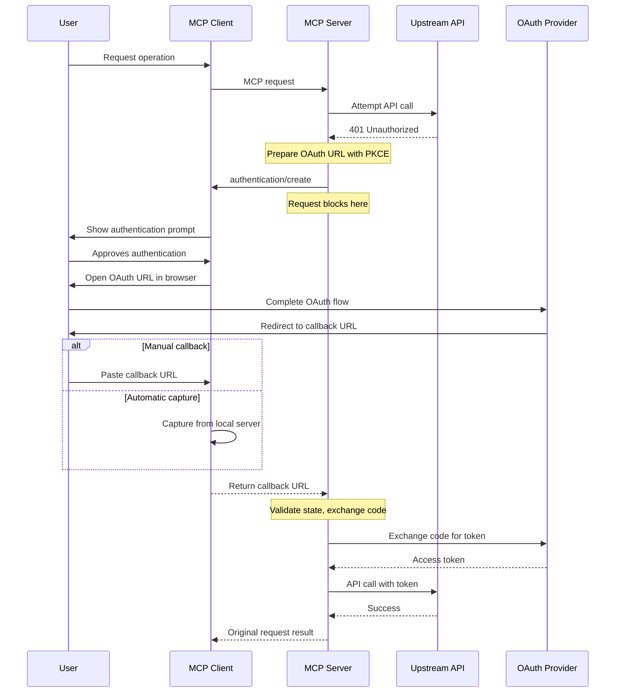

<div id="enable-section-numbers" />

<Info>**Protocol Revision**: draft</Info>

<Note>

Authentication is newly introduced in this version of the MCP specification and its design may evolve in future protocol versions.

</Note>

The Model Context Protocol (MCP) provides a standardized way for servers to request OAuth authentication from clients when accessing upstream resources. This feature enables servers that act as both MCP servers and clients (dual-role components) to obtain necessary tokens for upstream APIs through the user's MCP client interface.

## Overview

The authentication primitive allows MCP servers to:
- Request OAuth authentication for upstream resources
- Receive authorization codes through the client's UI
- Maintain security boundaries between different services

This is distinct from the [authorization flow](/specification/draft/basic/authorization) where clients authenticate to servers. Here, servers request authentication help from clients.

## Capabilities

Clients that support authentication requests **MUST** declare the `authentication` capability during [initialization](/specification/draft/basic/lifecycle#initialization):

```json
{
  "capabilities": {
    "authentication": {}
  }
}
```

Servers that may request authentication **MUST** declare this in their capabilities:

```json
{
  "capabilities": {
    "authentication": {}
  }
}
```

## Protocol Messages

### Authentication Request

Servers request authentication by sending an `authentication/create` request:

**Request:**

```json
{
  "jsonrpc": "2.0",
  "id": 1,
  "method": "authentication/create",
  "params": {
    "url": "https://github.com/login/oauth/authorize?client_id=abc123&redirect_uri=http://localhost:8080/callback&scope=repo%20read:user&state=xyz789&code_challenge=E9Melhoa2OwvFrEMTJguCHaoeK1t8URWbuGJSstw-cM&code_challenge_method=S256",
    "message": "GitHub authentication required to access private repositories"
  }
}
```

**Success Response:**

```json
{
  "jsonrpc": "2.0",
  "id": 1,
  "result": {
    "url": "http://localhost:8080/callback?code=abc123def456&state=xyz789"
  }
}
```

**Declined/Cancelled Response:**

```json
{
  "jsonrpc": "2.0",
  "id": 1,
  "result": {}
}
```

### Request Parameters

- **`url`** (required): The complete OAuth authorization URL containing all necessary parameters:
  - `client_id`: OAuth application identifier
  - `redirect_uri`: Callback URL for the OAuth flow
  - `scope`: Requested permissions
  - `state`: CSRF protection token
  - `code_challenge`: PKCE challenge for security
  - `code_challenge_method`: PKCE method (typically "S256")

- **`message`** (required): Human-readable explanation of why authentication is needed

### Response Handling

The response contains a single optional field:

- **`url`**: The OAuth callback URL if authentication succeeded
  - Contains `code` parameter with the authorization code
  - Contains `state` parameter for CSRF validation
  - May contain `error` and `error_description` for OAuth errors

If `url` is omitted, the user declined or cancelled authentication.

## Message Flow



## OAuth Parameter Handling

Servers **MUST** handle OAuth parameters according to OAuth 2.1:

### Success Response
```
http://localhost:8080/callback?code=abc123def456&state=xyz789
```

The server should:
1. Validate the `state` parameter matches the original request
2. Extract the `code` parameter
3. Exchange the code for an access token

### Error Response
```
http://localhost:8080/callback?error=access_denied&error_description=User+denied+access&state=xyz789
```

OAuth defines standard error codes:
- `access_denied`: User denied authorization
- `invalid_scope`: Requested scope is invalid
- `server_error`: Authorization server error
- `temporarily_unavailable`: Server is temporarily unavailable

## Integration with Long-Running Operations

When authentication is needed during a long-running operation:

1. The operation pauses with a progress notification
2. The server requests authentication
3. After authentication, the operation resumes

```json
// Operation pauses
{
  "method": "notifications/progress",
  "params": {
    "progressToken": "op-123",
    "progress": 50,
    "total": 100,
    "status": "paused",
    "_meta": {
      "reason": "authentication_required"
    }
  }
}

// Authentication request
{
  "method": "authentication/create",
  "params": {
    "url": "https://api.example.com/oauth/authorize?...",
    "message": "Authentication required to continue operation"
  }
}

// Operation resumes after authentication
{
  "method": "notifications/progress",
  "params": {
    "progressToken": "op-123",
    "progress": 50,
    "total": 100,
    "status": "running",
    "message": "Resumed after authentication"
  }
}
```

## Client Implementation Guidelines

### User Interface

Clients **SHOULD** present authentication requests with:

1. Clear indication of the requesting server
2. The OAuth provider domain (extracted from the URL)
3. The message explaining why authentication is needed
4. Options to approve or decline

Example UI elements:
- Show the OAuth provider's domain prominently
- Display a lock icon to indicate secure authentication
- Provide clear "Authenticate" and "Cancel" buttons
- Show instructions for manual callback URL entry if needed

### Callback Handling

Clients may support two callback methods:

1. **Automatic capture**: Start a local HTTP server to capture the callback
2. **Manual entry**: Provide a text field for users to paste the callback URL

For automatic capture:
- Start a local server on the `redirect_uri` port
- Automatically close the browser tab after capture
- Return the complete callback URL to the server

For manual entry:
- Provide clear instructions
- Validate the URL format
- Check for required parameters (`code` or `error`)

### Error Handling

Clients **SHOULD**:
- Set reasonable timeouts (recommended: 10 minutes)
- Allow users to cancel at any time
- Clear any authentication UI state on completion
- Never log or store callback URLs

## Security Considerations

### For Servers

1. **PKCE Required**: Always use PKCE for OAuth flows
2. **State Validation**: Generate and validate the `state` parameter
3. **Token Isolation**: Keep tokens isolated per user context
4. **Secure Storage**: Never log OAuth parameters or tokens

### For Clients

1. **Domain Display**: Always show the OAuth provider domain
2. **User Consent**: Require explicit user approval
3. **URL Validation**: Validate callback URLs before returning
4. **No Storage**: Never store or log authentication URLs

### OAuth Best Practices

Follow OAuth 2.1 security recommendations:
- Use PKCE even for confidential clients
- Validate the `state` parameter
- Use secure random values for all tokens
- Implement proper token storage and rotation
- Set appropriate token scopes and lifetimes

## Examples

### GitHub Authentication

```json
{
  "method": "authentication/create",
  "params": {
    "url": "https://github.com/login/oauth/authorize?client_id=Iv1.8a61f9b3a7aba766&redirect_uri=http://localhost:3000/callback&scope=repo%20read:user&state=e5a1ed89&code_challenge=dBjftJeZ4CVP-mB92K27uhbUJU1p1r_wW1gFWFOEjXk&code_challenge_method=S256",
    "message": "GitHub authentication needed to access your private repositories"
  }
}
```

### Google OAuth

```json
{
  "method": "authentication/create",
  "params": {
    "url": "https://accounts.google.com/o/oauth2/v2/auth?client_id=123456.apps.googleusercontent.com&redirect_uri=http://localhost:8080/callback&response_type=code&scope=https://www.googleapis.com/auth/drive.readonly&state=abc123&code_challenge=E9Melhoa&code_challenge_method=S256",
    "message": "Google Drive access required to read shared documents"
  }
}
```

## Relationship to Authorization

This authentication primitive complements the existing [authorization specification](/specification/draft/basic/authorization):

- **Authorization**: How clients authenticate TO servers
- **Authentication**: How servers request authentication FROM clients

Both features may be used together in dual-role components that act as both MCP servers and clients.