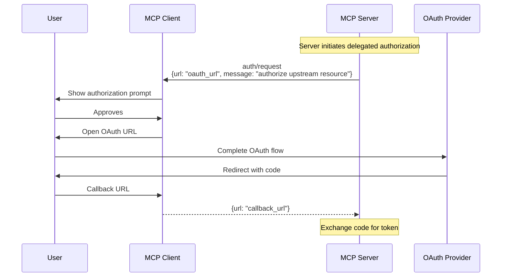
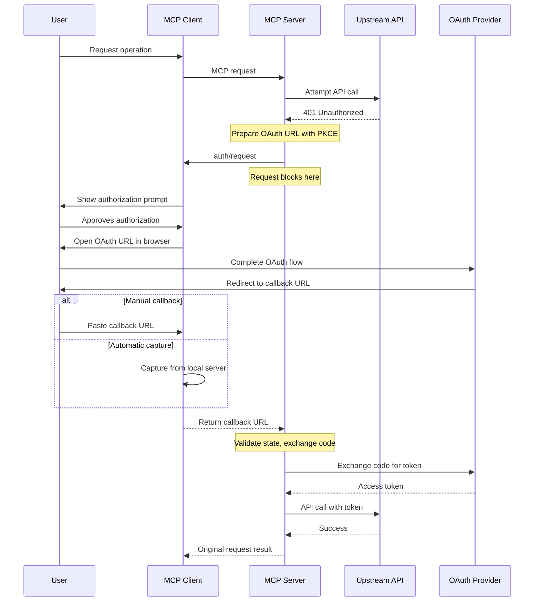

<div id="enable-section-numbers" />

<Info>**Protocol Revision**: draft</Info>

<Note>

Delegated authorization is newly introduced in this version of the MCP specification and its design may evolve in future protocol versions.

</Note>

The Model Context Protocol (MCP) provides a standardized way for servers to request OAuth authorization from clients in order to access upstream resources.
This feature enables servers to obtain necessary access tokens for upstream APIs through the user's MCP client.

## Overview

The delegated authorization primitive allows MCP servers to:

- Request OAuth authorization for upstream resources
- Receive authorization codes through the client's UI
- Maintain security boundaries between different services

This is distinct from the [authorization flow](/specification/draft/basic/authorization) where clients obtain authorization to access servers. Here, servers request authorization assistance from clients to access upstream resources.

## Capabilities

Clients that support delegated authorization requests **MUST** declare the `delegated_authorization` capability during [initialization](/specification/draft/basic/lifecycle#initialization):

```json
{
  "capabilities": {
    "delegated_authorization": {}
  }
}
```

## Protocol Messages

### Authorization Request

Servers request authorization by sending an `auth/request` request:

**Request:**

```json
{
  "jsonrpc": "2.0",
  "id": 1,
  "method": "auth/request",
  "params": {
    "url": "https://github.com/login/oauth/authorize?client_id=abc123&redirect_uri=http://localhost:8080/callback&scope=repo%20read:user&state=xyz789&code_challenge=E9Melhoa2OwvFrEMTJguCHaoeK1t8URWbuGJSstw-cM&code_challenge_method=S256",
    "message": "GitHub authorization required to access private repositories"
  }
}
```

**Success Response:**

```json
{
  "jsonrpc": "2.0",
  "id": 1,
  "result": {
    "url": "http://localhost:8080/callback?code=abc123def456&state=xyz789"
  }
}
```

**Declined/Cancelled Response:**

```json
{
  "jsonrpc": "2.0",
  "id": 1,
  "result": {}
}
```

### Request Parameters

- **`url`** (required): The complete OAuth authorization URL containing all necessary parameters:

  - `client_id`: OAuth application identifier
  - `redirect_uri`: Callback URL for the OAuth flow
  - `scope`: Requested permissions
  - `state`: CSRF protection token
  - `code_challenge`: PKCE challenge for security
  - `code_challenge_method`: PKCE method (typically "S256")

- **`message`** (required): Human-readable explanation of why authorization is needed

- **`redirect_uri_options`** (optional): Alternative redirect URI templates the server supports
  - Clients SHOULD select the first option they can handle
  - Templates may include placeholders like `{port}` or `{session}`
  - Examples:
    - `"http://127.0.0.1:{port}/callback"` (desktop clients)
    - `"https://callback.example.com/{session}"` (web clients)
    - `"com.example.app://oauth/callback"` (mobile clients)

### Response Handling

The response contains a single optional field:

- **`url`**: The OAuth callback URL if auth succeeded
  - Contains `code` parameter with the authorization code
  - Contains `state` parameter for CSRF validation
  - May contain `error` and `error_description` for OAuth errors

If `url` is omitted, the user declined or cancelled authorization.

## Message Flow



### Complete Flow



## OAuth Parameter Handling

Servers **MUST** handle OAuth parameters according to OAuth 2.1:

### Success Response

```
http://localhost:8080/callback?code=abc123def456&state=xyz789
```

The server should:

1. Validate the `state` parameter matches the original request
2. Extract the `code` parameter
3. Exchange the code for an access token

### Error Response

```
http://localhost:8080/callback?error=access_denied&error_description=User+denied+access&state=xyz789
```

OAuth defines standard error codes:

- `access_denied`: User denied authorization
- `invalid_scope`: Requested scope is invalid
- `server_error`: Authorization server error
- `temporarily_unavailable`: Server is temporarily unavailable

## Client Implementation Guidelines

### User Interface

Clients **SHOULD** present authorization requests with:

1. Clear indication of the requesting server
2. The OAuth provider domain (extracted from the URL)
3. The message explaining why authorization is needed
4. Options to approve or decline

Example UI elements:

- Show the OAuth provider's domain prominently
- Display a lock icon to indicate secure authorization
- Provide clear "Authorize" and "Cancel" buttons
- Show instructions for manual callback URL entry if needed

### OAuth Callback Capture

Clients **MUST** implement OAuth callback capture following [RFC 8252](https://datatracker.ietf.org/doc/html/rfc8252) (OAuth 2.0 for Native Apps).

Clients **SHOULD** support at least one of the following methods:

#### Loopback Interface Redirect

The preferred method for capturing OAuth callbacks:

1. Start a temporary HTTP server on `127.0.0.1` with an ephemeral port
2. Register `http://127.0.0.1:{port}/callback` as the redirect URI with the OAuth provider
3. Capture the callback automatically when the browser redirects

This method is used by standard developer tools including [GitHub CLI](https://github.com/cli/oauth), Google Cloud SDK, and AWS CLI, and follows [Google's OAuth 2.0 for Native Apps guidelines](https://developers.google.com/identity/protocols/oauth2/native-app).

#### Manual URL Entry

For environments where local servers are not feasible:

1. Display clear instructions to the user
2. Provide an input field for the callback URL
3. Validate the URL contains required OAuth parameters

### Callback Validation

When processing OAuth callbacks, clients **MUST**:

- Validate the callback URL format
- Check for required parameters (`code` or `error`)
- Return the complete callback URL to the server
- Clear any temporary state after capture

For automatic capture, clients **SHOULD**:

- Use the port specified in the `redirect_uri`
- Automatically close the browser tab after successful capture
- Handle both successful and error callbacks

### Error Handling

Clients **SHOULD**:

- Set reasonable timeouts (recommended: 10 minutes)
- Allow users to cancel at any time
- Clear any authorization UI state on completion
- Never log or store callback URLs

## Security Considerations

### OAuth Security Requirements

Servers implementing delegated authorization **MUST** follow OAuth 2.1 security best practices:

1. **PKCE Required**: Servers MUST use [PKCE (RFC 7636)](https://datatracker.ietf.org/doc/html/rfc7636) for all OAuth flows, even for confidential clients
2. **State Validation**: Servers MUST generate cryptographically secure `state` values and validate them in callbacks
3. **Redirect URI Registration**: All redirect URIs MUST be pre-registered with the OAuth provider
4. **Token Isolation**: Access tokens MUST never traverse the MCP protocol - only authorization codes

### Client Security Requirements

1. **Domain Display**: Clients MUST prominently display the OAuth provider domain before opening URLs
2. **User Consent**: Clients MUST obtain explicit user consent before opening authorization URLs
3. **No Token Storage**: Clients MUST NOT log or store authorization codes or callback URLs
4. **Secure Browser**: Clients MUST open URLs in a secure browser context that prevents inspection
5. **URL Validation**: Clients MUST validate callback URLs before returning them to the server

### Preventing Common Attacks

Following [RFC 6819: OAuth 2.0 Threat Model and Security Considerations](https://datatracker.ietf.org/doc/html/rfc6819):

| Attack Vector         | Mitigation                                                 |
| --------------------- | ---------------------------------------------------------- |
| CSRF / Code Confusion | Server-generated and validated `state` parameter           |
| Code Injection        | PKCE with S256 challenge method                            |
| Open Redirect         | Pre-registered redirect URIs only                          |
| Token Leakage         | Only authorization codes traverse MCP, never access tokens |
| Phishing              | Client displays OAuth provider domain prominently          |

### Redirect URI Selection

If the client receives `redirect_uri_options`, it **MUST**:

1. Select the first option it can fully support
2. Never substitute arbitrary redirect URIs
3. Validate that the selected URI matches the pre-registered pattern

This follows OAuth 2.1 guidance that redirect URIs **MUST** be pre-registered and origin-restricted to prevent open-redirect attacks.

## Examples

### GitHub Authorization

```json
{
  "method": "auth/request",
  "params": {
    "url": "https://github.com/login/oauth/authorize?client_id=Iv1.8a61f9b3a7aba766&redirect_uri=http://localhost:3000/callback&scope=repo%20read:user&state=e5a1ed89&code_challenge=dBjftJeZ4CVP-mB92K27uhbUJU1p1r_wW1gFWFOEjXk&code_challenge_method=S256",
    "message": "GitHub authorization needed to access your private repositories"
  }
}
```

### Google OAuth

```json
{
  "method": "auth/request",
  "params": {
    "url": "https://accounts.google.com/o/oauth2/v2/auth?client_id=123456.apps.googleusercontent.com&redirect_uri=http://localhost:8080/callback&response_type=code&scope=https://www.googleapis.com/auth/drive.readonly&state=abc123&code_challenge=E9Melhoa&code_challenge_method=S256",
    "message": "Google Drive access required to read shared documents"
  }
}
```

### Multi-Platform Support with redirect_uri_options

```json
{
  "method": "auth/request",
  "params": {
    "url": "https://github.com/login/oauth/authorize?client_id=Iv1.8a61f9b3a7aba766&redirect_uri=http://localhost:8080/callback&scope=repo%20read:user&state=e5a1ed89&code_challenge=dBjftJeZ4CVP-mB92K27uhbUJU1p1r_wW1gFWFOEjXk&code_challenge_method=S256",
    "message": "GitHub authorization needed to access your private repositories",
    "redirect_uri_options": [
      "http://127.0.0.1:{port}/callback",
      "https://auth.example.com/{session}",
      "com.example.mcp://oauth/callback"
    ]
  }
}
```

This allows:

- Desktop clients to use localhost with any available port
- Web clients to use the server-hosted callback endpoint
- Mobile clients to use their custom URL scheme

## Relationship to Client Authorization

This delegated authorization primitive complements the existing [authorization specification](/specification/draft/basic/authorization):

- **Client Authorization**: How clients obtain authorization to access servers
- **Delegated Authorization**: How servers request authorization FROM clients for upstream resources
