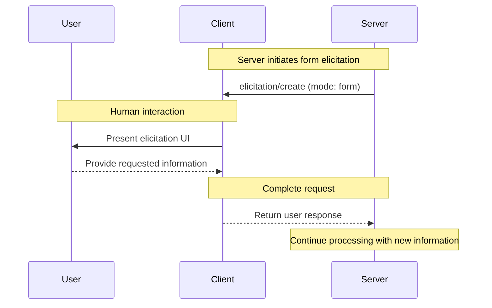
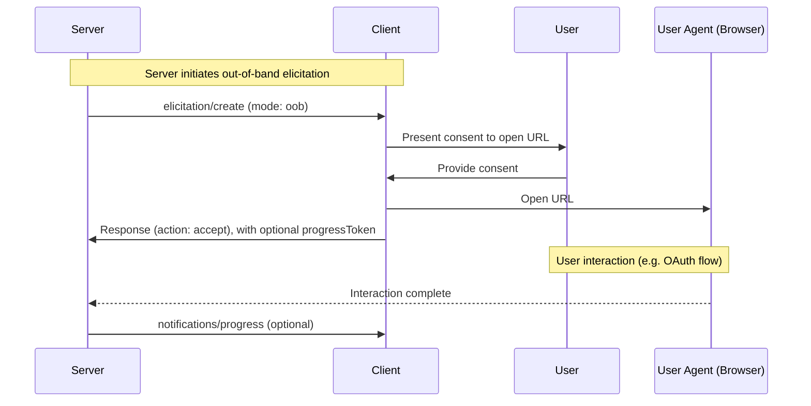
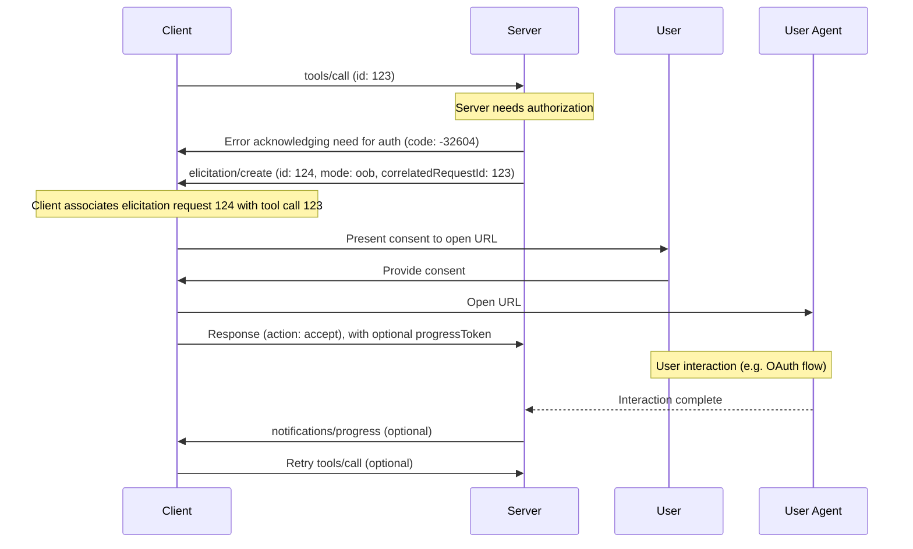

<div id="enable-section-numbers" />

<Info>**Protocol Revision**: draft</Info>

<Note>

Elicitation is newly introduced in this version of the MCP specification and its design may evolve in future protocol versions.

</Note>

The Model Context Protocol (MCP) provides a standardized way for servers to request additional
information from users through the client during interactions. This flow allows clients to
maintain control over user interactions and data sharing while enabling servers to gather
necessary information dynamically.

Elicitation supports two modes:

- **Form mode** (in-band): Servers can request structured data from users with optional JSON schemas to validate responses
- **Out-of-band mode**: Servers can direct users to external URLs for interactions that should not pass through the MCP client, such as OAuth authorization flows

## User Interaction Model

Elicitation in MCP allows servers to implement interactive workflows by enabling user input
requests to occur _nested_ inside other MCP server features.

Implementations are free to expose elicitation through any interface pattern that suits
their needs&mdash;the protocol itself does not mandate any specific user interaction
model.

<Warning>

For trust & safety and security:

- Servers **MUST NOT** use form mode elicitation to request sensitive information
- Servers **MUST** use out-of-band mode for OAuth flows and other security-sensitive interactions
- URLs **MUST NOT** appear in form mode messages or schemas

Applications **SHOULD**:

- Provide UI that makes it clear which server is requesting information
- For out-of-band mode, clearly display the target domain/host before navigation
- Allow users to review and modify their responses before sending
- Respect user privacy and provide clear reject and cancel options

</Warning>

## Capabilities

Clients that support elicitation **MUST** declare the `elicitation` capability during
[initialization](/specification/draft/basic/lifecycle#initialization):

```json
{
  "capabilities": {
    "elicitation": {}
  }
}
```

Clients **MAY** specify which elicitation modes they support:

```json
{
  "capabilities": {
    "elicitation": {
      "modes": ["form", "oob"]
    }
  }
}
```

If the `modes` array is not present, servers **MUST** assume the client only supports `form` mode for backward compatibility.

Servers **MUST NOT** send elicitation requests with modes that are not explicitly declared by the client.

## Protocol Messages

### Creating Elicitation Requests

To request information from a user, servers send an `elicitation/create` request. The request **MUST** include a `mode` parameter that specifies the type of elicitation:

- `"form"` (default): In-band structured data collection with optional schema validation
- `"oob"`: Out-of-band interaction via URL navigation

The elicitation request **MAY** include a `correlatedRequestId` parameter that indicates
the request is related to an earlier request (e.g. a failed tool call).

#### Form Mode (In-Band)

Form mode allows servers to collect structured data directly through the MCP client.

##### Simple Text Request

**Request:**

```json
{
  "jsonrpc": "2.0",
  "id": 1,
  "method": "elicitation/create",
  "params": {
    "mode": "form", // Optional, defaults to "form"
    "message": "Please provide your GitHub username",
    "requestedSchema": {
      "type": "object",
      "properties": {
        "name": {
          "type": "string"
        }
      },
      "required": ["name"]
    }
  }
}
```

**Response:**

```json
{
  "jsonrpc": "2.0",
  "id": 1,
  "result": {
    "action": "accept",
    "content": {
      "name": "octocat"
    }
  }
}
```

##### Structured Data Request

**Request:**

```json
{
  "jsonrpc": "2.0",
  "id": 2,
  "method": "elicitation/create",
  "params": {
    "mode": "form",
    "message": "Please provide your contact information",
    "requestedSchema": {
      "type": "object",
      "properties": {
        "name": {
          "type": "string",
          "description": "Your full name"
        },
        "email": {
          "type": "string",
          "format": "email",
          "description": "Your email address"
        },
        "age": {
          "type": "number",
          "minimum": 18,
          "description": "Your age"
        }
      },
      "required": ["name", "email"]
    }
  }
}
```

**Response:**

```json
{
  "jsonrpc": "2.0",
  "id": 2,
  "result": {
    "action": "accept",
    "content": {
      "name": "Monalisa Octocat",
      "email": "octocat@github.com",
      "age": 30
    }
  }
}
```

#### Out-of-Band Mode

Out-of-band mode enables servers to direct users to external URLs for interactions that
should not pass through the MCP client. This is essential for OAuth flows, payment
processing, and other security-sensitive operations.

**Request:**

```json
{
  "jsonrpc": "2.0",
  "id": 3,
  "method": "elicitation/create",
  "params": {
    "mode": "oob",
    "url": "https://oauth.example.com/authorize?client_id=abc123&response_type=code&...",
    "message": "Authorization is required to access your Example Co files.",
    "correlatedRequestId": 2 // Optional
  }
}
```

**Response with Progress Tracking:**

```json
{
  "jsonrpc": "2.0",
  "id": 3,
  "result": {
    "_meta": {
      "progressToken": "oob-progress-456" // Client wants progress updates (TODO needs to be a separate `elicitation/track` request?)
    },
    "action": "accept",
    "codeVerifier": "a1b2c3"
  }
}
```

The server can then send [progress notifications](/docs/specification/draft/basic/utilities/progress.mdx):

```json
{
  "jsonrpc": "2.0",
  "method": "notifications/progress",
  "params": {
    "progressToken": "oob-progress-456",
    "progress": 100,
    "total": 100,
    "message": "Authorization completed successfully"
  }
}
```

For sensitive flows (e.g. authorization), the server **MAY** send the client an additional
`elicitation/verify` request containing the request ID of an earlier elicitation request.

The client **MUST** validate that it received the elicitation request with the given request ID, and respond accordingly:
- Respond with `success` if the given request ID was received by this client, and the code verifier matches the cryptographic hash of the code
- Respond with an error if the given request ID was NOT received by this client

// TODO: Finish describing a PKCE-like challenge/verifier mechanism here,
// so that the client knows something cryptographically that the server doesn't know.
// I think it's necessary in chained scenarios like MCP client->MCP server 1->MCP server 2->...,
// to avoid a malicious server in the middle spoofing the response to `/elicitation/verify`.

**Confirm Request:**

```json
{
  "jsonrpc": "2.0",
  "id": 4,
  "method": "elicitation/confirm",
  "params": {
    "confirmRequestId": 3,
    "codeVerifier": "a1b2c3"
  }
}
```

**Response (Request ID Valid):**

```json
{
  "jsonrpc": "2.0",
  "id": 4,
  "result": {
    "confirmedRequestId": 3
  }
}
```

**Response (Request ID Invalid):**

```json
{
  "jsonrpc": "2.0",
  "id": 4,
  "error": {
    "code": -32600,
    "message": "Unknown elicitation request: 3"
  }
}
```

#### Decline and Cancel Response Examples

For all non-accept responses, the `content` field is omitted. The response payloads are identical for either form or out-of-band mode.

**Reject Response Example:**

```json
{
  "jsonrpc": "2.0",
  "id": 2,
  "result": {
    "action": "reject"
  }
}
```

**Cancel Response Example:**

```json
{
  "jsonrpc": "2.0",
  "id": 2,
  "result": {
    "action": "cancel"
  }
}
```

## Message Flow

### Form Mode Flow



### Out-of-Band Mode Flow



### Example: Elicitation Required for Tool Call

When an elicitation interaction is required as part of another request, the server **SHOULD**
return error -32604 to indicate to the client that an elicitation message is expected.
TODO: Finalize this error code and do a find-replace in the whole repo if it needs to change

In subsequent elicitation message(s), the server **SHOULD** set the `correlatedRequestId`
property to the JSON-RPC request ID of the original request.

When an elicitation is needed in response to another request (e.g., a tool call requiring payment):



TODO: I'm on the fence whether we should add an even more detailed example of doing downstream OAuth.
I don't want to fixate the whole OOB section on OAuth, but it is the most-requested thing to do.
We could keep it here, or alternatively move it to a new doc about "OAuth best practices" or even a blog post.
Adding it below in case we decide to keep it:

### Example: OAuth to Downstream Resource Server (TODO decide to keep?)

A variation on the above example is downstream OAuth authorization for a tool or resource
call.

In this scenario, the MCP client acts as an OAuth 2.1 client to the MCP server (as
described in [MCP authorization](/docs/specification/draft/basic/authorization.mdx)). The
MCP server then acts as an OAuth client to a downstream (third-party) Authorization Server
and Resource Server.

```mermaid
sequenceDiagram
    participant Client
    participant Server
    participant User
    participant UserAgent as User Agent
    participant 3PAS as 3rd-party Authorization Server
    participant 3PRS as 3rd-party Resource Server

    Client->>Server: tools/call (id: 123)

    Note over Server: Server needs authorization
    Note over Server: Generate OAuth 2.1 authorization URL to downstream AS
    Server->>Client: Error acknowledging need for auth (code: -32604)
    Server->>Client: elicitation/create (id: 124, mode: oob, correlatedRequestId: 123)
    Note over Client: Client associates elicitation request 124 with tool call 123

    Client->>User: Present consent to open URL
    User->>Client: Provide consent

    Client->>UserAgent: Open URL
    Client->>Server: Response (action: accept), with optional progressToken

    UserAgent-->>3PAS: Redirect
    Note over User,UserAgent,3PAS: OAuth flow
    3PAS-->>Server: Callback
    Server-->>3PAS: Token exchange (server acting as OAuth 2.1 client)
    Note over Server: Server binds 3rd-party tokens to MCP user

    Server->>Client: notifications/progress (optional)

    Client->>Server: Retry tools/call (optional)
    Note over Server: Retrieve 3rd-party tokens for MCP user
    Server-->>3PRS: API request to resource server (server acting as OAuth 2.1 client)
    3PRS-->>Server: API response
    Server->>Client: Tool response
```

## Request Schema

### Form Mode Schema

For `form` mode, the `requestedSchema` field allows servers to define the structure of the expected response using a restricted subset of JSON Schema. To simplify implementation for clients, elicitation schemas are limited to flat objects with primitive properties only:

```json
"requestedSchema": {
  "type": "object",
  "properties": {
    "propertyName": {
      "type": "string",
      "title": "Display Name",
      "description": "Description of the property"
    },
    "anotherProperty": {
      "type": "number",
      "minimum": 0,
      "maximum": 100
    }
  },
  "required": ["propertyName"]
}
```

#### Supported Schema Types

The schema is restricted to these primitive types:

1. **String Schema**

   ```json
   {
     "type": "string",
     "title": "Display Name",
     "description": "Description text",
     "minLength": 3,
     "maxLength": 50,
     "pattern": "^[A-Za-z]+$",
     "format": "email"
   }
   ```

   Supported formats: `email`, `uri`, `date`, `date-time`

2. **Number Schema**

   ```json
   {
     "type": "number", // or "integer"
     "title": "Display Name",
     "description": "Description text",
     "minimum": 0,
     "maximum": 100
   }
   ```

3. **Boolean Schema**

   ```json
   {
     "type": "boolean",
     "title": "Display Name",
     "description": "Description text",
     "default": false
   }
   ```

4. **Enum Schema**
   ```json
   {
     "type": "string",
     "title": "Display Name",
     "description": "Description text",
     "enum": ["option1", "option2", "option3"],
     "enumNames": ["Option 1", "Option 2", "Option 3"]
   }
   ```

Clients can use this schema to:

1. Generate appropriate input forms
2. Validate user input before sending
3. Provide better guidance to users

Note that complex nested structures, arrays of objects, and other advanced JSON Schema features are intentionally not supported to simplify client implementation.

### Out-of-Band Mode Parameters

For `oob` mode, the request parameters are:

- `mode`: **MUST** be `"oob"`
- `url`: **REQUIRED** - The URL that the user should navigate to
// TODO: should it be `url` or `uri`? There was a question on 475 about other protocols like tel://
// I am leaning towards `url` because then we can keep a clean MUST in Security Considerations about always requiring https://
// My only sticking point is mobile app schemes - would being able to redirect to my-app:// be useful, or a bigger can of worms?
- `message`: **OPTIONAL** - Human-readable explanation of why the interaction is needed

Parameters **MUST NOT** include:

- `requestedSchema` - This is only for form mode
- Any URLs in the `message` field. URLs must only appear in the `url` field

## Response Actions

Elicitation responses use a three-action model to clearly distinguish between different user actions.

Additionally, responses **MAY** include a progress token to enable progress tracking for long-running operations.

```json
{
  "jsonrpc": "2.0",
  "id": 1,
  "result": {
    "action": "accept", // or "reject" or "cancel"
    "content": {
      "propertyName": "value",
      "anotherProperty": 42
    },
    "_meta": {
      "progressToken": "client-token-123" // Optional: enables progress tracking.
      // TODO: According to a strict reading of the progress spec, this is incorrect(!)
      // because this is a JSONRPCResponse.Result payload. While Result does contain a `_meta` key,
      // `_meta.progressToken` is only defined on JSONRPCRequest, not JSONRPCResponse.Result
      // We worked within the boundaries of a strict reading of the progress spec in the original
      // UI PR 475 by introducing another request message, `interactions/track` so that the progressToken
      // could be passed in a proper JSONRPCRequest.
      // @ggoodman noted that this felt very inefficient (he's right). I still feel like this PR
      // isn't the place to amend the progress spec, but maybe worth opening a discussion
      // on the MCP github to see if there's an appetite for adding `_meta.progressToken` to JSONRPCResponse.Result
      // Unless/until the progress spec is updated, I believe the correct spec-compliant thing to do here
      // is to reintroduce something like `elicitations/track` :/
    }
  }
}
```

The three response actions are:

1. **Accept** (`action: "accept"`): User explicitly approved and submitted with data

   - For form mode: The `content` field contains the submitted data matching the requested schema
   - For out-of-band mode: The `content` field is omitted
   - Example: User clicked "Submit", "OK", "Confirm", etc.

2. **Reject** (`action: "reject"`): User explicitly rejected the request

   - The `content` field is typically omitted
   - Example: User clicked "Reject", "Decline", "No", etc.

3. **Cancel** (`action: "cancel"`): User dismissed without making an explicit choice
   - The `content` field is typically omitted
   - Example: User closed the dialog, clicked outside, pressed Escape, etc.

Servers should handle each state appropriately:

- **Accept**: Process the submitted data or proceed with the interaction
- **Decline**: Handle explicit rejection (e.g., offer alternatives)
- **Cancel**: Handle dismissal (e.g., prompt again later)

### Progress Tracking

When the client includes a `progressToken` in its response, the server **MAY** send progress notifications:

```json
{
  "jsonrpc": "2.0",
  "method": "notifications/progress",
  "params": {
    "progressToken": "client-token-123",
    "progress": 50,
    "total": 100,
    "message": "User completing authorization..."
  }
}
```

This is particularly useful for out-of-band mode where the interaction is a disconnected flow that may take time to complete.

## Security Considerations

1. Clients **MUST** provide clear indication of which server is requesting information
2. Clients **SHOULD** implement user approval controls
3. Clients **SHOULD** allow users to reject elicitation requests at any time
4. Clients **SHOULD** implement rate limiting
5. Clients **SHOULD** present elicitation requests in a way that makes it clear what information is being requested and why

### Identifying the User

Servers **MUST NOT** rely on client-provided user identification, as this can be forged.
Instead, servers **SHOULD** follow [security best practices](/specification/draft/basic/security_best_practices).

Non-normative examples:
- Incorrect: Treat user input like "I am joe@example.com" as authoritative
- Correct: Rely on the [MCP authorization server](/docs/specification/draft/basic/authorization.mdx) to identify the user

### Form Mode Security

1. Servers **MUST NOT** request sensitive information (passwords, API keys, etc.) via form mode
2. Servers **MUST NOT** place URLs intended for user interaction in form mode messages or schemas
3. Clients **SHOULD** validate all responses against the provided schema
4. Servers **SHOULD** validate received data matches the requested schema

### Out-of-Band Mode Security

1. Clients **MUST NOT** open a user agent (e.g. browser) without explicit consent from the user

#### Server-Side Request Forgery (SSRF)

Since clients open URLs provided by servers, they **MUST** implement SSRF protections:

- Block requests to internal IP ranges (e.g., 127.0.0.1, 10.0.0.0/8, etc.)
- Require the `https://` scheme for all out-of-band URLs (no HTTP, file://, etc.)
- Clearly render or distinguish Unicode characters (e.g. punycode URLs) to avoid "look-alike" misdirections
- Clearly communicate the destination server and target URL to the user when asking for consent

#### Phishing

One use of out of band elicitation is to perform OAuth flows where the server acts as an
OAuth client of another resource server. In this case, the server generates an
authorization URL to the third-party resource server and passes it to the client in the
form of an `oob` elicitation request.

Without proper mitigation, the following phishing attack is possible:
1. A malicious user (Alice) connected to a benign server triggers an elicitation request
2. The benign server generates an authorization URL, acting as an OAuth client of a third-party resource server
3. Instead of clicking on the link, Alice tricks a victim user (Bob) of the same benign server into clicking it
4. Bob follows the link and completes the authorization, thinking they are authorizing their own connection to the benign server
5. The tokens for the third-party server are bound to Alice's session and identity, instead of Bob's, resulting in an account takeover

To prevent this attack, the server **MUST**:
- Send an `elicitation/verify` message after the out-of-band interaction is complete, but _before_ the elicitation interaction is considered complete
- Bind out-of-band elicitation requests to the identity of the user, and ensure the `elicitation/verify` response is sent from the same identity // TODO might need to word better, what I really mean is "the Bearer token is for the same person"
- Bind out-of-band elicitation requests to the MCP session, and ensure the `elicitation/verify` response belongs to the same session // TODO: Is this too narrow? Not all transports support sessions. What if the session expires too soon?