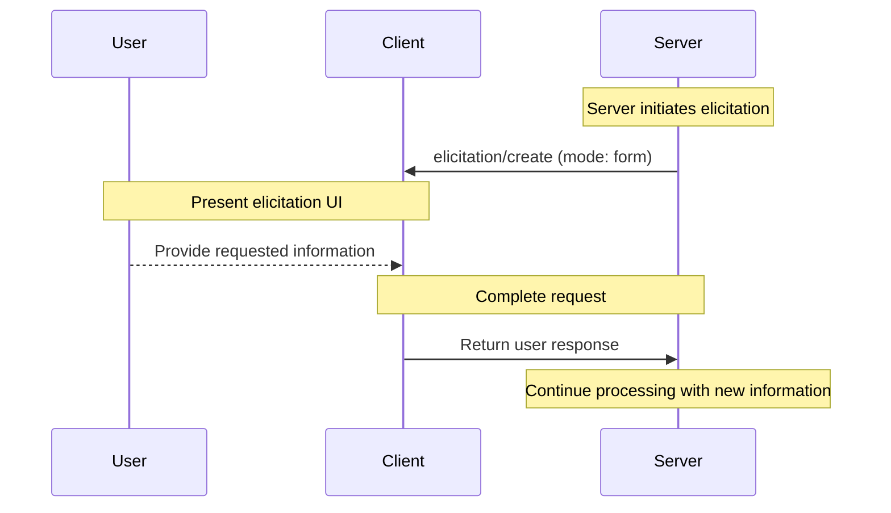
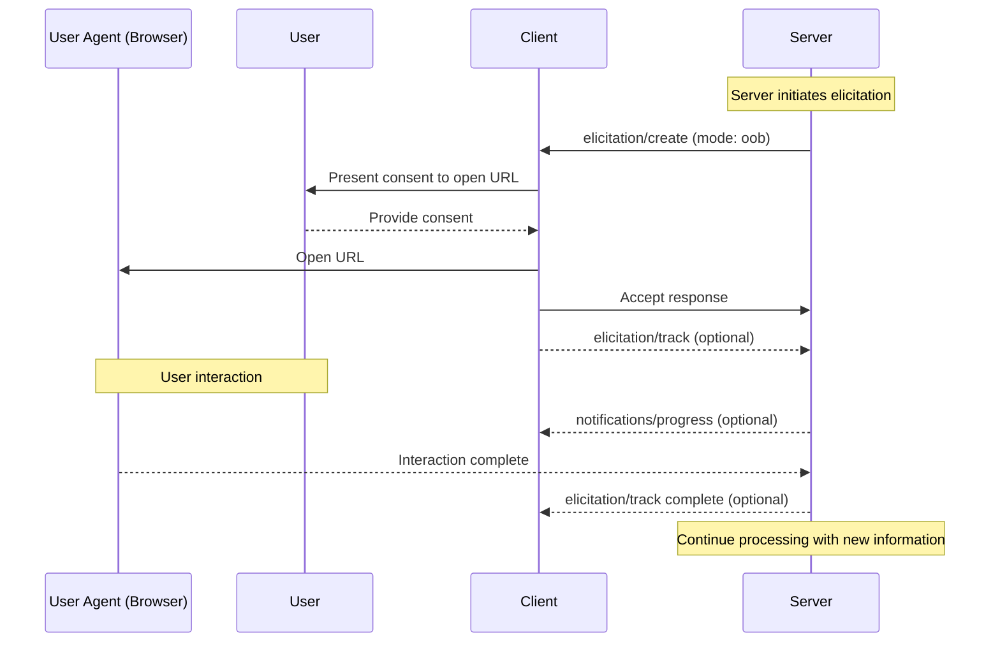
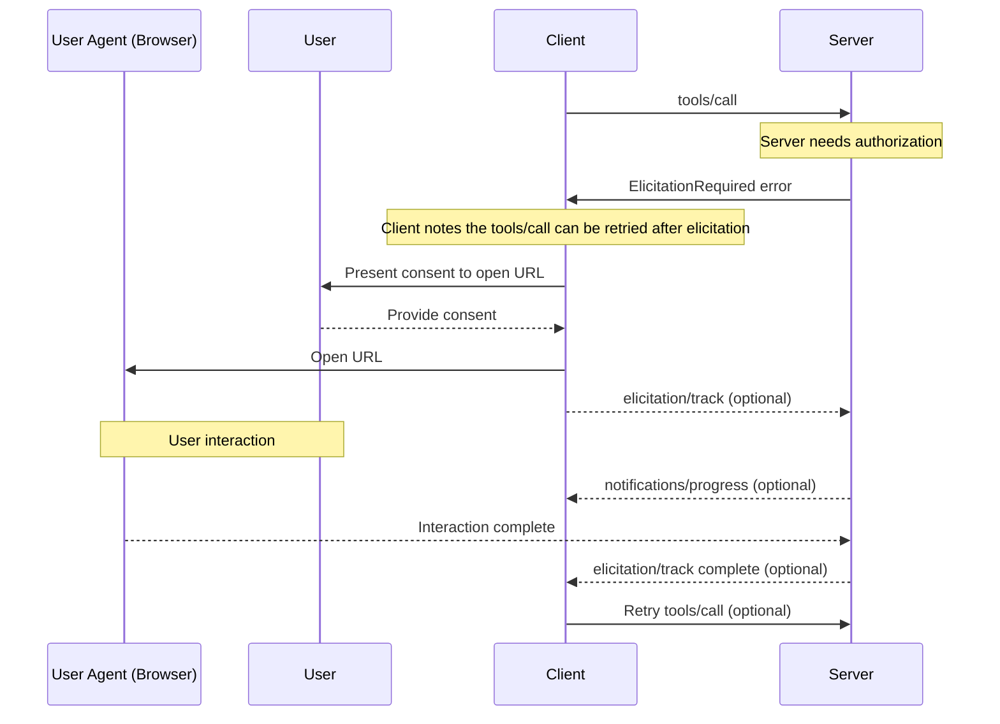

<div id="enable-section-numbers" />

<Info>**Protocol Revision**: draft</Info>

<Note>

The design of the Elicitation capability may evolve in future protocol versions.

</Note>

The Model Context Protocol (MCP) provides a standardized way for servers to request additional
information from users through the client during interactions. This flow allows clients to
maintain control over user interactions and data sharing while enabling servers to gather
necessary information dynamically.

Elicitation supports two modes:

- **Form mode** (in-band): Servers can request structured data from users with optional JSON schemas to validate responses
- **Out-of-band mode**: Servers can direct users to external URLs for interactions that should not pass through the MCP client, such as OAuth authorization flows

## User Interaction Model

Elicitation in MCP allows servers to implement interactive workflows by enabling user input
requests to occur _nested_ inside other MCP server features.

Implementations are free to expose elicitation through any interface pattern that suits
their needs&mdash;the protocol itself does not mandate any specific user interaction
model.

<Warning>

For trust & safety and security:

- Servers **MUST NOT** use form mode elicitation to request sensitive information
- Servers **MUST** use out-of-band mode for auth flows and other security-sensitive interactions
- URLs **MUST NOT** appear in form mode messages or schemas

Applications **SHOULD**:

- Provide UI that makes it clear which server is requesting information
- For out-of-band mode, clearly display the target domain/host before navigation
- Allow users to review and modify their responses before sending
- Respect user privacy and provide clear reject and cancel options

</Warning>

## Capabilities

Clients that support elicitation **MUST** declare the `elicitation` capability during
[initialization](/specification/draft/basic/lifecycle#initialization):

```json
{
  "capabilities": {
    "elicitation": {}
  }
}
```

Clients **MAY** specify sub-capabilities for elicitation modes they support:

```json
{
  "capabilities": {
    "elicitation": {
      "form": {},
      "oob": {}
    }
  }
}
```

If sub-capabilities are not present, servers **MUST** assume the client _only_ supports `form` mode for backward compatibility.

Servers **MUST NOT** send elicitation requests with modes that are not explicitly declared by the client.

## Protocol Messages

### Creating Elicitation Requests

To request information from a user, servers send an `elicitation/create` request. The request **SHOULD** include a `mode` parameter that specifies the type of elicitation:

- `"form"` (default): In-band structured data collection with optional schema validation. Data is exposed to the client.
- `"oob"`: Out-of-band interaction via URL navigation. Data is **not** exposed to the client.

#### Form Mode (In-Band)

Form mode allows servers to collect structured data directly through the MCP client.

##### Simple Text Request

**Request:**

```json
{
  "jsonrpc": "2.0",
  "id": 1,
  "method": "elicitation/create",
  "params": {
    "mode": "form",
    "message": "Please provide your GitHub username",
    "requestedSchema": {
      "type": "object",
      "properties": {
        "name": {
          "type": "string"
        }
      },
      "required": ["name"]
    }
  }
}
```

**Response:**

```json
{
  "jsonrpc": "2.0",
  "id": 1,
  "result": {
    "action": "accept",
    "content": {
      "name": "octocat"
    }
  }
}
```

##### Structured Data Request

**Request:**

```json
{
  "jsonrpc": "2.0",
  "id": 2,
  "method": "elicitation/create",
  "params": {
    "mode": "form",
    "message": "Please provide your contact information",
    "requestedSchema": {
      "type": "object",
      "properties": {
        "name": {
          "type": "string",
          "description": "Your full name"
        },
        "email": {
          "type": "string",
          "format": "email",
          "description": "Your email address"
        },
        "age": {
          "type": "number",
          "minimum": 18,
          "description": "Your age"
        }
      },
      "required": ["name", "email"]
    }
  }
}
```

**Response:**

```json
{
  "jsonrpc": "2.0",
  "id": 2,
  "result": {
    "action": "accept",
    "content": {
      "name": "Monalisa Octocat",
      "email": "octocat@github.com",
      "age": 30
    }
  }
}
```

#### Out-of-Band Mode

Out-of-band mode enables servers to direct users to external URLs for interactions that
should not pass through the MCP client. This is essential for auth flows, payment
processing, and other sensitive or secure operations.

**Request:**

```json
{
  "jsonrpc": "2.0",
  "id": 3,
  "method": "elicitation/create",
  "params": {
    "mode": "oob",
    "elicitationId": "550e8400-e29b-41d4-a716-446655440000",
    "url": "https://oauth.example.com/authorize?client_id=abc123&response_type=code&...",
    "message": "Authorization is required to access your Example Co files.",
  }
}
```

**Response:**

```json
{
  "jsonrpc": "2.0",
  "id": 3,
  "result": {
    "action": "accept",
  }
}
```

The response with `action: "accept"` indicates that the user has consented to the interaction.
It does not mean that the interaction is complete. The interaction occurs out of band and the
client is not aware of the outcome. To be aware of the outcome, the client can leverage the
[Progress Utility](/specification/draft/basic/utilities/progress), when supported by the server, to
track the progress of the interaction.


**Progress Tracking Request (from client to server):**

```json
{
  "jsonrpc": "2.0",
  "id": 3,
  "method": "elicitation/track",
  "params": {
    "elicitationId": "550e8400-e29b-41d4-a716-446655440000",
    "_meta": {
      "progressToken": "abc123"
    }
}
```

**Progress Tracking Notification (from server to client):**

```json
{
  "jsonrpc": "2.0",
  "method": "notifications/progress",
  "params": {
    "progressToken": "abc123",
    "progress": 42,
    "message": "Consent pending..."
  }
}
```

**Progress Tracking Response (from server to client):**

```json
{
  "jsonrpc": "2.0",
  "id": 3,
  "result": {
    "status": "complete"
  }
}
```

#### Decline and Cancel Responses

For all non-accept responses, the `content` field is omitted.
The response payloads are identical for either form or out-of-band mode.

**Reject Response Example:**

```json
{
  "jsonrpc": "2.0",
  "id": 2,
  "result": {
    "action": "reject"
  }
}
```

**Cancel Response Example:**

```json
{
  "jsonrpc": "2.0",
  "id": 2,
  "result": {
    "action": "cancel"
  }
}
```

### ElicitationRequired Errors

When another request cannot be processed until an elicitation is completed, the server **SHOULD**
return an [ElicitationRequired](/docs/concepts/architecture#error-handling) error to indicate to
the client that an elicitation message is expected.

The error **MAY** include a list of elicitations that are required to complete before the original
can be retried.

Elicitations returned in the error **MUST** be out-of-band mode elicitations and have an `elicitationId` property.
Servers that want form mode elicitations before another request can be retried **SHOULD** make a separate elicitation request for each form mode elicitation.

**Error Response:**

```json
{
  "jsonrpc": "2.0",
  "id": 2,
  "error": {
    "code": -32604,
    "message": "ElicitationRequired",
    "data": {
      "elicitations": [
        {
          "mode": "oob",
          "elicitionId": "550e8400-e29b-41d4-a716-446655440000",
          "url": "https://oauth.example.com/authorize?client_id=abc123&response_type=code&...",
          "message": "Authorization is required to access your Example Co files.",
        }
      ]
    }
  }
}
```

Clients can use the `elicitationId` to track the progress of the elicitation by sending a `elicitation/track` request.

## Message Flow

### Form Mode Flow



### Out-of-Band Mode Flow



### Elicitation Required Error Flow



## Request Schema

Common parameters for all elicitation requests are:

| Name            | Type   | Required    | Options           | Description |
|-----------------|--------|-------------|-------------------|-------------|
| `mode`          | string | RECOMMENDED | `"form"`, `"oob"` | The mode of the elicitation. Default is `"form"`. |
| `elicitationId` | string | REQUIRED for `"oob"` |                   | A unique identifier for the elicitation. |

### Form Mode Schema

For `form` mode, the `requestedSchema` parameter allows servers to define the structure of the expected
response using a restricted subset of JSON Schema. To simplify implementation for clients,
elicitation schemas are limited to flat objects with primitive properties only:

```json
"mode": "form",
"elicitationId": "550e8400-e29b-41d4-a716-446655440000",
"requestedSchema": {
  "type": "object",
  "properties": {
    "propertyName": {
      "type": "string",
      "title": "Display Name",
      "description": "Description of the property"
    },
    "anotherProperty": {
      "type": "number",
      "minimum": 0,
      "maximum": 100
    }
  },
  "required": ["propertyName"]
}
```

#### Supported Schema Types

The schema is restricted to these primitive types:

1. **String Schema**

   ```json
   {
     "type": "string",
     "title": "Display Name",
     "description": "Description text",
     "minLength": 3,
     "maxLength": 50,
     "pattern": "^[A-Za-z]+$",
     "format": "email"
   }
   ```

   Supported formats: `email`, `uri`, `date`, `date-time`

2. **Number Schema**

   ```json
   {
     "type": "number", // or "integer"
     "title": "Display Name",
     "description": "Description text",
     "minimum": 0,
     "maximum": 100
   }
   ```

3. **Boolean Schema**

   ```json
   {
     "type": "boolean",
     "title": "Display Name",
     "description": "Description text",
     "default": false
   }
   ```

4. **Enum Schema**
   ```json
   {
     "type": "string",
     "title": "Display Name",
     "description": "Description text",
     "enum": ["option1", "option2", "option3"],
     "enumNames": ["Option 1", "Option 2", "Option 3"]
   }
   ```

Clients can use this schema to:

1. Generate appropriate input forms
2. Validate user input before sending
3. Provide better guidance to users

Note that complex nested structures, arrays of objects, and other advanced JSON Schema features are intentionally not supported to simplify client implementation.

### Out-of-Band Mode Parameters

For `oob` mode elicitation, the `mode` parameter **MUST** be set to `"oob"` and `elicitationId` **MUST** be provided.

Request parameters specific to `oob` mode are:

| Name      | Type   | Required | Description |
|-----------|--------|----------|-------------|
| `url`     | string | REQUIRED | The URL that the user should navigate to. |
| `message` | string | REQUIRED | Human-readable explanation of why the interaction is needed. |

Parameters **MUST NOT** include:

- `requestedSchema` - This is only for form mode
- Any URLs in the `message` field; URLs must only appear in the `url` field

```json
"mode": "oob",
"elicitationId": "550e8400-e29b-41d4-a716-446655440000",
"url": "https://oauth.example.com/authorize?client_id=abc123&response_type=code&...",
"message": "Authorization is required to access your Example Co files.",
```

## Progress Tracking

Particularly for out-of-band mode, where the client is not involved in the interaction, the client **MAY** choose to request progress updates from the server.
Elicitation leverages MCP's [Progress Utility](/specification/draft/basic/utilities/progress) to track the progress of the interaction.

The client **MAY** send a `elicitation/track` request to the server to request progress updates.

The client **MUST** include an `elicitationId` in the request to signal to the server which elicitation to send progress updates for.

The client, per the Progress Utility protocol, **MUST** include a `progressToken` in the request to disambiguate across various progress tracking requests.

How that progressToken is generated is left to the client implementation.

The server **MAY** send a `notifications/progress` notification to the client with the progress token and the progress status.

The server **SHOULD** send a `elicitation/track` response to the client once the elicitation is complete.=

## Response Actions

Elicitation responses use a three-action model to clearly distinguish between different user actions.

```json
{
  "jsonrpc": "2.0",
  "id": 1,
  "result": {
    "action": "accept", // or "reject" or "cancel"
    "content": {
      "propertyName": "value",
      "anotherProperty": 42
    }
  }
}
```

The three response actions are:

1. **Accept** (`action: "accept"`): User explicitly approved and submitted with data

   - For form mode: The `content` field contains the submitted data matching the requested schema
   - For out-of-band mode: The `content` field is omitted
   - Example: User clicked "Submit", "OK", "Confirm", etc.

2. **Reject** (`action: "reject"`): User explicitly rejected the request

   - The `content` field is typically omitted
   - Example: User clicked "Reject", "Decline", "No", etc.

3. **Cancel** (`action: "cancel"`): User dismissed without making an explicit choice
   - The `content` field is typically omitted
   - Example: User closed the dialog, clicked outside, pressed Escape, etc.

Servers should handle each state appropriately:

- **Accept**: Process the submitted data or proceed with the interaction
- **Decline**: Handle explicit rejection (e.g., offer alternatives)
- **Cancel**: Handle dismissal (e.g., prompt again later)

## Security Considerations

1. Clients **MUST** provide clear indication of which server is requesting information
2. Clients **SHOULD** implement user approval controls
3. Clients **SHOULD** allow users to reject elicitation requests at any time
4. Clients **SHOULD** implement rate limiting
5. Clients **SHOULD** present elicitation requests in a way that makes it clear what information is being requested and why

### Identifying the User

Servers **MUST NOT** rely on client-provided user identification, as this can be forged.
Instead, servers **SHOULD** follow [security best practices](/specification/draft/basic/security_best_practices).

Non-normative examples:
- Incorrect: Treat user input like "I am joe@example.com" as authoritative
- Correct: Rely on the [MCP authorization server](/specification/draft/basic/authorization) to identify the user

### Form Mode Security

1. Servers **MUST NOT** request sensitive information (passwords, API keys, etc.) via form mode
2. Servers **MUST NOT** place URLs intended for user interaction in form mode messages or schemas
3. Clients **SHOULD** validate all responses against the provided schema
4. Servers **SHOULD** validate received data matches the requested schema

### Out-of-Band Mode Security

1. Clients **MUST NOT** open a user agent (e.g. browser) without explicit consent from the user

#### Server-Side Request Forgery (SSRF)

Since clients open URLs provided by servers, they **MUST** implement SSRF protections:

- Block requests to internal IP ranges (e.g., 127.0.0.1, 10.0.0.0/8, etc.)
- Require the `https://` scheme for all out-of-band URLs (no HTTP, file://, etc.)
- Clearly render or distinguish Unicode characters (e.g. punycode URLs) to avoid "look-alike" misdirections
- Clearly communicate the destination server and target URL to the user when asking for consent

#### Phishing

One use of out-of-band elicitation is to perform OAuth flows where the server acts as an
OAuth client of another resource server. In this case, the server generates an
authorization URL to the third-party resource server and passes it to the client in the
form of an `oob` elicitation request.

Without proper mitigation, the following phishing attack is possible:
1. A malicious user (Alice) connected to a benign server triggers an elicitation request
2. The benign server generates an authorization URL, acting as an OAuth client of a third-party resource server
3. Instead of clicking on the link, Alice tricks a victim user (Bob) of the same benign server into clicking it
4. Bob follows the link and completes the authorization, thinking they are authorizing their own connection to the benign server
5. The tokens for the third-party server are bound to Alice's session and identity, instead of Bob's, resulting in an account takeover

To prevent this attack, the server **MUST**, upon recieving the redirect_uri from the third-party authorization server,
ensure the user who is completing the authorization is the same user who initiated the elicitation request. Typically this
is done by leveraging the [MCP authorization server](/specification/draft/basic/authorization) to identify the user,
through a session cookie or equivalent in the browser.
