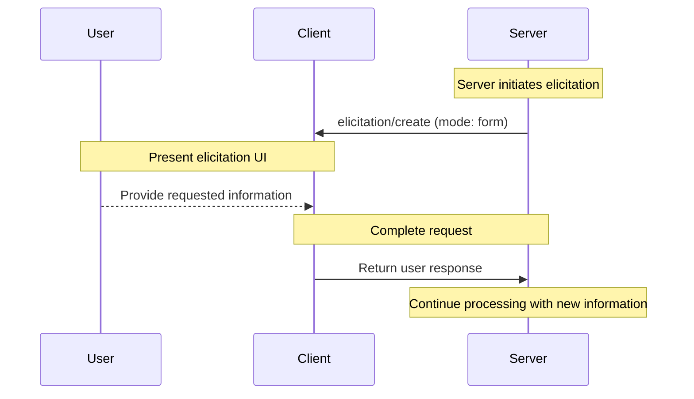
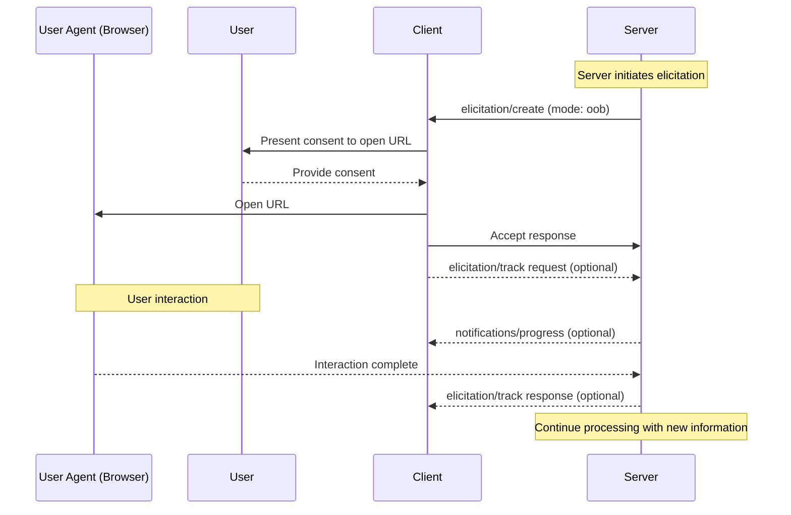
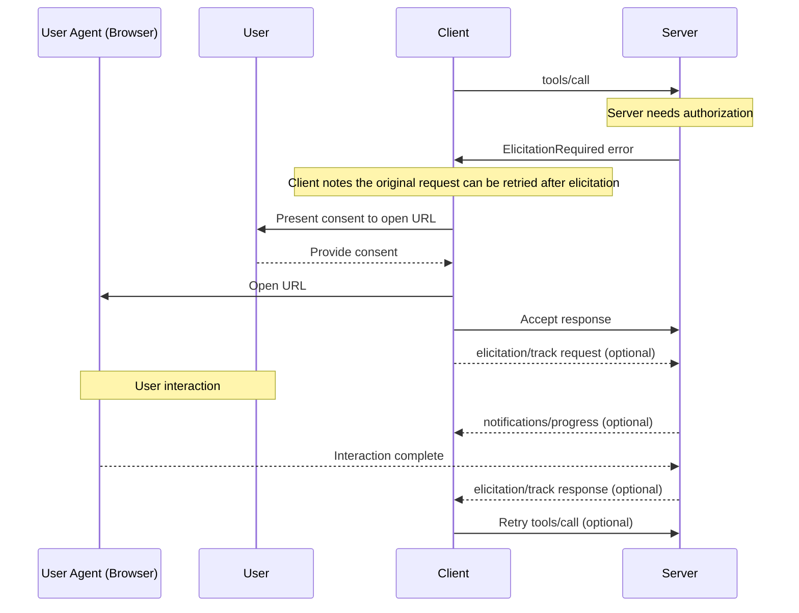

<div id="enable-section-numbers" />

<Info>**Protocol Revision**: draft</Info>

<Note>

The design of the Elicitation capability may evolve in future protocol versions.

</Note>

The Model Context Protocol (MCP) provides a standardized way for servers to request additional
information from users through the client during interactions. This flow allows clients to
maintain control over user interactions and data sharing while enabling servers to gather
necessary information dynamically.

Elicitation supports two modes:

- **Form mode** (in-band): Servers can request structured data from users with optional JSON schemas to validate responses
- **Out-of-band mode**: Servers can direct users to external URLs for interactions that must _not_ pass through the MCP client, such as OAuth authorization flows

## User Interaction Model

Elicitation in MCP allows servers to implement interactive workflows by enabling user input
requests to occur _nested_ inside other MCP server features.

Implementations are free to expose elicitation through any interface pattern that suits
their needs&mdash;the protocol itself does not mandate any specific user interaction
model.

<Warning>

For trust & safety and security:

- Servers **MUST NOT** use form mode elicitation to request sensitive information
- Servers **MUST** use out-of-band mode for auth flows and other security-sensitive interactions
- URLs **MUST NOT** appear in any field of an elicitation request other than the `url` field for out-of-band mode

Applications **SHOULD**:

- Provide UI that makes it clear which server is requesting information
- For out-of-band mode, clearly display the target domain/host before navigation
- Allow users to review and modify their responses before sending
- Respect user privacy and provide clear reject and cancel options

</Warning>

## Capabilities

Clients that support elicitation **MUST** declare the `elicitation` capability during
[initialization](/specification/draft/basic/lifecycle#initialization):

```json
{
  "capabilities": {
    "elicitation": {
      "form": {},
      "oob": {}
    }
  }
}
```

Clients declaring the `elicitation` capability **MUST** support at least one mode (`form` or `oob`).

Servers **MUST NOT** send elicitation requests with modes that are not supported by the client.

## Protocol Messages

### Elicitation Requests

To request information from a user, servers send an `elicitation/create` request.

All elicitation requests **MUST** include the following parameters:

| Name      | Type   | Options           | Description                                                        |
| --------- | ------ | ----------------- | ------------------------------------------------------------------ |
| `mode`    | string | `form`, `oob` | The mode of the elicitation.                                       |
| `message` | string |                   | A human-readable message explaining why the interaction is needed. |

 The `mode` parameter specifies the type of elicitation:

- `"form"`: In-band structured data collection with optional schema validation. Data is exposed to the client.
- `"oob"`: Out-of-band interaction via URL navigation. Data is **not** exposed to the client.

### Form Elicitation Requests

Form elicitation allows servers to collect structured data directly through the MCP client.

Form elicitation requests **MUST** specify `mode: "form"` and include these parameters:

| Name              | Type   | Description                                                    |
| ----------------- | ------ | -------------------------------------------------------------- |
| `requestedSchema` | object | A JSON Schema defining the structure of the expected response. |


#### Request Schema

The `requestedSchema` parameter allows servers to define the structure of the expected
response using a restricted subset of JSON Schema.

To simplify implementation for clients, elicitation schemas are limited to flat objects
with primitive properties only.

The schema is restricted to these primitive types:

1. **String Schema**

   ```json
   {
     "type": "string",
     "title": "Display Name",
     "description": "Description text",
     "minLength": 3,
     "maxLength": 50,
     "pattern": "^[A-Za-z]+$",
     "format": "email"
   }
   ```

   Supported formats: `email`, `uri`, `date`, `date-time`

2. **Number Schema**

   ```json
   {
     "type": "number", // or "integer"
     "title": "Display Name",
     "description": "Description text",
     "minimum": 0,
     "maximum": 100
   }
   ```

3. **Boolean Schema**

   ```json
   {
     "type": "boolean",
     "title": "Display Name",
     "description": "Description text",
     "default": false
   }
   ```

4. **Enum Schema**
   ```json
   {
     "type": "string",
     "title": "Display Name",
     "description": "Description text",
     "enum": ["option1", "option2", "option3"],
     "enumNames": ["Option 1", "Option 2", "Option 3"]
   }
   ```

Clients can use this schema to:

1. Generate appropriate input forms
2. Validate user input before sending
3. Provide better guidance to users

Note that complex nested structures, arrays of objects, and other advanced JSON Schema features are intentionally not supported to simplify client implementation.

#### Example: Simple Text Request

**Request:**

```json
{
  "jsonrpc": "2.0",
  "id": 1,
  "method": "elicitation/create",
  "params": {
    "mode": "form",
    "message": "Please provide your GitHub username",
    "requestedSchema": {
      "type": "object",
      "properties": {
        "name": {
          "type": "string"
        }
      },
      "required": ["name"]
    }
  }
}
```

**Response:**

```json
{
  "jsonrpc": "2.0",
  "id": 1,
  "result": {
    "action": "accept",
    "content": {
      "name": "octocat"
    }
  }
}
```

#### Example: Structured Data Request

**Request:**

```json
{
  "jsonrpc": "2.0",
  "id": 2,
  "method": "elicitation/create",
  "params": {
    "mode": "form",
    "message": "Please provide your contact information",
    "requestedSchema": {
      "type": "object",
      "properties": {
        "name": {
          "type": "string",
          "description": "Your full name"
        },
        "email": {
          "type": "string",
          "format": "email",
          "description": "Your email address"
        },
        "age": {
          "type": "number",
          "minimum": 18,
          "description": "Your age"
        }
      },
      "required": ["name", "email"]
    }
  }
}
```

**Response:**

```json
{
  "jsonrpc": "2.0",
  "id": 2,
  "result": {
    "action": "accept",
    "content": {
      "name": "Monalisa Octocat",
      "email": "octocat@github.com",
      "age": 30
    }
  }
}
```

### Out-of-Band Elicitation Requests

Out-of-band elicitation enables servers to direct users to external URLs for interactions that
must not pass through the MCP client. This is essential for auth flows, payment
processing, and other sensitive or secure operations.

Out-of-band elicitation requests **MUST** specify `mode: "oob"` and include these parameters:

| Name            | Type   | Description                               |
| --------------- | ------ | ----------------------------------------- |
| `url`           | string | The URL that the user should navigate to. |
| `elicitationId` | string | A unique identifier for the elicitation.  |

The `url` parameter **MUST** contain a valid URL. The `message` parameter **MUST NOT** contain a URL.

<Note>
In most cases, implementing out-of-band elicitation requires that the server be stateful: it must keep track of some state about the user (authorized/not authorized, paid/not paid, etc).
</Note>

#### Example: Request Sensitive Data

This example shows an out-of-band elicitation request directing the user to a secure URL where they can provide sensitive information (an API key, for example).
The same request could direct the user into an OAuth authorization flow, or a payment flow; the only difference is the URL and the message.

**Request:**

```json
{
  "jsonrpc": "2.0",
  "id": 3,
  "method": "elicitation/create",
  "params": {
    "mode": "oob",
    "elicitationId": "550e8400-e29b-41d4-a716-446655440000",
    "url": "https://mcp.example.com/ui/set_api_key",
    "message": "Please provide your API key to continue."
  }
}
```

**Response:**

```json
{
  "jsonrpc": "2.0",
  "id": 3,
  "result": {
    "action": "accept"
  }
}
```

The response with `action: "accept"` indicates that the user has consented to the
interaction. It does not mean that the interaction is complete. The interaction occurs out
of band and the client is not aware of the outcome, unless the client requests progress updates.


### Progress Tracking

The client **MAY** request progress updates from the server by sending an `elicitation/track` request with a [progress token](/specification/draft/basic/utilities/progress#progress-token). This is particularly useful in out-of-band mode, because the client is not involved in the interaction.

The client **MUST** include an `elicitationId` in the request to identify which elicitation to send progress updates for. The client **SHOULD** include a `progressToken` in the request's `_meta` field.

The server **MUST** ignore any `elicitation/track` requests containing an `elicitationId` that is not known or does not belong to the client.

The server **MAY** send a `notifications/progress` notification to the client with the progress token and the progress status.

The server **SHOULD** send a `elicitation/track` response to the client once the elicitation is complete.

#### Example

**Progress Tracking Request:**

```json
{
  "jsonrpc": "2.0",
  "id": 4,
  "method": "elicitation/track",
  "params": {
    "_meta": {
      "progressToken": "abc123"
    },
    "elicitationId": "550e8400-e29b-41d4-a716-446655440000"
}
```

**Progress Tracking Notification:**

```json
{
  "jsonrpc": "2.0",
  "method": "notifications/progress",
  "params": {
    "progressToken": "abc123",
    "progress": 42,
    "message": "Consent pending..."
  }
}
```

**Progress Tracking Response:**

```json
{
  "jsonrpc": "2.0",
  "id": 4,
  "result": {
    "status": "complete"
  }
}
```

### Elicitation Required Error

When another request cannot be processed until an elicitation is completed, the server **SHOULD**
return an [ElicitationRequired error](/docs/concepts/architecture#error-handling) (code `-32604`) to indicate to
the client that an elicitation is required.

The error **MUST** include a list of elicitations that are required to complete before the original
can be retried.

Any elicitations returned in the error **MUST** be out-of-band mode elicitations and have an `elicitationId` property.
Servers that want elicit data from the user via form mode **SHOULD** make a separate elicitation request for each form mode elicitation.

**Error Response:**

```json
{
  "jsonrpc": "2.0",
  "id": 2,
  "error": {
    "code": -32604, // ELICITATION_REQUIRED
    "message": "This request requires more information.",
    "data": {
      "elicitations": [
        {
          "mode": "oob",
          "elicitionId": "550e8400-e29b-41d4-a716-446655440000",
          "url": "https://oauth.example.com/authorize?client_id=abc123&response_type=code&...",
          "message": "Authorization is required to access your Example Co files."
        }
      ]
    }
  }
}
```

## Message Flow

### Form Mode Flow



### Out-of-Band Mode Flow



### Out-of-Band Mode With Elicitation Required Error Flow




## Response Actions

Elicitation responses use a three-action model to clearly distinguish between different user actions. These actions apply to both form and out-of-band elicitation modes.

```json
{
  "jsonrpc": "2.0",
  "id": 1,
  "result": {
    "action": "accept", // or "reject" or "cancel"
    "content": {
      "propertyName": "value",
      "anotherProperty": 42
    }
  }
}
```

The three response actions are:

1. **Accept** (`action: "accept"`): User explicitly approved and submitted with data

   - For form mode: The `content` field contains the submitted data matching the requested schema
   - For out-of-band mode: The `content` field is omitted
   - Example: User clicked "Submit", "OK", "Confirm", etc.

2. **Reject** (`action: "reject"`): User explicitly rejected the request

   - The `content` field is typically omitted
   - Example: User clicked "Reject", "Decline", "No", etc.

3. **Cancel** (`action: "cancel"`): User dismissed without making an explicit choice
   - The `content` field is typically omitted
   - Example: User closed the dialog, clicked outside, pressed Escape, etc.

Servers should handle each state appropriately:

- **Accept**: Process the submitted data or proceed with the interaction
- **Decline**: Handle explicit rejection (e.g., offer alternatives)
- **Cancel**: Handle dismissal (e.g., prompt again later)

## Implementation Considerations


## Security Considerations

1. Clients **MUST** provide clear indication of which server is requesting information
2. Clients **SHOULD** implement user approval controls
3. Clients **SHOULD** allow users to reject elicitation requests at any time
4. Clients **SHOULD** implement rate limiting
5. Clients **SHOULD** present elicitation requests in a way that makes it clear what information is being requested and why

### URL Safety

Clients implementing out-of-band elicitation **MUST** implement the safety checks for URLs described below. These strict controls, including obtaining consent from the user, help prevent users from unknowingly clicking malicious links.

URLs **MUST NOT** be present in any message or schema fields as part of an out-of-band elicitation request EXCEPT for the `url` field.

URLs **MUST NOT** be present in any message or schema fields as part of a form elicitation request.

### Identifying the User

Servers **MUST NOT** rely on client-provided user identification, as this can be forged.
Instead, servers **SHOULD** follow [security best practices](/specification/draft/basic/security_best_practices).

Non-normative examples:

- Incorrect: Treat user input like "I am joe@example.com" as authoritative
- Correct: Rely on the [MCP authorization server](/specification/draft/basic/authorization) to identify the user

### Form Mode Security

1. Servers **MUST NOT** request sensitive information (passwords, API keys, etc.) via form mode
2. Clients **SHOULD** validate all responses against the provided schema
3. Servers **SHOULD** validate received data matches the requested schema

### Out-of-Band Mode Security

1. Clients **MUST NOT** open a user agent (e.g. browser) without explicit consent from the user

#### Server-Side Request Forgery (SSRF)

Since clients open URLs provided by servers, they **MUST** implement SSRF protection, including:

- Block requests to internal IP ranges (e.g., 127.0.0.1, 10.0.0.0/8, etc.)
- Require the `https://` scheme for all out-of-band URLs (no HTTP, file://, etc.)
- Clearly render or distinguish Unicode characters (e.g. punycode URLs) to avoid "look-alike" misdirections
- Clearly communicate the destination server and target URL to the user when asking for consent

#### Phishing

One use of out-of-band elicitation is to perform OAuth flows where the server acts as an
OAuth client of another resource server. In this case, the server generates an
authorization URL to the third-party resource server and passes it to the client in the
form of an `oob` elicitation request.

Without proper mitigation, the following phishing attack is possible:

1. A malicious user (Alice) connected to a benign server triggers an elicitation request
2. The benign server generates an authorization URL, acting as an OAuth client of a third-party authorization server
3. Alice's client displays the URL and asks for consent
4. Instead of clicking on the link, Alice tricks a victim user (Bob) of the same benign server into clicking it
5. Bob opens the link and completes the authorization, thinking they are authorizing their own connection to the benign server
6. The benign server receives a callback/redirect form the third-party authorization server, and assumes it's Alice's request
7. The tokens for the third-party server are bound to Alice's session and identity, instead of Bob's, resulting in an account takeover

To prevent this attack, the server **MUST** check the identity of the user (step 6 in the
above example), and confirm that the user who is completing the authorization is the same
user who initiated the elicitation request. Typically this is done by
leveraging the [MCP authorization server](/specification/draft/basic/authorization) to
identify the user, through a session cookie or equivalent in the browser.
