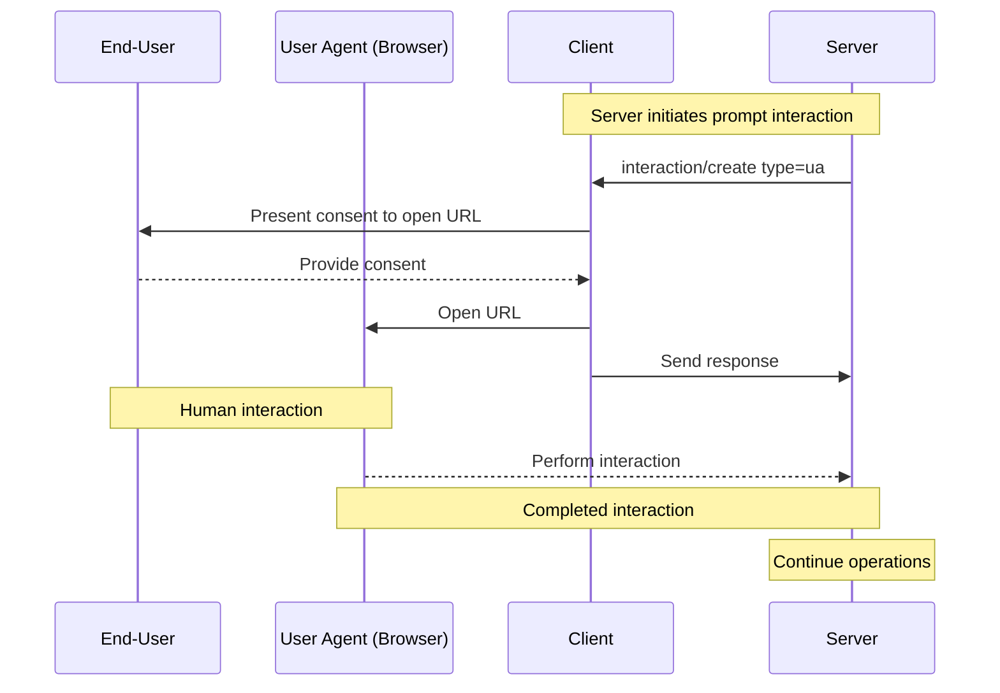
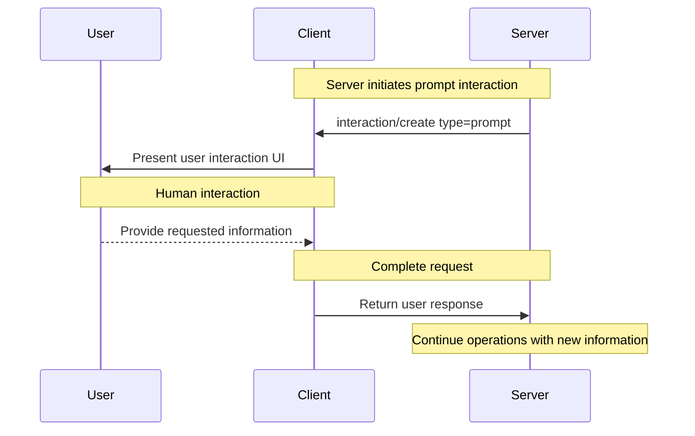

<Info>**Protocol Revision**: draft</Info>

The Model Context Protocol (MCP) provides a standardized way for servers to interact directly with
end-users without data passing through the client or the LLM. This allows servers to maintain control over user
interactions and data sharing while dynamically gathering necessary information.

The details of the interaction itself are fully under the control of the MCP server, and the MCP
client is only responsible for facilitating the interaction (typically by presenting a URL or
instructions to the end-user, or by rendering a form for non-sensitive information). With this model,
the client's responsibilities remain minimal and the server has the flexibility to implement a wide
range of interactions involving the end-user. For example:

- A productivity MCP server might request a user to authorize a third-party service to
  access their documents.
- A news MCP server might request a user to upgrade their subscription to access more features.
- A banking MCP server might request a user to verify their account to access a new feature.
- A media MCP server might request a user's favorite music genre to personalize the user
  experience.
- A social media MCP server might request an image to use as a profile picture.

## Terminology

- **End-user**: The human who is interacting with the MCP client (and, by extension, the MCP server).
- **User agent**: Most familiarly a Web browser, the user agent is a client that is capable of
  interacting with the end-user. Broadly, it is used as defined in
  [RFC 9110 Section 3.5](https://datatracker.ietf.org/doc/html/rfc9110#section-3.5).

## Capabilities

Clients that support user interaction **MUST** declare the `userInteraction` capability during
[initialization](/specification/draft/basic/lifecycle#initialization):

```json
{
  "capabilities": {
    "userInteraction": {
      "types": ["ua", "prompt"],
      "progress": true
    }
  }
}
```

Clients supporting the `userInteraction` capability **MUST** list all supported interaction types
in the `types` array, and **MUST** support at least one interaction type.

The MCP server **MUST NOT** send an interaction request to the client of a type that is not
supported by the client.


## Protocol Messages

### Server-Initiated Interaction Requests

When the MCP client indicates support for user interactions, the MCP server **MAY** request a user
interaction from the client at any time. To request a user interaction, the server sends an
`interaction/create` message to the client.

The request includes the following fields as part of the `params` object:

- `id`: The ID of the interaction that **MUST** be unique across the server's concurrent
  interactions.
- `type`: The type of interaction, which **MUST** be one of the types negotiated during
  initialization.
- `interaction`: The interaction object, the schema of which depends on the type of interaction. Each schema is defined in the [User Interaction Flow](#interaction-flow) section below.

The following is an example of a `interaction/create` message for a `ua` interaction:

```json
{
  "jsonrpc": "2.0",
  "id": 1,
  "method": "interaction/create",
  "params": {
    "id": "c8ec9a71-c475-4a88-a774-e9cd154bc7f8",
    "type": "ua",
    "interaction": {
      "url": "https://oauth.example.com/authorize?client_id=abc123&...",
      "message": {
        "type": "text",
        "text": "Authorization is required to access your Example Co files."
      }
    }
  }
}
```


### Requiring Interaction as an Error Response

The MCP server **MAY** require a user interaction as an error response to a client request.
This is useful when interaction is required as a pre-condition for a request (e.g. step-up authorization).

The MCP server **MUST** send an
[error response](/specification/draft/basic/lifecycle#error-handling) with the `code` equal to
`-32003` and the `message` equal to `interaction_required`.

The error response **MUST** include an `data` object consistent with one of the defined
[interaction schemas](#interaction-flow).

```json
{
  "jsonrpc": "2.0",
  "id": "abc-123",
  "error": {
    "code": -32003,
    "message": "interaction_required",
    "data": {
      "id": "c8ec9a71-c475-4a88-a774-e9cd154bc7f8",
      "type": "ua",
      "url": "https://oauth.example.com/authorize?client_id=abc123&...",
      "message": {
        "type": "text",
        "text": "Authorization is required to access your Example Co files."
      }
    }
  }
}
```


## Interaction Flow

When a user interaction is requested by the server and supported by the client, the MCP client **MUST** present
the user with an interaction flow. The type of flow is defined by the MCP server, and the client's behavior
is specific to the interaction type.

This specification defines the following types of user interactions:

- **`ua`**: A user agent interaction is a user interaction that involves making a request via a
  User Agent (e.g. a Web browser).
- **`prompt`**: A prompt interaction is a user interaction that involves the MCP client prompting
  the user for structured information (e.g. rendering a form).

The  client and server **MAY** negotiate additional interaction types.

<Warning>

For trust and safety, there **SHOULD** always
be a human in the loop with the ability to deny interaction requests.

MCP clients **SHOULD**:

- Provide UI that makes it clear which server is requesting information
- Allow users to review and modify their responses before sending
- Respect user privacy and provide clear cancel options

</Warning>

### User agent interactions

A user agent interaction is a user interaction that involves the MCP client facilitating navigating to
a URL in a User Agent (e.g. a Web browser). This allows the MCP server to obtain data without involving the MCP client.
 The MCP server can, as a result, control the entire interaction
from start to finish, including the user experience, and guarantee the security of sensitive data (e.g. API keys or authorization grants).

This flow requires the client to support the `ua` user interaction type.

```json
{
  "capabilities": {
    "userInteraction": {
      "types": ["ua"]
    }
  }
}
```

The MCP client **MUST** facilitate the opening of the URL in a User Agent.

#### Flow Diagram



#### Server Request

For `ua` interactions, the `interaction` object has the following properties:

- `url`: The URL that the user should interact with.
- `message`: An optional `TextContent` object used to provide an explanation to the user about the interaction.

```json
{
  "jsonrpc": "2.0",
  "id": 1,
  "method": "interaction/create",
  "params": {
    "id": "c8ec9a71-c475-4a88-a774-e9cd154bc7f8",
    "type": "ua",
    "interaction": {
      "url": "https://example.com/mcp?state=1234567890&...",
      "message": {
        "type": "text",
        "text": "Please sign in to your account."
      }
    }
  }
}
```

#### Client Response

When the client facilitates the opening of the URL, it **MUST** send a response to the server:

```json
{
  "jsonrpc": "2.0",
  "id": 1,
  "result": {}
}
```


### Prompt interactions

A prompt interaction is a user interaction that involves the MCP client prompting the user for
information within the MCP client UI. This provides a way for the MCP server to obtain data from
the user without needing to host a URL or create any UI for the user to interact with. The MCP
server can, as a result, receive non-sensitive information from the user with little effort.

This flow requires the client to support the `prompt` user interaction type.

```json
{
  "capabilities": {
    "userInteraction": {
      "types": ["prompt"]
    }
  }
}
```

The MCP client **MUST** present the user with a prompt UI consistent with the `schema` object.

#### Flow Diagram




#### Server Request

For `prompt` interactions, the `interaction` object has the following properties:

- `message`: A `TextContent` object used to provide context to the user about the interaction.
- `schema`: A `JSONSchema` object used to define the schema of the prompt for the MCP client.

```json
{
  "jsonrpc": "2.0",
  "id": 1,
  "method": "interaction/create",
  "params": {
    "id": "c8ec9a71-c475-4a88-a774-e9cd154bc7f8",
    "type": "prompt",
    "interaction": {
      "message": {
        "type": "text",
        "text": "Let us know some information about you."
      },
      "schema": {
        "type": "object",
        "properties": {
          "name": {
            "type": "string",
            "description": "Your full name"
          },
          "email": {
            "type": "string",
            "format": "email",
            "description": "Your email address"
          },
          "age": {
            "type": "number",
            "minimum": 18,
            "description": "Your age"
          }
        },
        "required": ["name", "email"]
      }
    }
  }
}
```

#### Client Response

When the user provides their response, the client **MUST** send a response to the server:

```json
{
  "jsonrpc": "2.0",
  "id": 1,
  "result": {
    "content": {
      "name": "Monalisa",
      "email": "monalisa@example.com",
      "age": 30
    }
  }
}
```


## Progress Tracking

The MCP client **MAY** support progress tracking for interactions. This can be used to
provide feedback to the user about the progress of the interaction in the MCP client's UI. This is
particularly useful for interactions where the user will be interacting out-of-band with the MCP
client, such as `ua` interactions, and the MCP client desires some way to update its UI.

This leverages the [Progress capability](/specification/draft/basic/utilities/progress) in the base
protocol. It requires the MCP server to support the `progress` capability during initialization.

Tracking progress for user interactions is optional. If the MCP server does not support progress
tracking, it **MUST NOT** respond to the `interaction/notify` message, in keeping with the
requirements of the
[Progress capability](/specification/draft/basic/utilities/progress#behavior-requirements).


Note that the MCP server may choose to not send progress notifications for a given interaction, even if
the client supports progress tracking and the server supports the progress capability generally.
Therefore, the client **SHOULD NOT** assume that progress notifications will be sent for an
interaction, and should be prepared to handle the case where no progress notifications are sent.

MCP clients **MAY** send an `interaction/notify` message to the server to initiate progress tracking for a
particular interaction. The MCP client **MUST** include the interaction ID in the `id` field that
it wants to track progress for. This `id` **MUST** be an interaction that the server created via
the `interaction/create` message.

```json
{
  "jsonrpc": "2.0",
  "id": "track-progress-123",
  "method": "interaction/notify",
  "params": {
    "id": "c8ec9a71-c475-4a88-a774-e9cd154bc7f8",
    "_meta": {
      "progressToken": "abc123"
    }
  }
}
```

MCP servers **MUST NOT** respond to the `interaction/notify` message if:

- the `id` is not an interaction that the server created via the `interaction/create` message.
- the `id` is not an interaction that is associated with the client.
- the `id` is not an interaction that is associated with the current MCP session, if session
  management is in use.

MCP clients **SHOULD** be aware that MCP servers might not respond to the `interaction/notify`
message, and **SHOULD** be prepared to handle the case where no response is received.

The following is an example of a progress notification sent by the MCP server:

```json
{
  "jsonrpc": "2.0",
  "method": "notifications/progress",
  "params": {
    "progressToken": "abc123",
    "progress": 50,
    "total": 100,
    "message": "Reticulating splines..."
  }
}
```

Once the interaction is complete, the server **MUST** respond to the `interaction/notify` message,
for example:

```json
{
  "jsonrpc": "2.0",
  "id": "track-progress-123",
  "result": {}
}
```


## Cancelling an Interaction

### Server-Initiated Cancellation

The MCP server **MAY** cancel an interaction at any time by sending a `notifications/cancelled`
message to the client. The MCP client **SHOULD NOT** send a response. This is consistent with the
[Cancellation capability](/specification/draft/basic/utilities/cancellation).

### Client-Initiated Cancellation

The end-user may choose to decline or cancel an interaction themselves. For example, the user may decline to submit a form rendered by
the MCP client as part of a `prompt` interaction, or not consent to open a URL as part of a
`ua` interaction. The MCP client **MAY** indicate at any time that the server should abandon (cancel) the interaction by returning an error response:

```json
{
  "jsonrpc": "2.0",
  "id": 1,
  "error": {
    "code": -1,
    "message": "User did not consent to the interaction"
  }
}
```

The `id` of the request **MUST** be the `id` of the original `interaction/create` request that the
client wants to cancel.

## Identifying the User

Most MCP servers will need a persistent identifier for the end-user. The MCP server **MUST NOT**
rely on input from the client or end-user to identify the end-user, as this can be forged and lead to impersonation attacks.
Instead, the MCP server **SHOULD** identify the end-user in trusted (server) code. For example,

- Implementations using an HTTP transport and [MCP authorization](/specification/draft/basic/authorization)
  **MAY** use the subject claim (`sub`) from the OAuth 2.1 Access Token as the user identifier, if present.
- Implementations using an stdio transport **MAY** acquire the user identifier from the environment.

## Security Considerations

### Handling Sensitive Information

One mechanism for which user interaction may be leveraged is passing a user's auth credentials, or
other secret and sensitive data to the MCP server. The specifics of the sensitive data is out of
scope for this specification. However, MCP servers that request secrets, such as auth credentials,
**MUST** leverage an interaction type which prevents the MCP client from interacting with those
secrets in any way.

### Server-side request forgery (SSRF)

In the case of `ua` interactions, the MCP client is expected to make a request via a user agent
based on the value of the `url` parameter in the interaction object. Since MCP enables clients
to interoperate with MCP servers it has no prior knowledge of, this opens a risk for Server-Side
Request Forgery (SSRF) attacks by malicious MCP servers. MCP clients **SHOULD** take appropriate
precautions against SSRF attacks, such as blocking requests to internal IP address ranges and
requiring TLS.

Additionally, the MCP client **SHOULD** validate the `url` parameter in the interaction object and
provide sufficient context to the user about the request that will be made, before it is opened in
a User Agent.

Further recommendations can be found in the Open Worldwide Application Security
Project (OWASP) SSRF Prevention Cheat Sheet
[OWASP.SSRF](https://cheatsheetseries.owasp.org/cheatsheets/Server_Side_Request_Forgery_Prevention_Cheat_Sheet.html).

### Phishing

This specification may be deployed in a way where the `url` parameter in the interaction object
for `ua` interactions points to a URL that defined by something other than the MCP server. For
example, the URL may be an authorization URL of a third-party service such as a file-sharing
service that the MCP server needs the user to authorize access to. If that third-party service
is malicious or compromised, it could trick the user into revealing their account credentials or
other sensitive information.

To mitigate this risk, MCP clients **SHOULD** take appropriate precautions, such as verifying the
authenticity of the URL and the destination of the request.

### Impersonation attacks

Since MCP enables clients to interoperate with MCP servers it has no prior knowledge of, this opens
a risk for impersonation attacks by malicious MCP clients. MCP servers **SHOULD** take appropriate
precautions against impersonation attacks, such as implementing
[Authorization](/specification/draft/basic/authorization) and ensuring that user interaction requests are bound
to the MCP session to prevent Insecure Direct Object Reference (IDOR) attacks.

