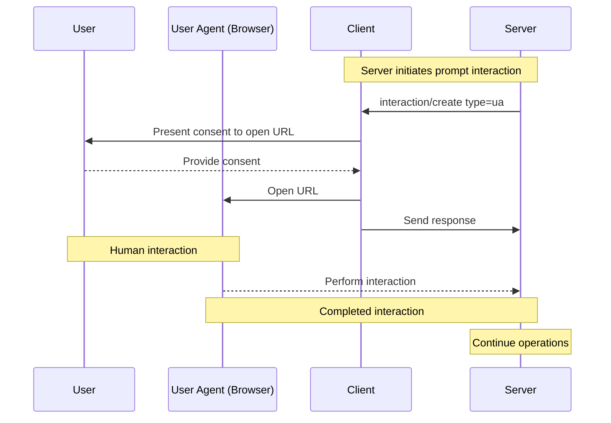
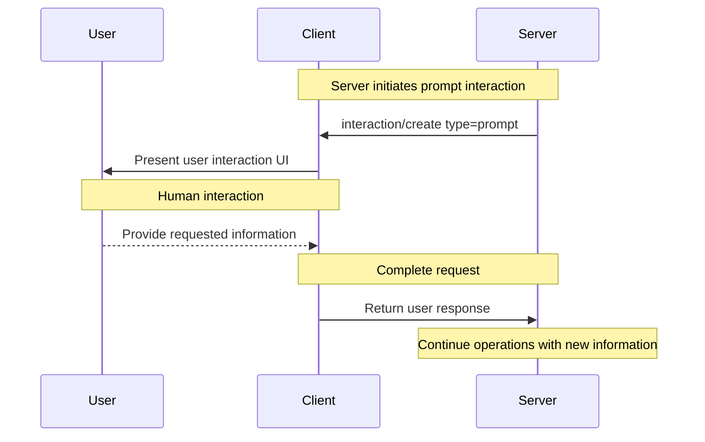
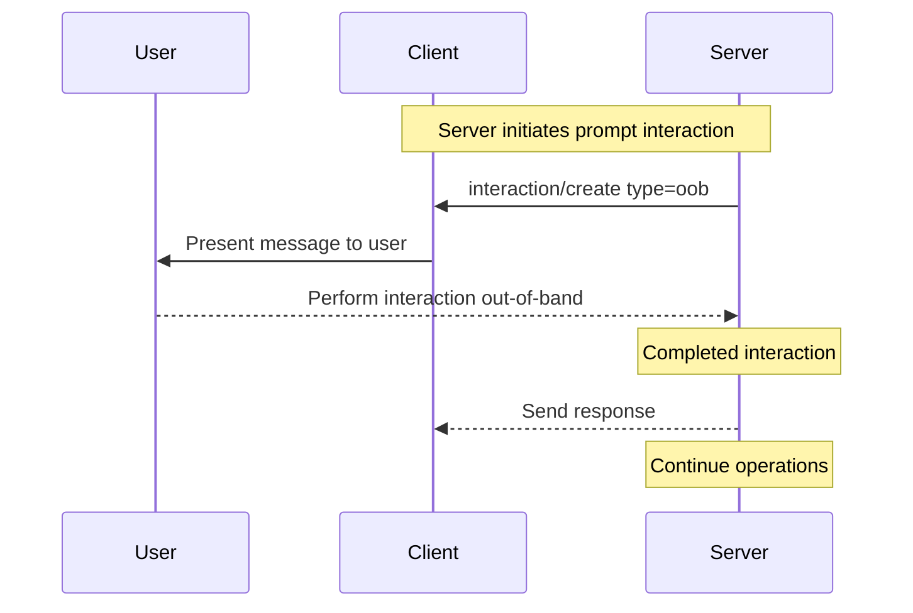

<Info>**Protocol Revision**: draft</Info>

The Model Context Protocol (MCP) provides a standardized way for servers to interact directly with
users without involving the client or the LLM. This allows servers to maintain control over user
interactions and data sharing while dynamically gathering necessary information.

The details of the interaction itself are fully under the control of the MCP server, and the MCP
client is only responsible for facilitating the interaction (typically by presenting a URL or
instructions to the end-user, or by rendering a form for non-sensitive information). With this model,
the client's responsibilities remain minimal and the server has the flexibility to implement a wide
range of interactions involving the end-user. For example:

- A productivity MCP server might request a user to authorize a third-party service to
  access their documents.
- A news MCP server might request a user to upgrade their subscription to access more features.
- A banking MCP server might request a user to verify their account to access a new feature.
- A media MCP server might request a user's favorite music genre to personalize the user
  experience.
- A social media MCP server might request an image to use as a profile picture.

## Terminology

- **User agent**: Most familiarly a Web browser, the user agent is a client that is capable of
  interacting with the end-user. Broadly, it is used as defined in
  [RFC 9110 Section 3.5](https://datatracker.ietf.org/doc/html/rfc9110#section-3.5).

## Capabilities

Clients that support user interaction **MUST** declare the `userInteraction` capability during
[initialization](/specification/draft/basic/lifecycle#initialization):

```json
{
  "capabilities": {
    "userInteraction": {
      "types": ["ua", "prompt", "oob"],
      "progress": true
    }
  }
}
```

Clients supporting the `userInteraction` capability **MUST** support at least one interaction type
and list all supported types in the `types` array.

The MCP server **MUST NOT** send an interaction request to the client of a type that is not
supported by the client.


## User Interaction Flow

When a user interaction is requested and supported by the client, the MCP client **MUST** present
the user with a user interaction flow. The type of flow is defined by the MCP server and is
specific to the interaction type.

This specification defines the following types of user interactions:

- **`ua`**: A user agent interaction is a user interaction that involves making a request via a
  User Agent (e.g. a Web browser).
- **`prompt`**: A prompt interaction is a user interaction that involves the MCP client prompting
  the user for information.
- **`oob`**: An out-of-band interaction is a user interaction that occurs outside of the MCP
  operations.

There may be other interaction types that a client and server **MAY** negotiate beyond those
outlined above.


When the client presents a user interaction to the user, it **SHOULD** provide UI that:

- Makes it clear which server is requesting information.
- Provides a way for the user to cancel the interaction.

### User agent interactions

A user agent interaction is a user interaction that involves the MCP client facilitating opening
a URL in a User Agent (e.g. a Web browser). This provides a way for the MCP server to obtain data without involving the MCP client.
 The MCP server can, as a result, control the entire interaction
from start to finish, including the user experience, and guarantee the security of sensitive data (e.g. API keys or authorization grants).



The MCP client **MUST** facilitate the opening of the URL in a User Agent.

This requires the client to support the `ua` user interaction type.

```json
{
  "capabilities": {
    "userInteraction": {
      "types": ["ua"]
    }
  }
}
```


### Prompt interactions

A prompt interaction is a user interaction that involves the MCP client prompting the user for
information within the MCP client UI. This provides a way for the MCP server to obtain data from
the user without needing to host a URL or create any UI for the user to interact with. The MCP
server can, as a result, receive information from the user with little effort, at the expense of
data privacy.



This requires the client to support the `prompt` user interaction type.

```json
{
  "capabilities": {
    "userInteraction": {
      "types": ["prompt"]
    }
  }
}
```

Implementations are free to expose user interactions through any interface pattern that suits
their needs&mdash;the protocol itself does not mandate any specific user interaction model.

<Warning>

For trust & safety and security, there **SHOULD** always
be a human in the loop with the ability to deny interaction requests.

MCP clients **SHOULD**:

- Provide UI that makes it clear which server is requesting information
- Allow users to review and modify their responses before sending
- Respect user privacy and provide clear cancel options

</Warning>


### Out-of-band interactions

An out-of-band interaction is a user interaction that occurs outside of the MCP operations. This
provides a way for the MCP server to obtain data from the user by initiating a separate
communication channel with the user, such as email or SMS. The MCP server can, as a result, receive
information from the user asynchronously and without involving the MCP client, while informing the
user that they should check that communication channel for further instructions.



This requires the client to support the `oob` interaction type.

```json
{
  "capabilities": {
    "userInteraction": {
      "types": ["oob"]
    }
  }
}
```


## Progress Tracking

The MCP client **MAY** support progress tracking for interactions. This can be used to
provide feedback to the user about the progress of the interaction in the MCP client UI. This is
particularly useful for interactions where the user will be interacting out-of-band with the MCP
client, such as `ua` or `oob` interactions, and the MCP client desires some way to update its UI.

This leverages the [Progress capability](/specification/draft/basic/utilities/progress) in the base
protocol. It requires the MCP server to support the `progress` capability during initialization.

Note that the MCP server may choose to not send progress notifications for a given interaction, even if
the client supports progress tracking and the server supports the progress capability generally.
Therefore, the client **SHOULD NOT** assume that progress notifications will be sent for an
interaction, and should be prepared to handle the case where no progress notifications are sent.

## Protocol Messages

### Server-initiated interaction requests

When the MCP client indicates support for user interactions, the MCP server can request a user
interaction from the client. To request a user interaction, the server sends an
`interaction/create` message to the client.

The request includes the following fields as part of the `params` object:

- `id`: The ID of the interaction that **MUST** be unique across the server's concurrent
  interactions.
- `type`: The type of interaction, which **MUST** be one of the types negotiated during
  initialization.
- `interaction`: The interaction object, the schema of which depends on the type of interaction.
- `progressAvailable`: An optional boolean indicating whether progress can be tracked for this
  interaction. This acts as a hint to the client about whether to expect a response to the
  `interaction/notify` request, described in the [Tracking progress](#tracking-progress) section.

The following is an example of a `interaction/create` message for a `ua` interaction:

```json
{
  "jsonrpc": "2.0",
  "id": 1,
  "method": "interaction/create",
  "params": {
    "id": "c8ec9a71-c475-4a88-a774-e9cd154bc7f8",
    "type": "ua",
    "interaction": {
      "url": "https://oauth.example.com/authorize?client_id=abc123&...",
      "message": {
        "type": "text",
        "text": "Authorization is required to access your Example Co files."
      }
    },
    "progressAvailable": true
  }
}
```

#### User agent interaction schema

**Server Request:**

For `ua` interactions, the `interaction` object has the following properties:

- `url`: The URL that the user should interact with.
- `message`: An optional `TextContent` used to provide an explanation to the user about the interaction.

```json
{
  "jsonrpc": "2.0",
  "id": 1,
  "method": "interaction/create",
  "params": {
    "id": "c8ec9a71-c475-4a88-a774-e9cd154bc7f8",
    "type": "ua",
    "interaction": {
      "url": "https://example.com/mcp?state=1234567890&...",
      "message": {
        "type": "text",
        "text": "Please sign in to your account."
      }
    }
  }
}
```

**Client Response:**

When the client opens the URL, it **MUST** send a response to the server:

```json
{
  "jsonrpc": "2.0",
  "id": 1,
  "result": {}
}
```

#### Prompt interaction schema

**Server Request:**

For `prompt` interactions, the `interaction` object has the following properties:

- `message`: A `TextContent` object used to provide context to the user about the interaction.
- `schema`: A `JSONSchema` object used to define the schema of the prompt for the MCP client.

```json
{
  "jsonrpc": "2.0",
  "id": 1,
  "method": "interaction/create",
  "params": {
    "id": "c8ec9a71-c475-4a88-a774-e9cd154bc7f8",
    "type": "prompt",
    "interaction": {
      "message": {
        "type": "text",
        "text": "Let us know some information about you."
      },
      "schema": {
        "type": "object",
        "properties": {
          "name": {
            "type": "string",
            "description": "Your full name"
          },
          "email": {
            "type": "string",
            "format": "email",
            "description": "Your email address"
          },
          "age": {
            "type": "number",
            "minimum": 18,
            "description": "Your age"
          }
        },
        "required": ["name", "email"]
      }
    }
  }
}
```

**Client Response:**

When the user provides their response, the client **MUST** send a response to the server:

```json
{
  "jsonrpc": "2.0",
  "id": 1,
  "result": {
    "content": {
      "name": "Monalisa",
      "email": "monalisa@example.com",
      "age": 30
    }
  }
}
```

##### Out-of-band interactions

**Server Request:**

For `oob` interactions, the `interaction` object has the following properties:

- `message`: A `TextContent` used to provide context to the user about the interaction.

```json
{
  "interaction": {
    "message": {
      "type": "text",
      "text": "Please check your email for a verification link."
    }
  }
}
```

**Client Response:**

When the client displays the message to the user, it **MUST** send a response to the server:

```json
{
  "jsonrpc": "2.0",
  "id": 1,
  "result": {}
}
```

### Requiring interaction as an error response

Sometimes the MCP server may need to require a user interaction as an error response to a client
request. This can be useful when the MCP server or the transport does not support Server-Side
events. It can also be used to require a user interaction as a pre-condition for a request.

The MCP server **MUST** send an
[error response](/specification/draft/basic/lifecycle#error-handling) with the `code` set to
`-32003` and the `message` set to `interaction_required`.

The error response **MUST** include an `data` object consistent with an the
[`interaction` schema](#Server-initiated-interaction-requests), defined above.

In addition, when the transport is **Streamable HTTP**, the error response **MAY** include an
optional `Retry-After` header. This header **MUST** conform to the
[HTTP `Retry-After` header field semantics](https://developer.mozilla.org/en-US/docs/Web/HTTP/Reference/Headers/Retry-After).
It allows the server to provide a hint to the client about how long to wait before retrying the
request.

```json
{
  "jsonrpc": "2.0",
  "id": "abc-123",
  "error": {
    "code": -32003,
    "message": "User interaction required",
    "data": {
      "id": "c8ec9a71-c475-4a88-a774-e9cd154bc7f8",
      "type": "ua",
      "url": "https://oauth.example.com/authorize?client_id=abc123&...",
      "message": {
        "type": "text",
        "text": "Authorization is required to access your Example Co files."
      },
      "progressAvailable": false
    }
  }
}
```

### Tracking progress

This section is intended to leverage the
[Progress capability](/specification/draft/basic/utilities/progress) to provide a way for MCP
clients to track progress for user interactions.

Tracking progress for user interactions is optional. If the MCP server does not support progress
tracking, it **MUST NOT** respond to the `interaction/notify` message, in keeping with the
requirements of the
[Progress capability](/specification/draft/basic/utilities/progress#behavior-requirements).

MCP clients send an `interaction/notify` message to the server to initiate progress tracking for a
particular interaction. The MCP client **MUST** include the interaction ID in the `id` field that
it wants to track progress for. This `id` **MUST** be an interaction that the server created via
the `interaction/create` message.

```json
{
  "jsonrpc": "2.0",
  "id": "track-progress-123",
  "method": "interaction/notify",
  "params": {
    "id": "c8ec9a71-c475-4a88-a774-e9cd154bc7f8",
    "_meta": {
      "progressToken": "abc123"
    }
  }
}
```

MCP servers **MUST NOT** respond to the `interaction/notify` message if:

- the `id` is not an interaction that the server created via the `interaction/create` message.
- the `id` is not an interaction that is associated with the client.
- the `id` is not an interaction that is associated with the current MCP session, if session
  management is in use.

MCP clients **SHOULD** be aware that MCP servers might not respond to the `interaction/notify`
message, and **SHOULD** be prepared to handle the case where no response is received.

The following is an example of a progress notification sent by the MCP server:

```json
{
  "jsonrpc": "2.0",
  "method": "notifications/progress",
  "params": {
    "progressToken": "abc123",
    "progress": 50,
    "total": 100,
    "message": "Reticulating splines..."
  }
}
```

Once the interaction is complete, the server **MUST** respond to the `interaction/notify` message,
for example:

```json
{
  "jsonrpc": "2.0",
  "id": "track-progress-123",
  "result": {}
}
```

### Cancelling an interaction

A user may choose to cancel an interaction, for example, by cancelling submitting a form rendered
by the MCP client as part of a `prompt` interaction or by not consenting to open a URL as part of
a `ua` interaction. In such cases, the MCP client **MAY** cancel an interaction at any time by
sending a `notifications/cancelled` message to the server. Cancellations will be consistent with
the [Cancellation capability](/specification/draft/basic/utilities/cancellation).

The `requestId` **MUST** be the `id` of the original `interaction/create` request that the
client wants to cancel.

```json
{
  "jsonrpc": "2.0",
  "method": "notifications/cancelled",
  "params": {
    "requestId": 1,
    "reason": "User requested cancellation"
  }
}
```

TODO: @nbarettini decide what we want to do for cancellation. Define server to client notification?
      e.g. timeout, "link expired", etc.

## Identifying the User

It is often useful for the MCP server to have some persistent identifier for the user. For the
purposes of this specification, the user identifier is an opaque string that is associated with the
user throughout the duration of the interaction. Obtaining verified information about the user, such
as their name or email address, is out of scope for this specification.

- Implementations using an HTTP-based transport **SHOULD** use the subject claim (`sub`) from the
  OAuth 2 Access Token as the user identifier, if present.
- Implementations using an STDIO transport **SHOULD** acquire the user identifier from the
  environment.

## Security Considerations

### Handling sensitive information

One mechanism for which user interaction may be leveraged is passing a user's auth credentials, or
other secret and sensitive data to the MCP server. The specifics of the sensitive data is out of
scope for this specification. However, MCP servers that request secrets, such as auth credentials,
**MUST** leverage an interaction type which prevents the MCP client from interacting with those
secrets in any way.

### Server-side request forgery (SSRF)

In the case of `ua` interactions, the MCP client is expected to make a request via a user agent
based on the value of the `url` parameter in the interaction object. Since MCP enables clients
to interoperate with MCP servers it has no prior knowledge of, this opens a risk for Server-Side
Request Forgery (SSRF) attacks by malicious MCP servers. MCP clients **SHOULD** take appropriate
precautions against SSRF attacks, such as blocking requests to internal IP address ranges and
requiring TLS.

Additionally, the MCP client **SHOULD** validate the `url` parameter in the interaction object and
provide sufficient context to the user about the request that will be made, before it is opened in
a User Agent.

Further recommendations can be found in the Open Worldwide Application Security
Project (OWASP) SSRF Prevention Cheat Sheet
[OWASP.SSRF](https://cheatsheetseries.owasp.org/cheatsheets/Server_Side_Request_Forgery_Prevention_Cheat_Sheet.html).

### Phishing

This specification may be deployed in a way where the `url` parameter in the interaction object
for `ua` interactions points to a URL that defined by something other than the MCP server. For
example, the URL may be an authorization URL of a third-party service such as a file-sharing
service that the MCP server needs the user to authorize access to. If that third-party service
is malicious or compromised, it could trick the user into revealing their account credentials or
other sensitive information.

To mitigate this risk, MCP clients **SHOULD** take appropriate precautions, such as verifying the
authenticity of the URL and the destination of the request.

### Impersonation attacks

Since MCP enables clients to interoperate with MCP servers it has no prior knowledge of, this opens
a risk for impersonation attacks by malicious MCP clients. MCP servers **SHOULD** take appropriate
precautions against impersonation attacks, such as implementing the
[Authorization](/specification/draft/basic/authorization) capabilities and properly validating
interaction IDs that are requested for progress tracking.

TODO: @nbarettini categorize this as Improper Resource Authorization???
