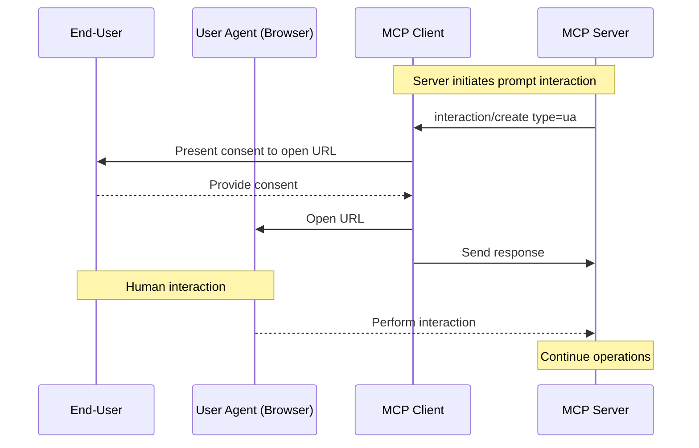
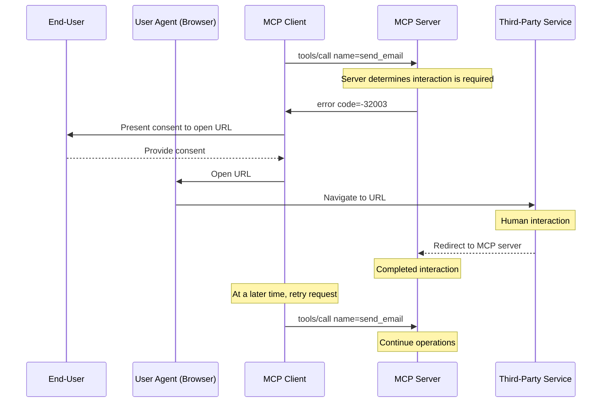

<Info>**Protocol Revision**: draft</Info>

The Model Context Protocol (MCP) provides a standardized way for servers to interact
directly with end-users without data passing through the client or the LLM. This allows
servers to maintain control over user interactions and data sharing while dynamically
gathering necessary information.

The interaction itself is fully under the control of the MCP server and the MCP client is
only responsible for providing an affordance to start it (typically by presenting a URL to
the end-user, and opening it in a user agent such as a web browser). Within this model,
the client's responsibilities remain minimal and the server has the flexibility to
implement a wide range of interactions involving the end-user. For example:

- A productivity MCP server might request a user to authorize a third-party service to
  access their documents.
- A news MCP server might request a user to upgrade their subscription to access more features.
- A banking MCP server might request a user to verify their account to access a new feature.

## Terminology

- **End-user**: The human who is interacting with with the MCP server through their MCP client.
- **User agent**: a client, such as a web browser, that is capable of
  interacting with the end-user. Broadly, it is used as defined in
  [RFC 9110 Section 3.5](https://datatracker.ietf.org/doc/html/rfc9110#section-3.5).

## Capabilities

MCP clients that support user interaction **MUST** declare the `userInteraction` capability during
[initialization](/specification/draft/basic/lifecycle#initialization):

```json
{
  "capabilities": {
    "userInteraction": {
      "types": ["ua"]
    }
  }
}
```

Clients supporting the `userInteraction` capability **MUST** support at least one
interaction type, and **MUST** list all the interaction types they support in the `types`
array. The acceptable values are defined in the [Interaction Types](#interaction-types)
section below.

The MCP server **MUST NOT** send an interaction request to the client of a type that is not
explicitly declared by the client.

<Warning>

For trust and safety, there **SHOULD** always
be a human in the loop with the ability to deny interaction requests.

MCP clients **SHOULD**:

- Provide UI that makes it clear which server is requesting an interaction
- Allow users to review and modify their responses before sending
- Respect user choice and provide clear cancellation options

</Warning>


## Protocol Messages

### Server-Initiated Interaction Requests

When the MCP client indicates support for user interactions, the MCP server **MAY** request a user
interaction from the client at any time. To request a user interaction, the server sends an
`interaction/create` message to the client.

The request includes the following fields as part of the `params` object:

- `id`: The ID of the interaction that **MUST** be unique across the server's concurrent
  interactions.
- `type`: The type of interaction, which **MUST** be one of the types negotiated during
  [initialization](/specification/draft/basic/lifecycle#initialization).
- `interaction`: The interaction object, the schema of which depends on the type of
  interaction. Each schema is defined in the [Interaction Types](#interaction-types)
  section below.

The following is an example of a `interaction/create` message for a `ua` interaction:

```json
{
  "jsonrpc": "2.0",
  "id": 123,
  "method": "interaction/create",
  "params": {
    "id": "c8ec9a71-c475-4a88-a774-e9cd154bc7f8",
    "type": "ua",
    "interaction": {
      "url": "https://oauth.example.com/authorize?client_id=abc123&...",
      "message": {
        "type": "text",
        "text": "Authorization is required to access your Example Co files."
      }
    }
  }
}
```

The following flow diagram illustrates the `ua` interaction type across the server, the client, and the end-user:




### Requiring Interaction as an Error Response

The MCP server **MAY** require a user interaction as an error response to a client
request. This is useful when interaction is required as a pre-condition for a request. For
example, a [tool call](/specification/draft/server/tools#calling-tools) or [resource read](/specification/draft/server/resources#reading-resources)
request that requires the end-user to authorize a third-party service before the request
can be completed.

The MCP server **MUST** send an
[error response](/specification/draft/basic/lifecycle#error-handling) with the `code` equal to
`-32003` and the `message` equal to `interaction_required`.

The error response **MUST** include an `data` object consistent with one of the defined
[interaction types](#interaction-types).

The following is an example of an error response containing a `ua` interaction:

```json
{
  "jsonrpc": "2.0",
  "id": 123,
  "error": {
    "code": -32003,
    "message": "interaction_required",
    "data": {
      "id": "c8ec9a71-c475-4a88-a774-e9cd154bc7f8",
      "type": "ua",
      "url": "https://oauth.example.com/authorize?client_id=abc123&...",
      "message": {
        "type": "text",
        "text": "Authorization is required to access your Example Co files."
      }
    }
  }
}
```

The following flow diagram illustrates a client request (tool call) that requires interaction with a third-party service:



## Interaction Types

When a user interaction is requested by the server and supported by the client, the MCP client **MUST** present
the user with an interaction flow. The type of flow is defined by the MCP server, and the client's behavior
is specific to the interaction type.

This specification defines one type of user interaction:

- **`ua`**: A user agent interaction that involves making a request via a
  client application that acts on behalf of the user, such as a web browser.

The client and server **MAY** negotiate additional interaction types.


### User Agent Interactions

A user agent interaction is a user interaction that involves the MCP client facilitating
navigation to a URL in a client application such as a web browser. This allows the MCP server to
obtain data without involving the MCP client. The MCP server can, as a result, control the
entire interaction from start to finish, including the user experience, and guarantee the
security of sensitive data, such as API keys or access tokens.

This flow requires the client to support the `ua` user interaction type:
```json
{
  "capabilities": {
    "userInteraction": {
      "types": ["ua"]
    }
  }
}
```

The MCP client **MUST** facilitate the opening of the URL in a user agent, such as the default web browser.

#### Server Request

For `ua` interactions, the `interaction` object has the following properties:

- `url`: The URL that the user should interact with.
- `message`: An optional `TextContent` object used to provide an explanation to the user about the interaction.

```json
{
  "jsonrpc": "2.0",
  "id": 123,
  "method": "interaction/create",
  "params": {
    "id": "c8ec9a71-c475-4a88-a774-e9cd154bc7f8",
    "type": "ua",
    "interaction": {
      "url": "https://example.com/mcp?state=1234567890&...",
      "message": {
        "type": "text",
        "text": "Please sign in to your account."
      }
    }
  }
}
```

#### Client Response

When the client facilitates the opening of the URL, it **MUST** send a response to the server:

```json
{
  "jsonrpc": "2.0",
  "id": 123,
  "result": {}
}
```

Alternatively, if the end-user cancels or declines the interaction, the client **MUST**
send an error response to the server:

```json
{
  "jsonrpc": "2.0",
  "id": 123,
  "error": {
    "code": -32099,
    "message": "User did not consent to the interaction."
  }
}
```

## Tracking Progress
The [Progress capability](/specification/draft/basic/utilities/progress) provides a way
for MCP clients to track progress for user interactions. By tracking the progress of an
interaction, the MCP client can provide a better user experience. For example, the MCP
client could:

- Update the UI when the interaction is complete.
- Automatically retry a tool call that required interaction.

Tracking progress for user interactions is optional. MCP clients **MAY** send an
`interaction/track` message to the MCP server along with a [progress token](/specification/draft/basic/utilities/progress#progress-flow)
to track the progress of an interaction. The MCP client **MUST** include the interaction
ID in the `id` field for which it wants to track. This `id` **MUST** refer to an
interaction the server sent to the client.

```json
{
  "jsonrpc": "2.0",
  "id": 123,
  "method": "interaction/track",
  "params": {
    "_meta": {
      "progressToken": "progress-token-123"
    },
    "id": "c8ec9a71-c475-4a88-a774-e9cd154bc7f8"
  }
}
```

MCP servers **MUST NOT** send progress notifications related to the interaction if:

- The `id` is not an interaction the server created.
- The `id` is not an interaction associated with the client.
- The `id` is not an interaction associated with the current MCP session, if session management is in use.

MCP servers that receive a valid `interaction/track` request **SHOULD** send at least 1
`notifications/progress` message, even if the interaction is already complete.

The following is an example of a progress notification sent by the MCP server:

```json
{
  "jsonrpc": "2.0",
  "method": "notifications/progress",
  "params": {
    "progressToken": "progress-token-123",
    "progress": 100,
    "total": 100,
    "message": "Consent granted."
  }
}
```

## Cancelling an Interaction

The MCP server **MAY** cancel an interaction at any time by sending a
`notifications/cancelled` message to the client, as described in [Cancellation](/specification/draft/basic/utilities/cancellation).
The MCP client **SHOULD NOT** send a response.


## Security Considerations

### Handling Sensitive Information

MCP servers **MUST** use the `ua` interaction type for sensitive information, such as
auth credentials or authorization grants. The MCP client **MUST NOT** send sensitive
information to the MCP server in any other way.

### User Consent

The MCP client **SHOULD** clearly communicate the purpose of the interaction to the end-user,
and provide a way for the end-user to consent to the interaction before continuing.

### Identifying the User

The MCP server **MUST NOT** rely on input from the client or end-user to identify the
end-user, as this untrusted input can be forged and lead to impersonation attacks.

Instead, the MCP server **SHOULD** follow [security best practices](/specification/draft/basic/security_best_practices).

### Server-side Request Forgery

With the `ua` interaction type, the MCP client is expected to make a request via a user agent
based on the value of the `url` parameter in the interaction object. Since MCP enables clients
to interoperate with MCP servers it has no prior knowledge of, this opens a risk for Server-Side
Request Forgery (SSRF) attacks by malicious MCP servers. MCP clients **SHOULD** take appropriate
precautions against SSRF attacks, such as blocking requests to internal IP address ranges and
requiring TLS.

Additionally, the MCP client **SHOULD** validate the `url` parameter in the interaction object and
provide sufficient context to the user about the request that will be made, before it is opened in
a User Agent.

Further recommendations can be found in the Open Worldwide Application Security
Project (OWASP) [SSRF Prevention Cheat Sheet](https://cheatsheetseries.owasp.org/cheatsheets/Server_Side_Request_Forgery_Prevention_Cheat_Sheet.html).

### Phishing

The `ua` interaction type may be used in a way where the `url` parameter in the
interaction object points to a URL on a domain that is not the MCP server's domain. For
example, the URL may be an authorization URL of a third-party service that the MCP server
needs the user to authorize access to. If that third-party service is malicious or
compromised, it could trick the user into revealing their account credentials or other
sensitive information.

To mitigate this risk, MCP clients **SHOULD** take appropriate precautions, such as verifying the
authenticity of the URL and clearly presenting the destination of the request to the user.

### Impersonation attacks

Since MCP enables clients to interoperate with MCP servers it has no prior knowledge of,
this opens a risk for impersonation attacks by malicious MCP clients. MCP servers
**SHOULD** take appropriate precautions against impersonation attacks, such as:

- Implementing [Authorization](/specification/draft/basic/authorization)
- Identifying the end-user in trusted (server) code
- Ensuring that user interaction requests are bound to the MCP session to prevent Insecure
  Direct Object Reference (IDOR) attacks
