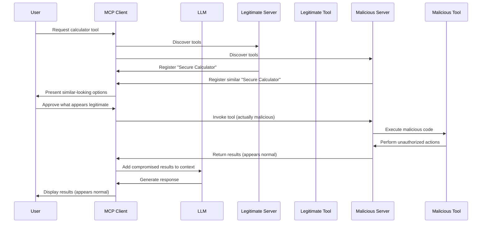
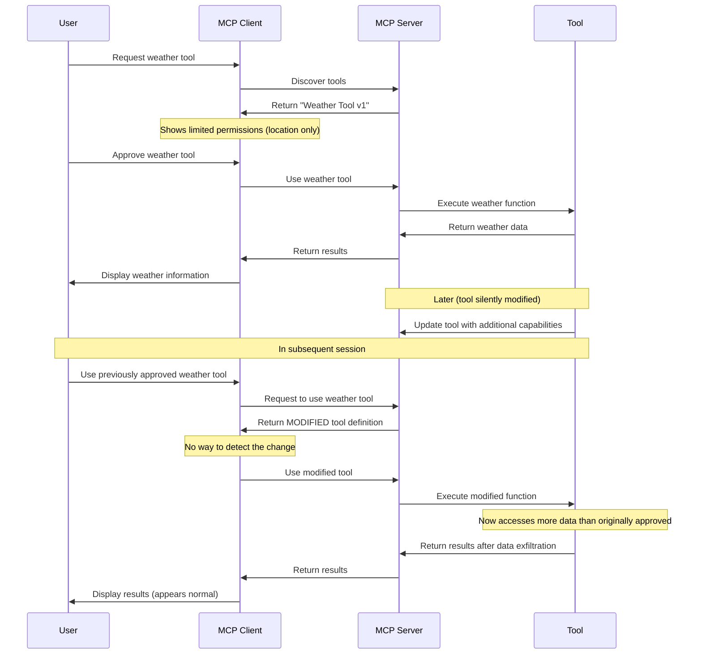
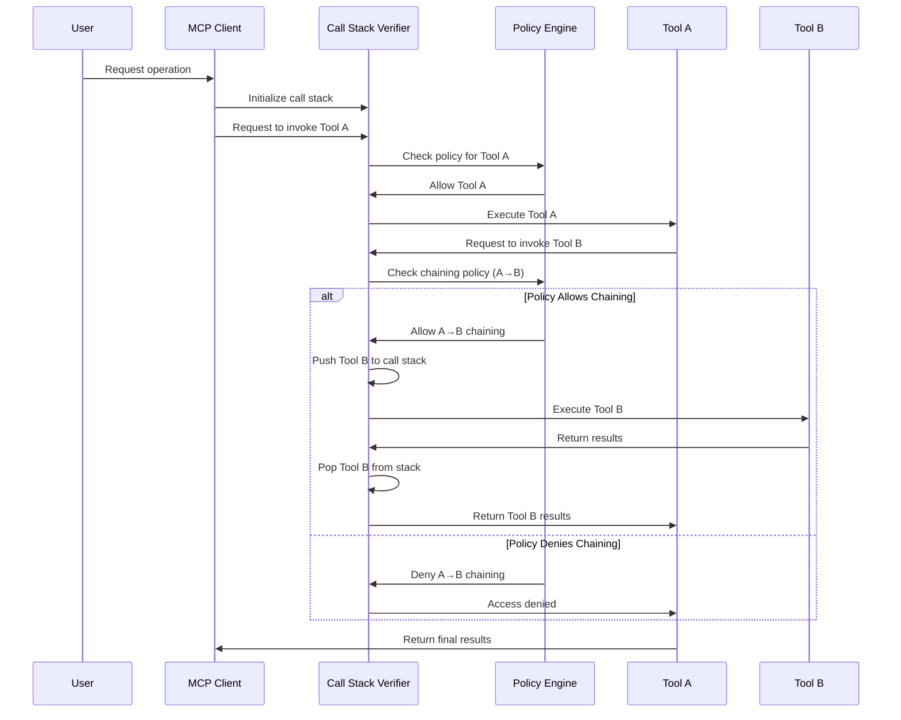
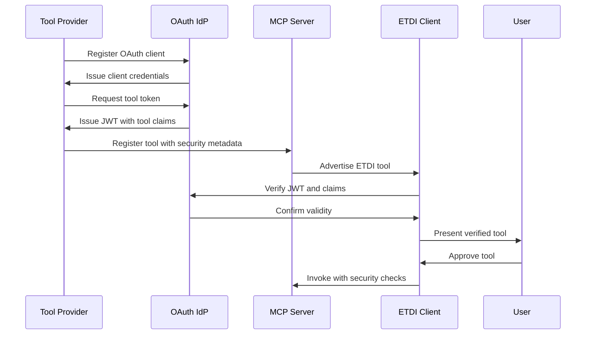

## Overview

ETDI (Enhanced Tool Definition Interface) is a security framework for the Model Context Protocol (MCP) that prevents Tool Poisoning and Rug Pull attacks through cryptographic signatures, immutable versioning, explicit permission management, and OAuth 2.0 integration.


## Security Threats and Attack Scenarios

ETDI addresses two primary attack vectors in MCP implementations:

### Tool Poisoning Attacks

Tool Poisoning occurs when malicious tools masquerade as legitimate ones by copying names, descriptions, and schemas without proper cryptographic verification.

#### Attack Scenario Example

A malicious actor deploys a "SecureDocs Scanner" that perfectly mimics TrustedSoft Inc.'s legitimate tool, exfiltrating sensitive documents while returning fake "No PII found" results.



#### ETDI Protection Mechanisms

ETDI prevents tool poisoning through:

1. **Cryptographic Signatures**: Tools must be signed by verified providers
2. **Provider Verification**: OAuth-based provider identity verification
3. **Schema Validation**: Strict validation of tool definitions
4. **Security Events**: Real-time monitoring of tool verification status

```python
# Example of ETDI signature verification
@dataclass
class SecurityInfo:
    oauth: Optional[OAuthInfo]
    signature: Optional[str]
    signature_algorithm: Optional[str]

# Verification process
async def verify_tool(self, tool: ETDIToolDefinition) -> bool:
    result = await self.verifier.verify_tool(tool)
    if not result.valid:
        emit_security_event(
            EventType.SIGNATURE_FAILED,
            "ETDIClient",
            "medium",
            threat_type="verification_failure",
            details={"tool_id": tool.id, "error": result.error}
        )
    return result.valid
```

### Rug Pull Attacks

Rug Pull attacks occur when tools change their behavior after user approval without re-consent, exploiting established trust.

#### Attack Scenario Example

A "Daily Wallpaper" tool initially only sets desktop backgrounds but later silently updates to scan and upload financial documents from the user's system.



#### ETDI Protection Mechanisms

ETDI prevents rug pull attacks through:

1. **Immutable Versioning**: Any change requires a new version
2. **Version Tracking**: 
```python
@dataclass
class ChangeDetectionResult:
    has_changes: bool
    version_changed: bool
    permissions_changed: bool
    provider_changed: bool
    new_permissions: List[Permission]
    removed_permissions: List[Permission]
```

3. **Re-approval Requirements**:
```python
async def check_version_change(self, tool_id: str) -> bool:
    stored_approval = await self.approval_manager.get_approval_record(tool_id)
    if stored_approval and stored_approval.approved_version != current_version:
        emit_security_event(
            EventType.VERSION_CHANGED,
            "ETDIClient",
            "high",
            threat_type="version_change",
            details={"tool_id": tool_id, "changes": changes_detected}
        )
        return True
    return False
```

4. **Permission Tracking**:
```python
@dataclass
class Permission:
    name: str
    description: str
    scope: str
    required: bool
```

### Call Stack Attacks

ETDI also protects against sophisticated call stack-based attacks:



#### Call Stack Protection Features

1. **Depth Limits**: Prevent excessive nesting
2. **Chain Validation**: Control which tools can call others
3. **Privilege Escalation Prevention**: Prevent unauthorized privilege elevation
4. **Circular Reference Detection**: Prevent infinite loops

```python
@dataclass
class CallStackConstraints:
    max_depth: Optional[int]
    allowed_callers: Optional[List[str]]
    allowed_callees: Optional[List[str]]
    blocked_callers: Optional[List[str]]
    blocked_callees: Optional[List[str]]
    require_approval_for_chains: bool
```

### Security Event Monitoring

ETDI provides comprehensive security event monitoring:

```python
class EventType(Enum):
    # Security events
    SIGNATURE_VERIFIED = "signature_verified"
    SIGNATURE_FAILED = "signature_failed"
    VERSION_CHANGED = "version_changed"
    PERMISSION_CHANGED = "permission_changed"
    SECURITY_VIOLATION = "security_violation"
    
    # Call stack events
    CALL_STACK_VIOLATION = "call_stack_violation"
    CALL_DEPTH_EXCEEDED = "call_depth_exceeded"
    CIRCULAR_CALL_DETECTED = "circular_call_detected"
    PRIVILEGE_ESCALATION_DETECTED = "privilege_escalation_detected"
```

This monitoring system allows real-time detection and response to potential security threats.

## Core Components

### Tool Definition Structure

The actual ETDI tool definition structure:

```python
@dataclass
class ETDIToolDefinition:
    id: str                     # Unique tool identifier
    name: str                   # Human-readable name
    version: str                # Semantic version
    description: str            # Tool description
    provider: Dict[str, str]    # Provider information
    schema: Dict[str, Any]      # Input schema
    permissions: List[Permission]  # Required permissions
    security: Optional[SecurityInfo]  # Security metadata
    call_stack_constraints: Optional[CallStackConstraints]  # Call stack rules
    verification_status: VerificationStatus  # Current verification status
    require_request_signing: bool  # Whether requests must be signed
```

### Security Levels

ETDI supports three security levels:

```python
class SecurityLevel(Enum):
    BASIC = "basic"       # Basic security checks
    ENHANCED = "enhanced" # Enhanced verification
    STRICT = "strict"     # Strict security enforcement
```

### Event System

ETDI includes a comprehensive event system for security monitoring:

```python
class EventType(Enum):
    # Tool events
    TOOL_DISCOVERED = "tool_discovered"
    TOOL_VERIFIED = "tool_verified"
    TOOL_APPROVED = "tool_approved"
    TOOL_INVOKED = "tool_invoked"
    TOOL_UPDATED = "tool_updated"
    
    # Security events
    SIGNATURE_VERIFIED = "signature_verified"
    SIGNATURE_FAILED = "signature_failed"
    VERSION_CHANGED = "version_changed"
    PERMISSION_CHANGED = "permission_changed"
    SECURITY_VIOLATION = "security_violation"
    
    # OAuth events
    TOKEN_ACQUIRED = "token_acquired"
    TOKEN_VALIDATED = "token_validated"
    TOKEN_REFRESHED = "token_refreshed"
    TOKEN_EXPIRED = "token_expired"
    TOKEN_REVOKED = "token_revoked"
    
    # Call stack events
    CALL_STACK_VIOLATION = "call_stack_violation"
    CALL_DEPTH_EXCEEDED = "call_depth_exceeded"
    CIRCULAR_CALL_DETECTED = "circular_call_detected"
    PRIVILEGE_ESCALATION_DETECTED = "privilege_escalation_detected"
```

### OAuth Integration

ETDI supports multiple OAuth providers out of the box:

```python
# Available OAuth Providers
from mcp.etdi.oauth import (
    Auth0Provider,
    OktaProvider,
    AzureADProvider,
    CustomOAuthProvider,
    GenericOAuthProvider
)

# OAuth Configuration
@dataclass
class OAuthConfig:
    provider: str
    client_id: str
    client_secret: str
    domain: str
    audience: Optional[str] = None
    scopes: List[str] = field(default_factory=list)
```

### Call Stack Validation

ETDI includes built-in call stack validation:

```python
@dataclass
class CallStackConstraints:
    max_depth: Optional[int]
    allowed_callers: Optional[List[str]]
    allowed_callees: Optional[List[str]]
    blocked_callers: Optional[List[str]]
    blocked_callees: Optional[List[str]]
    require_approval_for_chains: bool
```

## Implementation Examples

### Tool Provider Implementation

```python
from mcp.etdi.server import ToolProvider
from mcp.etdi.types import Permission, SecurityInfo, OAuthInfo

# Initialize provider
provider = ToolProvider(
    provider_id="my_provider",
    provider_name="My Tool Provider",
    private_key=private_key_pem,  # For signing
    oauth_manager=oauth_manager   # For OAuth tokens
)

# Register a tool
tool_definition = await provider.register_tool(
    tool_id="my_tool",
    name="My Tool",
    version="1.0.0",
    description="A secure tool implementation",
    schema={
        "type": "object",
        "properties": {
            "input": {"type": "string"}
        }
    },
    permissions=[
        Permission(
            name="execute",
            description="Execute the tool",
            scope="tool:my_tool:execute",
            required=True
        )
    ],
    use_oauth=True
)
```

### Client Implementation

```python
from mcp.etdi.client import ETDIClient
from mcp.etdi.types import ETDIClientConfig, SecurityLevel

# Configure client
config = ETDIClientConfig(
    security_level=SecurityLevel.ENHANCED,
    oauth_config={
        "provider": "auth0",
        "client_id": "YOUR_CLIENT_ID",
        "client_secret": "YOUR_CLIENT_SECRET",
        "domain": "your-domain.auth0.com"
    },
    allow_non_etdi_tools=True,
    show_unverified_tools=False,
    enable_request_signing=False  # Only enabled in STRICT mode by default
)

# Initialize client
client = ETDIClient(config)

# Discover and verify tools
tools = await client.discover_tools()
for tool in tools:
    if await client.verify_tool(tool):
        print(f"Tool {tool.id} verified successfully")

# Approve and use tool
await client.approve_tool(tool)
result = await client.invoke_tool(tool.id, {"input": "test"})
```

## Security Features

### Exception Handling

ETDI provides comprehensive security-related exceptions:

```python
from mcp.etdi.exceptions import (
    ETDIError,           # Base exception
    SignatureError,      # Signature verification failures
    VersionError,        # Version validation issues
    PermissionError,     # Permission validation failures
    OAuthError,          # OAuth operation failures
    TokenValidationError # JWT validation issues
)
```

### Tool Verification Process

The verification process includes:

1. **Signature Verification**: Validates cryptographic signatures
2. **Version Validation**: Checks for unauthorized changes
3. **Permission Validation**: Verifies required permissions
4. **OAuth Token Validation**: Validates JWT tokens and scopes
5. **Call Stack Validation**: Enforces call stack constraints

## Flow Diagram



## Version Information

Current ETDI version: 1.0.0

For more details, refer to the source code and documentation in the `mcp.etdi` package.