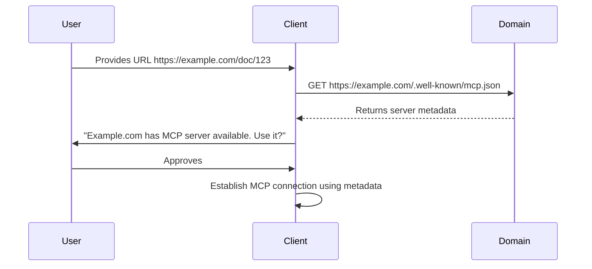

<div id="enable-section-numbers" />

<Info>**Protocol Revision**: draft</Info>

## Overview

MCP supports automatic server discovery through well-known metadata files hosted on domain origins. This mechanism enables clients to discover and connect to MCP servers when users provide URLs from those domains.

## Discovery Mechanism

### Well-Known Metadata File

MCP servers **SHOULD** host a metadata file at `/.well-known/mcp.json` on their domain to enable automatic discovery. This file contains information about the server's capabilities, connection details, and metadata for client presentation.

The well-known file **MUST** be served with appropriate CORS headers to allow cross-origin requests from web-based MCP clients.

### Discovery Process

When a client receives a URL (e.g., through user input or from another system), it **MAY** attempt server discovery:

1. Extract the origin from the URL (e.g., `https://example.com` from `https://example.com/path/to/resource`)
2. Request the well-known metadata file at `https://example.com/.well-known/mcp.json`
3. If successful, parse the metadata to determine available MCP servers
4. Use the metadata to establish a connection or prompt the user to install/configure the server

## Metadata Schema

The well-known metadata file **MUST** be a valid JSON object with the following structure:

```typescript
interface McpMetadata {
  // Required fields
  name: string; // Human-readable server name
  logo?: string; // URL to server logo image
  tagline?: string; // Brief description of server functionality

  // Connection information
  endpoint?: string; // Primary web endpoint (required when transports.http or transports.sse is provided)
  transports?: {
    http?: {
      endpoint: string; // HTTP endpoint for streamable HTTP transport (preferred)
    };
    sse?: {
      endpoint: string; // SSE endpoint URL
    };
    stdio?: {
      command: string; // Command to execute for stdio transport
      args?: string[]; // Optional command arguments
    };
  };

  // Capabilities hint
  capabilities?: {
    tools?: boolean; // Server provides tools
    resources?: boolean; // Server provides resources
    prompts?: boolean; // Server provides prompts
  };

  // Additional metadata
  version?: string; // Server version
  vendor?: string; // Vendor/organization name
  apiCompatibility?: string[]; // Supported protocol versions
}
```

### Example

```json
{
  "name": "Example MCP Server",
  "logo": "https://example.com/logo.png",
  "tagline": "Access and manage Example.com resources through MCP",
  "endpoint": "https://api.example.com/mcp",
  "transports": {
    "http": {
      "endpoint": "https://api.example.com/mcp"
    },
    "sse": {
      "endpoint": "https://api.example.com/mcp/sse"
    }
  },
  "capabilities": {
    "tools": true,
    "resources": true,
    "prompts": false
  },
  "version": "1.0.0",
  "vendor": "Example Corp",
  "apiCompatibility": ["2024-11-05", "draft"]
}
```

## Client Behavior

### Discovery Integration

Clients **MAY** integrate server discovery in various ways:

1. **Automatic Detection**: When handling URLs, check for MCP server availability
2. **User Prompting**: Offer to use discovered MCP servers instead of direct URL fetching
3. **Server Registry**: Maintain a registry of discovered servers for future use

### User Experience

When a server is discovered, clients **SHOULD**:

1. Display the server's name, logo, and tagline to help users understand its purpose
2. Request user consent before establishing connections
3. Store user preferences for future interactions with the same domain

### Example Flow



### Endpoint Field

The top-level `endpoint` field **MUST** be provided when the server supports web-based transports (`transports.http` or `transports.sse`). This field provides a canonical URL for connecting to the server.

When both `transports.http` and `transports.sse` are available, clients **SHOULD** prefer streamable HTTP transport as it uses a single unified endpoint and is the standard approach for MCP servers.

## Security Considerations

### HTTPS Requirement

Well-known metadata files **MUST** be served over HTTPS to prevent tampering and ensure authenticity.

### CORS Policy

Servers **MUST** implement appropriate CORS policies for the well-known endpoint:

```http
Access-Control-Allow-Origin: *
Access-Control-Allow-Methods: GET, OPTIONS
```

### Trust Model

Clients **SHOULD**:

1. Verify the metadata file is served from the same origin as the requested resource
2. Validate all URLs in the metadata resolve to the same origin or explicitly trusted domains
3. Present clear information to users about what permissions the server is requesting

### Content Validation

Clients **MUST**:

1. Validate the JSON structure before processing
2. Sanitize all string fields to prevent injection attacks
3. Verify logo URLs point to valid image resources
4. Implement reasonable size limits for metadata files

## Best Practices

### For Servers

1. Keep metadata files concise and accurate
2. Use stable URLs for logos and other resources
3. Update `apiCompatibility` when protocol support changes
4. Provide meaningful taglines that explain server functionality

### For Clients

1. Cache discovery results with appropriate TTLs
2. Handle discovery failures gracefully
3. Provide clear UX for server selection when multiple options exist
4. Respect user preferences for automatic discovery

## Future Considerations

The discovery mechanism may be extended to support:

1. Multiple servers per domain
2. Server authentication requirements
3. Capability negotiation hints
4. Localized metadata
