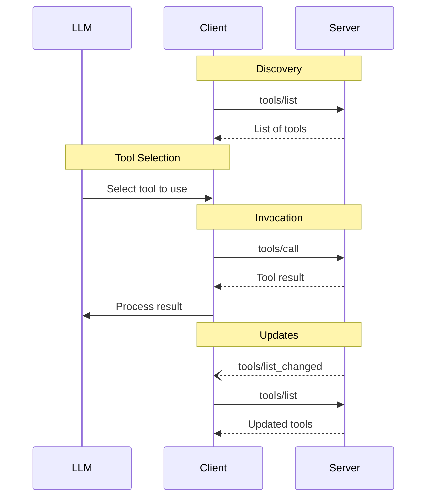

<Info>**Protocol Revision**: draft</Info>

The Model Context Protocol (MCP) allows servers to expose tools that can be invoked by
language models. Tools enable models to interact with external systems, such as querying
databases, calling APIs, or performing computations. Each tool is uniquely identified by
a name and includes metadata describing its schema.

## User Interaction Model

Tools in MCP are designed to be **model-controlled**, meaning that the language model can
discover and invoke tools automatically based on its contextual understanding and the
user's prompts.

However, implementations are free to expose tools through any interface pattern that
suits their needs&mdash;the protocol itself does not mandate any specific user
interaction model.

<Warning>
For trust & safety and security, there **SHOULD** always
be a human in the loop with the ability to deny tool invocations.

Applications **SHOULD**:

- Provide UI that makes clear which tools are being exposed to the AI model
- Insert clear visual indicators when tools are invoked
- Present confirmation prompts to the user for operations, to ensure a human is in the
  loop
</Warning>

## Capabilities

Servers that support tools **MUST** declare the `tools` capability:

```json
{
  "capabilities": {
    "tools": {
      "listChanged": true
    }
  }
}
```

`listChanged` indicates whether the server will emit notifications when the list of
available tools changes.

## Protocol Messages

### Listing Tools

To discover available tools, clients send a `tools/list` request. This operation supports
[pagination](/specification/draft/server/utilities/pagination).

**Request:**

```json
{
  "jsonrpc": "2.0",
  "id": 1,
  "method": "tools/list",
  "params": {
    "cursor": "optional-cursor-value"
  }
}
```

**Response:**

```json
{
  "jsonrpc": "2.0",
  "id": 1,
  "result": {
    "tools": [
      {
        "name": "get_weather",
        "description": "Get current weather information for a location",
        "inputSchema": {
          "type": "object",
          "properties": {
            "location": {
              "type": "string",
              "description": "City name or zip code"
            }
          },
          "required": ["location"]
        },
        "annotations": {
          "title": "Weather Lookup",
          "readOnlyHint": true,
          "openWorldHint": true
        }
      }
    ],
    "nextCursor": "next-page-cursor"
  }
}
```

### Calling Tools

To invoke a tool, clients send a `tools/call` request:

**Request:**

```json
{
  "jsonrpc": "2.0",
  "id": 2,
  "method": "tools/call",
  "params": {
    "name": "get_weather",
    "arguments": {
      "location": "New York"
    }
  }
}
```

**Response:**

```json
{
  "jsonrpc": "2.0",
  "id": 2,
  "result": {
    "content": [
      {
        "type": "text",
        "text": "Current weather in New York:\nTemperature: 72°F\nConditions: Partly cloudy"
      }
    ],
    "isError": false
  }
}
```

### List Changed Notification

When the list of available tools changes, servers that declared the `listChanged`
capability **SHOULD** send a notification:

```json
{
  "jsonrpc": "2.0",
  "method": "notifications/tools/list_changed"
}
```

## Message Flow



## Data Types

### Tool

A tool definition includes:

- `name`: Unique identifier for the tool
- `description`: Human-readable description of functionality
- `inputSchema`: JSON Schema defining expected parameters
- `outputSchema`: Optional JSON Schema defining expected output structure
- `annotations`: optional properties describing tool behavior

<Warning>For trust & safety and security, clients **MUST** consider
tool annotations to be untrusted unless they come from trusted servers.</Warning>

## Tool Annotations

Tool annotations provide additional metadata about a tool's behavior, helping clients understand how to present and manage tools appropriately. These annotations are **hints** that describe the nature and impact of a tool, but should not be relied upon for security decisions.

### Purpose

Tool annotations serve several key purposes:

1. **User Experience**: Provide information for UI elements without affecting model context
2. **Tool Categorization**: Help clients group and present tools appropriately  
3. **Side Effect Awareness**: Convey information about a tool's potential impact
4. **Approval Workflows**: Assist in developing intuitive interfaces for tool approval
5. **Governance Policies**: Enable appropriate security controls and organizational policies

### Available Annotations

| Annotation | Type | Default | Description |
|------------|------|---------|-------------|
| `title` | string | - | Human-readable title for UI display |
| `readOnlyHint` | boolean | false | Tool does not modify its environment |
| `destructiveHint` | boolean | true | Tool may perform destructive updates (only meaningful when `readOnlyHint` is false) |
| `idempotentHint` | boolean | false | Repeated calls with same arguments have no additional effect (only meaningful when `readOnlyHint` is false) |
| `openWorldHint` | boolean | true | Tool may interact with external, uncontrolled entities |
| `aiProcessingHint` | boolean | false | Tool involves AI or LLM processing |
| `slowExecutionHint` | boolean | false | Tool typically takes a long time to execute |
| `resourceIntensiveHint` | boolean | false | Tool uses significant CPU, memory, or disk resources |
| `sensitiveDataHint` | boolean | false | Tool processes or accesses sensitive data |
| `privilegedAccessHint` | boolean | false | Tool requires elevated system privileges |
| `reversibleHint` | boolean | false | Tool's operations can be undone or reversed (only meaningful when `readOnlyHint` is false) |

### Annotation Descriptions

#### Basic Operation Annotations

**`title`**: Provides a human-friendly display name.
- Example: Tool name `"gh_create_issue"` → Title `"Create GitHub Issue"`

**`readOnlyHint`**: Indicates whether the tool modifies its environment.
- `true`: `search_database`, `get_weather`, `read_file`
- `false`: `create_user`, `delete_file`, `send_email`

**`destructiveHint`**: For non-read-only tools, indicates if changes are destructive.
- `true`: `delete_file`, `drop_database_table`, `factory_reset`
- `false`: `create_backup`, `add_user`, `append_to_log`

**`idempotentHint`**: For non-read-only tools, indicates if repeated calls have the same effect.
- `true`: `set_user_status`, `ensure_directory_exists`
- `false`: `increment_counter`, `append_to_file`, `send_notification`

**`openWorldHint`**: Indicates interaction with external, uncontrolled entities.
- `true`: `web_search`, `external_api_call`, `fetch_url`
- `false`: `local_database_query`, `memory_store`, `file_system_operation`

#### AI and Processing Annotations

**`aiProcessingHint`**: Indicates AI/ML model usage for governance policies.
- `true`: `generate_text`, `analyze_sentiment`, `create_embedding`
- `false`: `database_query`, `file_upload`, `send_email`

**`slowExecutionHint`**: Helps clients manage user expectations and timeouts.
- `true`: `large_file_processing`, `model_training`, `video_encoding`
- `false`: `simple_calculation`, `cache_lookup`, `status_check`

**`resourceIntensiveHint`**: Helps clients manage system resources.
- `true`: `image_processing`, `data_compression`, `crypto_mining`
- `false`: `text_formatting`, `simple_math`, `configuration_read`

#### Security and Access Annotations

**`sensitiveDataHint`**: Indicates handling of confidential information.
- `true`: `access_user_passwords`, `read_financial_records`, `process_medical_data`
- `false`: `get_weather`, `public_api_lookup`, `system_time`

**`privilegedAccessHint`**: Indicates need for elevated system permissions.
- `true`: `install_software`, `modify_system_config`, `restart_service`
- `false`: `read_user_file`, `send_http_request`, `calculate_hash`

**`reversibleHint`**: For non-read-only tools, indicates if operations can be undone.
- `true`: `create_backup` (can be deleted), `rename_file` (can rename back)
- `false`: `send_email` (cannot unsend), `delete_permanently`

### Example Tool with Annotations

```json
{
  "name": "ai_code_analyzer",
  "description": "Analyze code quality and security using AI",
  "inputSchema": {
    "type": "object",
    "properties": {
      "code": { "type": "string" },
      "language": { "type": "string" }
    },
    "required": ["code"]
  },
  "annotations": {
    "title": "AI Code Analyzer",
    "readOnlyHint": true,
    "openWorldHint": true,
    "aiProcessingHint": true,
    "slowExecutionHint": true,
    "sensitiveDataHint": true
  }
}
```

### Usage Guidelines

1. **Be accurate about side effects**: Clearly indicate whether a tool modifies its environment and whether those modifications are destructive.

2. **Use descriptive titles**: Provide human-friendly titles that clearly describe the tool's purpose.

3. **Consider security implications**: Use `sensitiveDataHint` and `privilegedAccessHint` to help clients implement appropriate security controls.

4. **Help with resource management**: Use `slowExecutionHint` and `resourceIntensiveHint` to enable better UX and system resource management.

5. **Enable AI governance**: Use `aiProcessingHint` to support organizational policies around AI tool usage.

6. **Remember annotations are hints**: All properties in annotations are hints and not guaranteed to provide a faithful description of tool behavior. Clients should never make security-critical decisions based solely on annotations.

### Tool Result

Tool results may contain [**structured**](#structured-content) or **unstructured** content.

**Unstructured** content is returned in the `content` field of a result, and can contain multiple content items of different types:

#### Text Content

```json
{
  "type": "text",
  "text": "Tool result text"
}
```

#### Image Content

```json
{
  "type": "image",
  "data": "base64-encoded-data",
  "mimeType": "image/png"
}
```

#### Audio Content

```json
{
  "type": "audio",
  "data": "base64-encoded-audio-data",
  "mimeType": "audio/wav"
}
```

#### Embedded Resources

[Resources](/specification/draft/server/resources) **MAY** be embedded, to provide additional context
or data, behind a URI that can be subscribed to or fetched again by the client later:

```json
{
  "type": "resource",
  "resource": {
    "uri": "resource://example",
    "mimeType": "text/plain",
    "text": "Resource content"
  }
}
```

#### Structured Content

**Structured** content is returned as a JSON object in the `structuredContent` field of a result. 

For backwards compatibility, a tool that returns structured content SHOULD also return functionally equivalent unstructured content.
(For example, serialized JSON can be returned in a `TextContent` block.)

#### Output Schema

Tools may also provide an output schema for validation of structured results.
If an output schema is provided:
* Servers **MUST** provide structured results that conform to this schema.
* Clients **SHOULD** validate structured results against this schema.

Example tool with output schema:

```json
{
  "name": "get_weather_data",
  "description": "Get current weather data for a location",
  "inputSchema": {
    "type": "object",
    "properties": {
      "location": {
        "type": "string",
        "description": "City name or zip code"
      }
    },
    "required": ["location"]
  },
  "outputSchema": {
    "type": "object",
    "properties": {
      "temperature": {
        "type": "number",
        "description": "Temperature in celsius"
      },
      "conditions": {
        "type": "string",
        "description": "Weather conditions description"
      },
      "humidity": {
        "type": "number",
        "description": "Humidity percentage"
      }
    },
    "required": ["temperature", "conditions", "humidity"]
  }
}
```

Example valid response for this tool:

```json
{
  "jsonrpc": "2.0",
  "id": 5,
  "result": {
    "content": [
      {
        "type": "text",
        "text": "{\"temperature\": 22.5, \"conditions\": \"Partly cloudy\", \"humidity\": 65}"
      }
    ],
    "structuredContent": {
      "temperature": 22.5,
      "conditions": "Partly cloudy",
      "humidity": 65
    }
  }
}
```

Providing an output schema helps clients and LLMs understand and properly handle structured tool outputs by:

- Enabling strict schema validation of responses
- Providing type information for better integration with programming languages
- Guiding clients and LLMs to properly parse and utilize the returned data
- Supporting better documentation and developer experience

## Error Handling

Tools use two error reporting mechanisms:

1. **Protocol Errors**: Standard JSON-RPC errors for issues like:

   - Unknown tools
   - Invalid arguments
   - Server errors

2. **Tool Execution Errors**: Reported in tool results with `isError: true`:
   - API failures
   - Invalid input data
   - Business logic errors

Example protocol error:

```json
{
  "jsonrpc": "2.0",
  "id": 3,
  "error": {
    "code": -32602,
    "message": "Unknown tool: invalid_tool_name"
  }
}
```

Example tool execution error:

```json
{
  "jsonrpc": "2.0",
  "id": 4,
  "result": {
    "content": [
      {
        "type": "text",
        "text": "Failed to fetch weather data: API rate limit exceeded"
      }
    ],
    "isError": true
  }
}
```

## Security Considerations

1. Servers **MUST**:

   - Validate all tool inputs
   - Implement proper access controls
   - Rate limit tool invocations
   - Sanitize tool outputs

2. Clients **SHOULD**:
   - Prompt for user confirmation on sensitive operations
   - Show tool inputs to the user before calling the server, to avoid malicious or
     accidental data exfiltration
   - Validate tool results before passing to LLM
   - Implement timeouts for tool calls
   - Log tool usage for audit purposes
