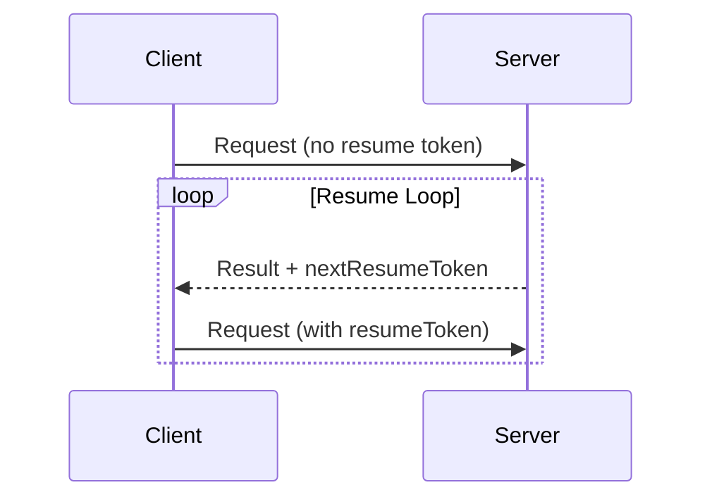

<div id="enable-section-numbers" />

<Info>**Protocol Revision**: draft</Info>

The Model Context Protocol (MCP) supports a mechanism for servers to communicate
to clients that a call is resumable, allowing the server to provide robust support
for long-running operations, large result sets, and eventually consistent operations.

This technique is essential to load-balancing, fairness, and isolation guarantees
within highly distributed serving environments to distribute load related to large
or long-running operations among many tasks and is also tolerant of client-side
disconnection.

## Resume Token Flow

When a server wants to communicate to a client that a call may be resumed, it includes
a `nextResumeToken` in the result metadata. If the caller chooses to resume the call
it provides this value in the `resumeToken` metadata of the original request.

The caller initiates a new long-running operation as usual:

```json
{
  "jsonrpc": "2.0",
  "id": 1,
  "method": "long_running_method",
  "params": {
    "param_str": "value",
    "param_num": 2
  }
}
```

The server returns a result to the caller and indicates that the request may
be resumed. The request may terminate or remain open as this call flow is
transport and streaming agnostic.

```json
{
  "jsonrpc": "2.0",
  "id": 1,
  "result": {
    ...
    "_meta": {
      "nextResumeToken": "adef50"
    }
  },
}
```

The opaque `nextResumeToken` communicates to the caller that the request may
be resumed by providing the `resumeToken` in the request params metadata.

```json
{
  "jsonrpc": "2.0",
  "id": 1,
  "method": "long_running_method",
  "params": {
    "param_str": "value",
    "param_num": 2,
    "_meta": {
      "resumeToken": "adef50"
    }
  }
}
```

The operation is considered complete when the server provides a response which
does not contain a `nextResumeToken`.



## Implementation Guidelines

1. Servers:

- **SHOULD** provide a `nextResumeToken` when requests are resumable.
- **SHOULD** ensure that resume tokens are stable.
- **MUST** ensure tokens do not expose internal or sensitive information.
- **MUST** omit the nextResumeToken if the operation errors.
- **MUST** validate the parameters of a resumed request.
- **MAY** communicate tool execution duration hints in tool metadata

2. Clients:

- **SHOULD** treat an absent `nextResumeToken` as the completion of the operation.
- **MUST** only mutate the metadata for the resume token on a resumed request.
- **MUST** treat resume tokens from completed requests as expired.

3. Clients **MUST** treat resume tokens as opaque tokens:

   - Do not make assumptions about the token format
   - Do not attempt to parse or modify tokens

## Error Handling

Invalid resume tokens **SHOULD** result in an error with code -32602 (Invalid params).
A token may be considered invalid due to the completion state of the operation,
the time elapsed since the last resume attempt, or a validation error related
to the token content and request paramaters.
