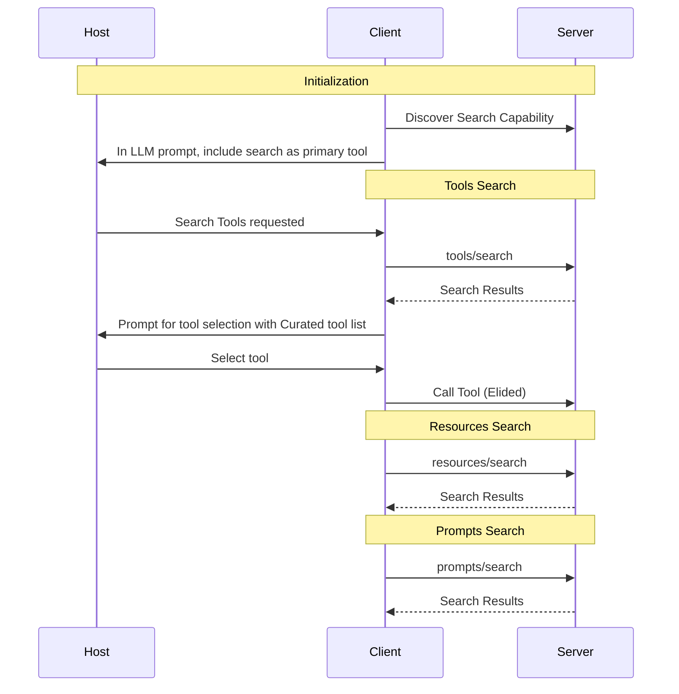

<Info>**Protocol Revision**: DRAFT</Info>

The Model Context Protocol (MCP) provides a standardized way for agents to search tools,
resources, prompts, and other features as they're added.

## User Interaction Model

As MCP servers scale, and the number of tools increases, it can become more unwieldy for clients
to capture tools and present them to the model in a cost-effective and context preserving way.
Search can help this by allowing clients to request a constrained list of tools, resources, or prompts,
thus minimizing the data added to the model context. Search is an OPTIONAL capability to be used in
environments where the number of tools is either too large to be reasonably paginated or there are
concerns with LLM context length for the number of tools.

For servers that support this capability, rather than paginating all tools and adding all tools to context,
clients should present the model with a search tool and a prompt that directs the model to search for tools
with a clean description of the MCP server and the tools it supplies from the MCP Server Metadata. An example
flow is outlined below.

Server implementations are free to use any different method to enable search, from very simple
keyword search, to more complex embedded vectorization search.

## Capabilities

Servers **MAY** declare the `search` capability in the respective feature area:

```json
{
  "capabilities": {
    "tools": {
      "search": true
    }
  }
}
```

```json
{
  "capabilities": {
    "prompts": {
      "search": true
    }
  }
}
```

```json
{
  "capabilities": {
    "resources": {
      "search": true
    }
  }
}
```

## Protocol Messages

### Requesting Search

To request a filtered list of tools, resources, resource templates, or prompts, clients send the
appropriate request to the server, `tools/search`, identifying both what feature set is being
searched and providing a query. Pagination is handled through the cursor, but the client **MUST**
provide the original query parameter paired with the cursor.

**Request:**

```json
{
  "jsonrpc": "2.0",
  "id": 1,
  "method": "tools/search",
  "params": {
    "query": "tools to return the weather in San Francisco",
    "cursor": "optional-cursor-value"
  }
}
```

**Response:**

```json
{
  "jsonrpc": "2.0",
  "id": 1,
  "result": {
    "tools": [
      {
        "name": "get_weather",
        "description": "Get current weather information for a location",
        "inputSchema": {
          "type": "object",
          "properties": {
            "location": {
              "type": "string",
              "description": "City name or zip code"
            }
          },
          "required": ["location"]
        }
      }
    ],
    "nextCursor": "next-page-cursor"
  }
}
```

### Search Results

Servers return an array of search results, matching the format of the list call for the
various features, ranked by relevance, with:

- Maximum 10 items per response
- Optional next cursor

## Message Flow



## Data Types

### SearchRequest

- `query`: Arbitrary text that expresses what is being searched for. This can be a keyword (e.g., 'weather'), a description (e.g., 'cities weather is available for'), or a use case (e.g., 'trying to generate weather reports').
- `cursor`: An opaque pagination token

### SearchResult
Please see the list results in [Tools](/specification/draft/server/tools),
[Prompts](/specification/draft/server/prompts), [Resources](/specification/draft/server/resources),
[Resource Template](/specification/draft/server/resource-templates),

## Error Handling

Servers **SHOULD** return standard JSON-RPC errors for common failure cases:

- Method not found: `-32601` (Capability not supported)
- Missing required arguments: `-32602` (Invalid params)
- Internal errors: `-32603` (Internal error)

## Implementation Considerations

1. Servers **SHOULD**:
   - Return suggestions sorted by relevance
   - Implement embedded vectorization when possible to enable better natural language results
   - Rate limit search results
   - Validate all inputs
   - Resources **SHOULD** be deeply indexed (i.e. the content itself is indexed, not just the name and description)

2. Clients **SHOULD**:
   - Provide clear guidance to models on the capabilities of the server and the way search can be used to filter tools lists
   - Clients should avoid caching search results, or use a very short TTL
   - Facilitate pagination through the `cursor` field

## Security

1. Implementations **MUST**:
  - Validate all search inputs
  - Implement appropriate rate limiting
  - Limit access to search results based on appropriate user controls
