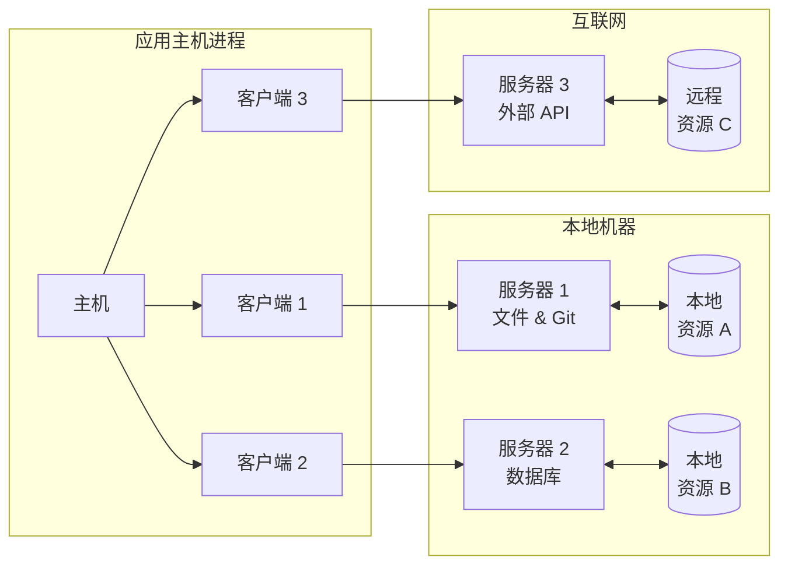
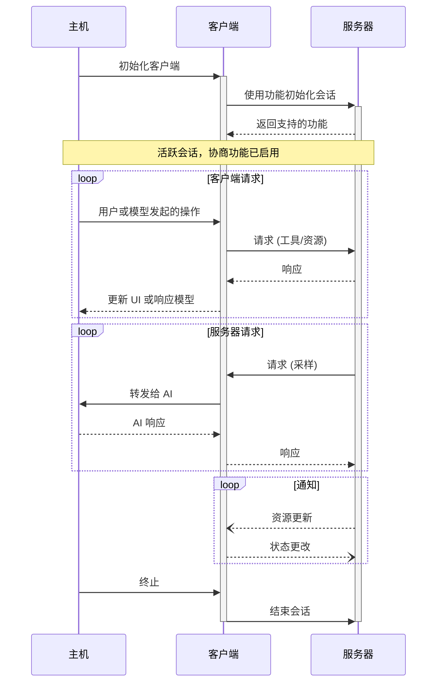

Model Context Protocol (MCP) 遵循客户端-主机-服务器架构，每个主机可以运行多个客户端实例。此架构使用户能够在不同应用程序中集成 AI 功能，同时维护明确的安全边界并实现关注点分离。基于 JSON-RPC，MCP 提供了一个有状态的会话协议，专注于客户端与服务器之间的上下文交换和采样协调。

## 核心组件

### 主机 (Host)

主机进程充当容器和协调器的角色：

- 创建和管理多个客户端实例
- 控制客户端的连接权限和生命周期
- 强制执行安全策略和用户同意要求
- 处理用户授权决策
- 协调 AI/LLM 的集成与采样
- 管理跨客户端的上下文聚合

### 客户端 (Clients)

每个客户端由主机创建，并维护一个与服务器的独立连接：

- 与每个服务器建立一个有状态会话
- 处理协议协商和功能交换
- 双向路由协议消息
- 管理订阅和通知
- 在服务器之间保持安全边界

主机应用程序可以创建和管理多个客户端，每个客户端与特定服务器保持 1:1 的关系。

### 服务器 (Servers)

服务器提供特定的上下文和功能：

- 通过 MCP 原语暴露资源、工具和提示
- 独立运行，专注于明确的职责
- 通过客户端接口请求采样
- 必须遵守安全约束
- 可以是本地进程或远程服务

## 设计原则

MCP 基于多个关键设计原则，这些原则指导了其架构和实现：

1. **服务器应该非常容易构建**

   - 主机应用程序处理复杂的协调职责
   - 服务器专注于特定的、明确的功能
   - 简单的接口将实现开销降至最低
   - 明确的分离促进代码的可维护性

2. **服务器应该高度可组合**

   - 每个服务器在隔离中提供专注的功能
   - 多个服务器可以无缝组合
   - 共享协议支持互操作性
   - 模块化设计支持扩展性

3. **服务器不应能够读取整个对话，也不能“窥视”其他服务器**

   - 服务器仅接收必要的上下文信息
   - 完整的对话历史保留在主机中
   - 每个服务器连接保持隔离
   - 跨服务器交互由主机控制
   - 主机进程强制执行安全边界

4. **可以逐步为服务器和客户端添加功能**

   - 核心协议提供最少的必要功能
   - 其他功能可以按需协商
   - 服务器和客户端可以独立进化
   - 协议设计支持未来扩展
   - 保持向后兼容性

## 功能协商

Model Context Protocol 使用基于功能的协商系统，客户端和服务器在初始化期间明确声明其支持的功能。功能决定了会话期间可用的协议特性和原语。

- 服务器声明功能，例如资源订阅、工具支持和提示模板
- 客户端声明功能，例如采样支持和通知处理
- 双方必须在整个会话期间遵守已声明的功能
- 可以通过协议扩展协商其他功能

每个功能在会话期间解锁特定的协议特性。例如：

- [服务器功能]() 必须在服务器的功能声明中明确说明
- 发出资源订阅通知需要服务器声明订阅支持
- 工具调用需要服务器声明工具功能
- [采样]() 需要客户端在其功能中声明支持

这种功能协商确保客户端和服务器对支持的功能有明确的理解，同时保持协议的可扩展性。