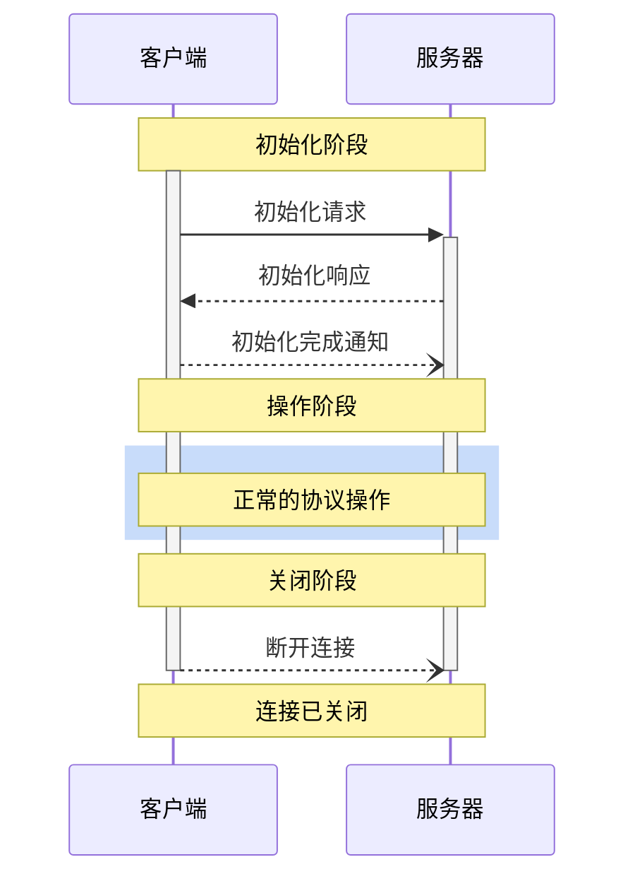

 **协议修订版本**: 2025-03-26 

Model Context Protocol（MCP，模型上下文协议）定义了一个严谨的客户端-服务器连接生命周期，以确保正确的功能协商和状态管理。

1. **初始化**: 功能协商和协议版本确认  
2. **操作**: 正常的协议通信  
3. **关闭**: 优雅地终止连接  



## 生命周期阶段

### 初始化

初始化阶段**必须**是客户端和服务器之间的第一个交互。在此阶段，客户端和服务器需要：

- 确认协议版本兼容性
- 交换并协商功能
- 共享实现细节

客户端**必须**通过发送包含以下内容的 `initialize` 请求来启动此阶段：

- 支持的协议版本
- 客户端功能
- 客户端实现信息

```json
{
  "jsonrpc": "2.0",
  "id": 1,
  "method": "initialize",
  "params": {
    "protocolVersion": "2024-11-05",
    "capabilities": {
      "roots": {
        "listChanged": true
      },
      "sampling": {}
    },
    "clientInfo": {
      "name": "ExampleClient",
      "version": "1.0.0"
    }
  }
}
```

`initialize` 请求**不得**成为 JSON-RPC [批处理](https://www.jsonrpc.org/specification#batch)的一部分，因为在初始化完成之前，其他请求和通知是不可行的。这也确保了与不显式支持 JSON-RPC 批处理的早期协议版本的向后兼容性。

服务器**必须**以其自身的功能和信息进行响应：

```json
{
  "jsonrpc": "2.0",
  "id": 1,
  "result": {
    "protocolVersion": "2024-11-05",
    "capabilities": {
      "logging": {},
      "prompts": {
        "listChanged": true
      },
      "resources": {
        "subscribe": true,
        "listChanged": true
      },
      "tools": {
        "listChanged": true
      }
    },
    "serverInfo": {
      "name": "ExampleServer",
      "version": "1.0.0"
    }
  }
}
```

在初始化成功后，客户端**必须**发送一个 `initialized` 通知，表示已准备好开始正常操作：

```json
{
  "jsonrpc": "2.0",
  "method": "notifications/initialized"
}
```

- 在服务器响应 `initialize` 请求之前，客户端**不应**发送除 [ping 请求]()之外的其他请求。  
- 在接收到 `initialized` 通知之前，服务器**不应**发送除 [ping 请求]()和 [日志记录]()之外的其他请求。

#### 版本协商

在 `initialize` 请求中，客户端**必须**发送其支持的协议版本。这**应当**是客户端支持的**最新**版本。

如果服务器支持请求的协议版本，则**必须**以相同的版本进行响应。否则，服务器**必须**以其支持的另一个协议版本响应。这**应当**是服务器支持的**最新**版本。

如果客户端不支持服务器响应中的协议版本，则客户端**应当**断开连接。

#### 功能协商

客户端和服务器的功能协商决定了会话期间可用的可选协议功能。

主要功能包括：

| 分类   | 功能            | 描述                                                                          |
| ------ | --------------- | ----------------------------------------------------------------------------- |
| 客户端 | `roots`         | 提供文件系统[根目录]()的能力                     |
| 客户端 | `sampling`      | 支持 LLM [采样]()请求                        |
| 客户端 | `experimental`  | 描述对非标准实验性功能的支持                                                  |
| 服务器 | `prompts`       | 提供[提示模板]()                               |
| 服务器 | `resources`     | 提供可读的[资源]()                           |
| 服务器 | `tools`         | 暴露可调用的[工具]()                             |
| 服务器 | `logging`       | 输出结构化的[日志消息]()             |
| 服务器 | `experimental`  | 描述对非标准实验性功能的支持                                                  |

功能对象可以描述子功能，例如：

- `listChanged`: 支持列表更改通知（用于提示、资源和工具）  
- `subscribe`: 支持订阅单个项目的更改（仅资源）  

### 操作

在操作阶段，客户端和服务器根据协商的功能交换消息。

双方**应当**：

- 遵守协商的协议版本  
- 仅使用已成功协商的功能  

### 关闭

在关闭阶段，一方（通常是客户端）会优雅地终止协议连接。没有定义特定的关闭消息，而是使用底层传输机制来指示连接终止：

#### 标准输入输出（stdio）

对于标准输入输出[传输方式]()，客户端**应当**通过以下方式启动关闭：

1. 首先关闭子进程（服务器）的输入流  
2. 等待服务器退出；如果服务器在合理时间内未退出，则发送 `SIGTERM`  
3. 如果服务器在发送 `SIGTERM` 后的合理时间内仍未退出，则发送 `SIGKILL`  

服务器**可以**通过关闭其输出流并退出来启动关闭。

#### HTTP

对于 HTTP [传输方式]()，通过关闭相关的 HTTP 连接来指示关闭。

## 超时

实现**应当**为所有发送的请求设置超时，以防止连接挂起和资源耗尽。如果在超时时间内未收到成功或错误响应，发送方**应当**为该请求发出 [取消通知]()，并停止等待响应。

SDK 和其他中间件**应当**允许按请求配置这些超时。

如果接收到与请求对应的 [进度通知]()，表示工作正在进行，实现**可以**选择重置超时计时器。然而，实现**应当**始终强制执行最大超时时间，以限制不正常的客户端或服务器的影响。

## 错误处理

实现**应当**准备处理以下错误情况：

- 协议版本不匹配  
- 功能协商失败  
- 请求[超时](#timeouts)  

初始化错误示例：

```json
{
  "jsonrpc": "2.0",
  "id": 1,
  "error": {
    "code": -32602,
    "message": "Unsupported protocol version",
    "data": {
      "supported": ["2024-11-05"],
      "requested": "1.0.0"
    }
  }
}
```
