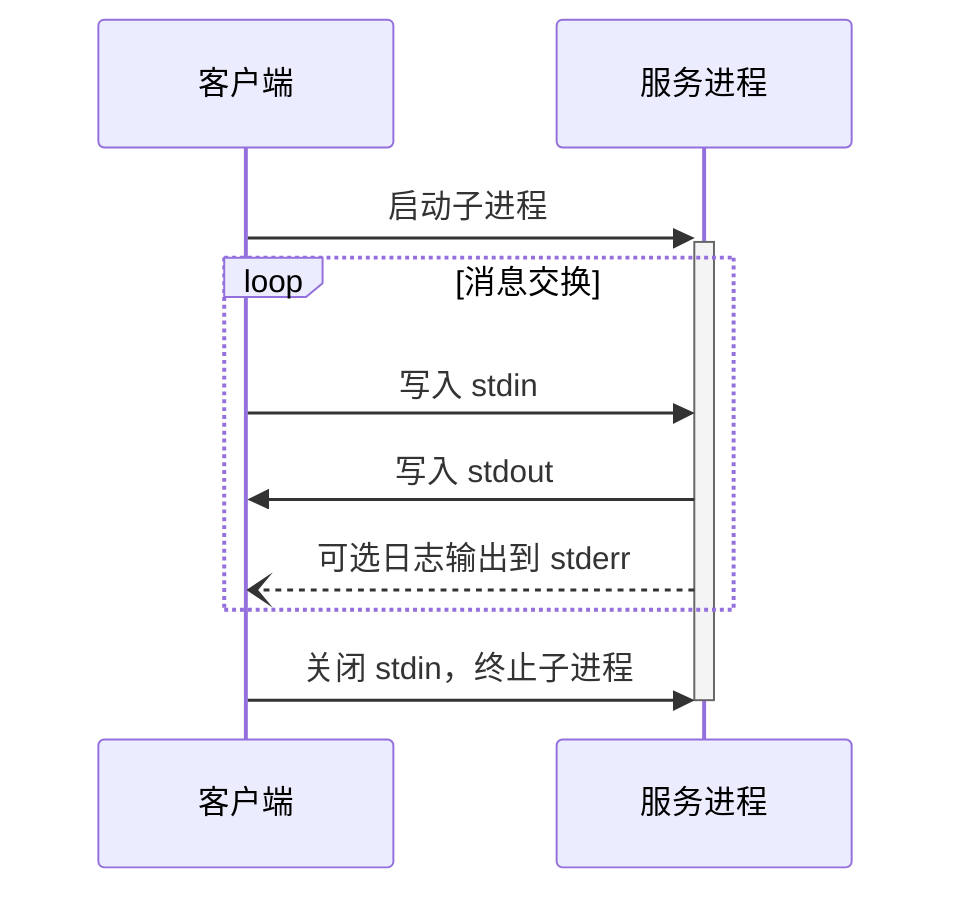
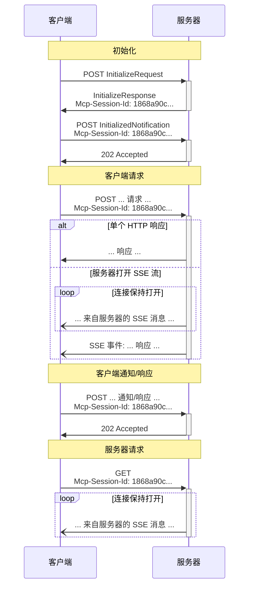

 **协议修订版本**: 2025-03-26 

MCP 使用 JSON-RPC 编码消息。JSON-RPC 消息 **必须** 以 UTF-8 编码。

该协议目前定义了两种用于客户端与服务器通信的标准传输机制：

1. [stdio](#stdio)：通过标准输入和标准输出通信
2. [可流式 HTTP](#streamable-http)

客户端在可能的情况下 **应当** 支持 stdio。

客户端与服务器也可以实现[自定义传输机制](#custom-transports)，以插件化方式扩展功能。

## stdio

在 **stdio** 传输机制中：

- 客户端将 MCP 服务器作为子进程启动。
- 服务器从其标准输入（`stdin`）读取 JSON-RPC 消息，并将消息发送到标准输出（`stdout`）。
- 消息可以是 JSON-RPC 请求、通知、响应，或者是包含一个或多个请求和/或通知的 JSON-RPC
  [批处理](https://www.jsonrpc.org/specification#batch)。
- 消息使用换行符分隔，且 **不得** 包含嵌入的换行符。
- 服务器 **可以** 将日志信息以 UTF-8 字符串形式写入其标准错误（`stderr`）。客户端 **可以** 捕获、转发或忽略这些日志。
- 服务器 **不得** 向其 `stdout` 写入任何非 MCP 消息的内容。
- 客户端 **不得** 向服务器的 `stdin` 写入任何非 MCP 消息的内容。

## 可流式 HTTP

 该机制替代了协议版本 2024-11-05 中的 [HTTP+SSE 传输]()。请参阅以下[向后兼容性](#backwards-compatibility)指南。

在 **可流式 HTTP** 传输机制中，服务器作为独立进程运行，可以处理多个客户端连接。该机制使用 HTTP 的 POST 和 GET 请求。服务器还可以选择使用 [服务器推送事件（Server-Sent Events, SSE）](https://en.wikipedia.org/wiki/Server-sent_events) 来流式发送多个服务器消息。这种方式支持基本的 MCP 服务器以及更高级的服务器功能，例如流式传输和服务器到客户端的通知与请求。

服务器 **必须** 提供单个 HTTP 端点路径（以下简称 **MCP 端点**），支持 POST 和 GET 方法。例如，可以是类似 `https://example.com/mcp` 的 URL。

### 向服务器发送消息

从客户端发送的每条 JSON-RPC 消息 **必须** 是发送到 MCP 端点的新 HTTP POST 请求。

1. 客户端 **必须** 使用 HTTP POST 将 JSON-RPC 消息发送到 MCP 端点。
2. 客户端 **必须** 包含一个 `Accept` 头，声明支持的内容类型为 `application/json` 和 `text/event-stream`。
3. POST 请求的正文 **必须** 是以下之一：
   - 单个 JSON-RPC _请求_、_通知_ 或 _响应_
   - 包含一个或多个 _请求_ 和/或 _通知_ 的数组形式的[批处理](https://www.jsonrpc.org/specification#batch)
   - 包含一个或多个 _响应_ 的数组形式的[批处理](https://www.jsonrpc.org/specification#batch)
4. 如果输入仅包含（任意数量的）JSON-RPC _响应_ 或 _通知_：
   - 如果服务器接受输入，则服务器 **必须** 返回 HTTP 状态代码 202 Accepted，且不包含响应正文。
   - 如果服务器无法接受输入，则服务器 **必须** 返回一个 HTTP 错误状态代码（如 400 Bad Request）。HTTP 响应正文 **可以** 包含没有 `id` 的 JSON-RPC _错误响应_。
5. 如果输入包含任意数量的 JSON-RPC _请求_，服务器 **必须** 返回以下之一：
   - `Content-Type: text/event-stream`，以启动 SSE 流。
   - `Content-Type: application/json`，以返回一个 JSON 对象。客户端 **必须** 支持这两种情况。
6. 如果服务器启动 SSE 流：
   - SSE 流 **应当** 最终包含针对 POST 请求正文中每个 JSON-RPC _请求_ 的一个 JSON-RPC _响应_。这些 _响应_ **可以** 是[批处理](https://www.jsonrpc.org/specification#batch)。
   - 服务器 **可以** 在发送 JSON-RPC _响应_ 之前，发送 JSON-RPC _请求_ 和 _通知_。这些消息 **应当** 与原始客户端 _请求_ 相关。这些 _请求_ 和 _通知_ **可以** 是[批处理](https://www.jsonrpc.org/specification#batch)。
   - 除非[会话](#session-management)过期，服务器 **不应** 在发送完每个接收的 JSON-RPC _请求_ 的 JSON-RPC _响应_ 前关闭 SSE 流。
   - 在所有 JSON-RPC _响应_ 发送完成后，服务器 **应当** 关闭 SSE 流。
   - 断开连接 **可以** 随时发生（例如，由于网络条件）。因此：
     - 断开连接 **不应** 被解释为客户端取消了请求。
     - 若需取消，客户端 **应当** 显式发送 MCP `CancelledNotification`。
     - 为避免因断开连接导致消息丢失，服务器 **可以** 使流[支持恢复](#resumability-and-redelivery)。

### 从服务器监听消息

1. 客户端 **可以** 向 MCP 端点发出 HTTP GET 请求。这用于打开 SSE 流，使服务器可以在客户端未通过 HTTP POST 发送数据的情况下与客户端通信。
2. 客户端 **必须** 包含一个 `Accept` 头，声明支持的内容类型为 `text/event-stream`。
3. 服务器 **必须** 返回 `Content-Type: text/event-stream` 以响应该 HTTP GET 请求，或者返回 HTTP 405 Method Not Allowed，表明服务器不提供此端点的 SSE 流。
4. 如果服务器启动 SSE 流：
   - 服务器 **可以** 在流上发送 JSON-RPC _请求_ 和 _通知_。这些 _请求_ 和 _通知_ **可以** 是[批处理](https://www.jsonrpc.org/specification#batch)。
   - 这些消息 **应当** 与客户端当前运行的 JSON-RPC _请求_ 无关。
   - 除非是[恢复](#resumability-and-redelivery)与先前客户端请求相关的流，服务器 **不得** 在流上发送 JSON-RPC _响应_。
   - 服务器 **可以** 随时关闭 SSE 流。
   - 客户端 **可以** 随时关闭 SSE 流。

### 多个连接

1. 客户端 **可以** 同时保持与多个 SSE 流的连接。
2. 服务器 **必须** 仅在一个连接的流上发送其 JSON-RPC 消息；即 **不得** 在多个流上广播相同的消息。
   - 消息丢失的风险 **可以** 通过使流[支持恢复](#resumability-and-redelivery)来缓解。

### 恢复与重新发送

为支持恢复中断的连接并重新发送可能丢失的消息：

1. 服务器 **可以** 将 `id` 字段附加到其 SSE 事件中，如 [SSE 标准](https://html.spec.whatwg.org/multipage/server-sent-events.html#event-stream-interpretation) 中所述。
   - 如果存在，ID **必须** 在该[会话](#session-management)内的所有流中全局唯一——或者如果未使用会话管理，则在与该特定客户端的所有流中全局唯一。
2. 如果客户端希望在断开连接后恢复，它 **应当** 向 MCP 端点发出 HTTP GET 请求，并包含 [`Last-Event-ID`](https://html.spec.whatwg.org/multipage/server-sent-events.html#the-last-event-id-header) 头以指示其接收到的最后事件 ID。
   - 服务器 **可以** 使用此头重放在最后事件 ID 之后应发送的消息（仅限于断开连接的流），并从该点恢复流。
   - 服务器 **不得** 重放本应在其他流上发送的消息。

换句话说，这些事件 ID 应由服务器按 _每个流_ 分配，用作该流中特定位置的游标。

### 会话管理

MCP "会话" 包括客户端与服务器之间逻辑相关的交互，从[初始化阶段]()开始。为支持需要建立有状态会话的服务器：

1. 使用可流式 HTTP 传输的服务器 **可以** 在初始化时分配一个会话 ID，并在包含 `InitializeResult` 的 HTTP 响应中通过 `Mcp-Session-Id` 头返回该 ID。
   - 会话 ID **应当** 是全局唯一且加密安全的（例如，安全生成的 UUID、JWT 或加密哈希）。
   - 会话 ID **必须** 仅包含可见的 ASCII 字符（范围从 0x21 到 0x7E）。
2. 如果服务器在初始化期间返回了 `Mcp-Session-Id`，使用可流式 HTTP 传输的客户端在其后续所有 HTTP 请求中 **必须** 包含该 ID 的 `Mcp-Session-Id` 头。
   - 若服务器要求会话 ID，**应当** 对不带 `Mcp-Session-Id` 头的请求（初始化除外）返回 HTTP 400 Bad Request。
3. 服务器 **可以** 随时终止会话，之后 **必须** 对包含该会话 ID 的请求返回 HTTP 404 Not Found。
4. 当客户端收到包含 `Mcp-Session-Id` 的请求返回的 HTTP 404 响应时，它 **必须** 通过发送新的不附加会话 ID 的 `InitializeRequest` 开始新会话。
5. 不再需要特定会话的客户端（例如，用户离开客户端应用程序）**应当** 向 MCP 端点发送带有 `Mcp-Session-Id` 头的 HTTP DELETE 请求，以显式终止会话。
   - 服务器 **可以** 对此请求返回 HTTP 405 Method Not Allowed，表明服务器不允许客户端终止会话。

### 时序图

### 向后兼容性

客户端和服务器可以通过以下方式与已弃用的 [HTTP+SSE 传输]()（协议版本 2024-11-05）保持向后兼容：

**服务器** 希望支持旧客户端时应：

- 继续托管旧传输的 SSE 和 POST 端点，与定义的可流式 HTTP 传输的新 "MCP 端点" 并存。
  - 也可以将旧 POST 端点与新 MCP 端点合并，但这可能会引入不必要的复杂性。

**客户端** 希望支持旧服务器时应：

1. 从用户处接受 MCP 服务器 URL，该 URL 可能指向使用旧传输或新传输的服务器。
2. 试图向服务器 URL POST 一个 `InitializeRequest`，并包含上述定义的 `Accept` 头：
   - 如果成功，则客户端可以假定这是支持新可流式 HTTP 传输的服务器。
   - 如果失败并返回 HTTP 4xx 状态码（例如，405 Method Not Allowed 或 404 Not Found）：
     - 发起一个 GET 请求到服务器 URL，期望其打开 SSE 流并返回一个 `endpoint` 事件作为第一个事件。
     - 当接收到 `endpoint` 事件时，客户端可以假定这是运行旧 HTTP+SSE 传输的服务器，并应使用该传输进行所有后续通信。

## 自定义传输机制

客户端和服务器 **可以** 实现额外的自定义传输机制，以满足其特定需求。该协议对传输机制保持无关性，可以在任何支持双向消息交换的通信通道上实现。

选择支持自定义传输的实现者 **必须** 确保其符合 MCP 定义的 JSON-RPC 消息格式和生命周期要求。自定义传输 **应当** 记录其特定的连接建立和消息交换模式，以帮助实现互操作性。
